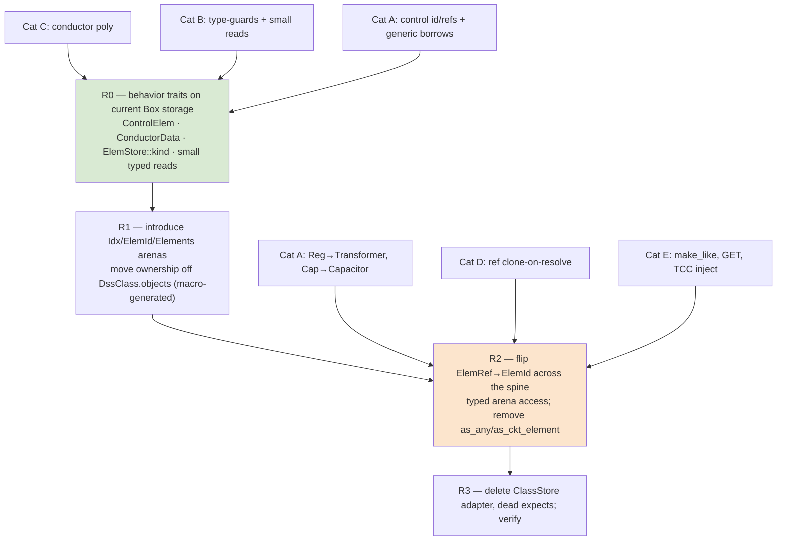

# Plan: De-Pascalize the Rust codebase

Typed arenas + `enum ElemId` (eliminate downcasting) · **index elimination** (flat-offset
arithmetic, 1-based remnants, parallel arrays, sentinels) · integer-constant families →
enums · bitfield → typed flags · borrow hygiene · error/case fidelity cleanups ·
**Stage F: the `oracle-parity` feature split** (idiomatic default build; bit-compat
verification build) · a (small) keep list of genuine product semantics · thread-readiness
design constraints. Master ordering across all plan documents: `PLAN_SEQUENCE.md`.

Companion: `MULTITHREADING_PLAN.md` (Phase 9 parallelism). This plan's job is to make sure
the de-Pascalized architecture is the one that plan builds on.

## Scheduling & golden policy (user decision, 2026-07-06 — supersedes the earlier
"no goldens regenerated" scoping)

All of this runs **after the 1:1 port reaches final acceptance** (`PORTING_PLAN §6`). At that
point the porting rules ("Pascal is the spec", "port loop-for-loop where numerics matter")
**no longer bind** — this is refactoring of an accepted engine, and **byte-exact goldens may
be deliberately regenerated**. Two contracts survive acceptance and still constrain every
stage:

1. **The live oracle is not regenerable.** `corpus_live` compares the Rust engine against
   pinned dss-python *live*, under calibrated tolerance floors (`tests/TOLERANCE_NOTES.md`).
   Any refactor that changes floating-point results must stay inside those floors — or come
   with the empirical decomposition proof the `CLAUDE.md` rules demand. No fudging: a
   tolerance is never loosened to admit a refactor. (The only exceptions are Stage F's
   **documented deliberate divergences** — its dual-kernel table — which are excluded from
   oracle comparison field-by-field and pinned by expected-value tests instead.)
2. **Committed byte-exact goldens are the cheapest equivalence oracle we will ever have.**
   A refactor that preserves arithmetic exactly (same operations, same order) is *proven*
   equivalent by the existing goldens for free. Therefore: **bit-neutral refactors run
   FIRST, against the existing goldens; arithmetic-changing refactors run LAST, inside
   Stage F's feature split (Part IV) — which absorbs and supersedes the `TODO(compat)`
   "wipe-out" sweep of `PORTING_PLAN §6`.**

Available but not a contract: the opt-in **official-EPRI-binary oracle**
(`tools/opendss/`, Oddie bridge, r3723/r4088/r4133, added 2026-07-07) — a third
reference for settling "is this dss_capi-specific or upstream?" questions during
Stage F's dual-kernel table work (`ab_compare.py --a capi --b oddie:r3723`). It
gates nothing here; the pinned dss-python oracle remains the parity-lane spec.

Every work package is tagged with a stratum:

- **[A] bit-neutral** — same arithmetic, same order; existing goldens must stay green
  unchanged. (Iterator/`chunks_exact` rewrites, typed views, `Vec<struct>` re-layouts,
  0-basing, `Option`-ification, enum-ification.)
- **[C] arithmetic-changing** — accumulation order or algorithms change. Lands in
  **Stage F** (Part IV): the idiomatic kernel becomes the **default build**, the
  bit-compat kernel moves behind `#[cfg(feature = "oracle-parity")]`, and only the default
  lane re-baselines. Nothing is deleted, so 1:1 verifiability against the pinned oracle
  never rots.

## Per-step ritual (every WP/stage, in order, autonomously — the `PHASE8_PLAN` discipline)

0. **Tier check (before touching anything)** — look up this WP's **exec tier** in the
   difficulty table below and compare against the session (model name is in your system
   prompt; if the effort level is not visible to you, ask the user to confirm it — always
   confirm for `opus-xhigh` stages). Below tier → do NOT execute; reply exactly:
   «Этот шаг требует <exec tier>. Переключи сессию (/model + reasoning effort) и повтори
   команду.» and stop. (Protocol defined in `PLAN_SEQUENCE.md`.)
1. **Gate green** — `cargo fmt --all --check` · `cargo clippy --workspace --all-targets
   -- -D warnings` · `cargo test --workspace` (all goldens + the always-on live corpus
   gate). **After Stage F lands: both lanes** (default and `--features oracle-parity`) +
   the parity↔default differential job. No `#[ignore]`, no name-filter that greens on zero
   matches; a red test blocks the commit.
2. **Update `STATUS.md`** (frontier + phase record), **commit** (code + STATUS together).
3. **`/audit-code` + `/audit-tests` in parallel** — two fresh independent agents (never
   forks), **spawned with an explicit model/effort override matching this WP's audit tier
   from the table below** (never "whatever the session runs"). Each gets a self-contained
   brief: the step's commit range, the diff, the relevant plan Part/WP, and the binding
   rules (stratum [A] = goldens byte-identical / Stage F = lane discipline; the Part IV
   keep list; no tolerance fudging). Settle every finding empirically; a finding
   deliberately not fixed is recorded in STATUS, never dropped; re-run the gate, commit.
4. **`STATUS.md` full review** — sync whatever the step made stale, archive dead weight to
   `docs/phase-records/`; `docs:` commit if anything changed (gate re-run first).
5. **Only now stop** and report in Russian (code/identifiers/commits/STATUS stay English):
   what landed, audit findings and how they were settled, gate status (per lane once
   Stage F exists), next step.

## Executor guidance (difficulty map, forbidden moves, escape protocol)

This plan is written to be executable by a mid-tier model. Difficulty map — where to slow
down and where mechanical execution is enough:

| Stage | Exec tier | Audit tier | Executor notes |
|---|---|---|---|
| R0, R3, Part II (P1/P2/P5/P6/P7), P3 | opus-medium+ | opus-high+ | compiler-guided; each WP names its pattern and pinning tests — follow them literally |
| **R1** | **opus-xhigh** | **opus-xhigh** | follow the macro sketch below **literally**; land as two commits (arena types first, ownership flip second). If the macro fights: **hand-writing the 34 match arms behind the same API is the sanctioned fallback** — the macro is a convenience, not a requirement |
| R2 | opus-high+ | opus-high+ | flip one class/cross-ref cluster at a time; the build must compile between clusters; `pair_mut`-style disjoint borrows, `mem::take` as escape hatch |
| Part III P8/P9/P11/P12/P13/P14 | opus-medium+ | opus-high+ | bit-neutrality: after each rewritten file, run that WP's named pinning tests; a failing golden means *your* rewrite changed arithmetic |
| P10 (transformer core) | opus-high+ | opus-high+ | densest index math in the tree; same bit-neutrality invariant |
| P15 | opus-high+ (**item 2: opus-xhigh**) | opus-high+ (item 2: xhigh) | the dedup-mapping cache + its invalidation is the subtle part; everything else follows the file:line list; checkpoint Y goldens are the bit-exact proof |
| **Stage F** | **opus-xhigh** | **opus-xhigh** | follow the compat sketch below; the dual-kernel table in Part IV.2 is the complete, closed inventory — do not invent new compat items |

Tier vocabulary and the step-0 refuse protocol: `PLAN_SEQUENCE.md` §Model-tier protocol.

**Forbidden moves (hard rules; violating any one = stop, revert the change, record in STATUS):**
1. Never regenerate any golden in an [A] stage.
2. Never loosen any tolerance, anywhere, for any reason.
3. Never reorder floating-point accumulation "because it's cleaner" — order changes are
   Stage F's job, behind the feature.
4. Never write `#[cfg(feature = "oracle-parity")]` outside the `compat` modules.
5. Never delete a compat kernel or a `TODO(compat)` site outside Stage F.
6. Never change class registration order or any Part IV.1 semantic order.
7. Never introduce `Rc`/`RefCell`/`Mutex`/statics (Part V; P7's grep gate enforces it).

**When stuck (escape protocol — do NOT improvise a new design):** if a downcast site
doesn't fit its category (A–E), a rewrite can't be made bit-neutral, or a borrow fight
survives `pair_mut`/`mem::take` — leave the old code in place (gate stays green), record
the site + blocker in `STATUS.md`, finish the WP's remaining sites, and surface the list at
the stop point for the user to decide.

**R1 macro sketch (the one hard artifact — follow literally):**

```rust
// obj/arena.rs — ONE class list, in exec/construct.rs registration order (invariant!).
macro_rules! with_all_classes { ($m:ident) => { $m! {
    //  variant     field          concrete type
    (Line,        lines,         Line),
    (Load,        loads,         Load),
    (Transformer, transformers,  Transformer),
    /* … one row per registered class — ALL 34, registration order … */
} } }
// ONE consumer macro expands that list into: `enum ElemId`, `struct Elements`,
// and every impl (ckt_elem/ckt_elem_mut/obj/obj_mut/kind/find/pair_mut) as match arms.
// Mandatory test: ElemId variant order == construct.rs registration order
// (assert via a generated `ElemId::CLASS_NAMES` array compared to the registry).
```

**Stage F compat sketch (the alias pattern — both impls always compiled):**

```rust
// dss-core/src/compat.rs — the ONLY file in the crate allowed to contain the cfg string.
pub fn cdiv_fpc_impl(a: Complex64, b: Complex64) -> Complex64 { /* Smith, moved as-is */ }
pub fn cdiv_std_impl(a: Complex64, b: Complex64) -> Complex64 { a / b }
#[cfg(feature = "oracle-parity")]      pub use cdiv_fpc_impl as cdiv;
#[cfg(not(feature = "oracle-parity"))] pub use cdiv_std_impl as cdiv;
// Same alias pattern for: round_i32, PI, stddev_single_point, SymComp variant,
// the two bug-fix branches, the solver Par/refinement knobs (dss-sparse).
// Unit tests call BOTH `_impl`s directly and assert the documented bound — in any build.
```

---

# Part I — Element storage: typed arenas + `ElemId`, eliminate downcasting [A]

## Context

The port is idiomatic Rust almost everywhere; the one pervasive Pascal-ism is **dynamic
downcasting** — verified at **306 `downcast_ref`/`downcast_mut`/`as_any` sites across 55
production files** (the draft's "239/52" is a stale undercount). Root cause: every class
stores its objects as a heterogeneous `Vec<Box<dyn DssObject>>` (`exec/registry.rs:16`), so
any code needing a concrete `&Load`/`&mut Transformer` recovers it at runtime via
`as_any().downcast_ref::<T>()`. This **diverges from `PORTING_PLAN.md §2.1`**, which specified
typed `Vec<T>` arenas + `Idx<T>` newtype indices + an `enum ElemId` with match dispatch —
explicitly "no downcast." The implementation took the boxed-trait shortcut; this work package
restores the specified design.

## What exploration confirmed (and corrected vs. the draft)

- **`ElemRef { cls: usize, idx: usize }`** (`elements/traits.rs:15`) is already a tagged
  index; every cross-ref is `Vec<ElemRef>`/`Option<ElemRef>`. The plumbing exists — R2 retypes
  the `cls` tag into an enum variant.
- **Registry blast radius is small and contained:** only ~56 direct `.objects[` accesses,
  almost entirely in `exec/` (`registry` 17, `view` 16, `command` 11, `helpers` 2). The solver
  reaches elements through `ElemStore`/`ElemRef`, not direct indexing — so R2's flip is mostly
  confined to the executive.
- **34 classes are registered in `exec/construct.rs`, and registration order is semantically
  significant** — bare-name `find_ckt_element` and `ForeignClasses` lookups iterate classes in
  registration order and return the first match. **The `Elements` arena layout and any
  iteration over it MUST preserve this order.** This is the single most important invariant the
  macro must encode.
- **`ElemId`/`Elements` must cover ALL 34 classes, not just circuit elements.** General data
  classes (LoadShape, TCC_Curve, Spectrum, WireData/CnData/TsData, LineGeometry, …) also live
  in `DssClass` arenas and are produced as `ElemRef` by object-ref resolution. The draft's
  `ElemId` sketch (circuit classes only) is incomplete.
- **The draft over-claims that R0 "deletes the 67-downcast block" in `dispatch.rs`.** A
  `ControlElem` trait removes the *identification* chain and the generic-controlled-element
  downcasts, but RegControl needs `&mut Transformer` and CapControl needs `&mut Capacitor` —
  those concrete borrows only vanish with typed-arena pair access in **R2**. So dispatch is
  *reduced* in R0 and *emptied* in R2.

## The downcasts fall into four categories — each needs a distinct fix

| # | Category | Sites (approx) | Where | Fix | Stage |
|---|----------|------|-------|-----|-------|
| **A** | Control dispatch | 67 + 4 | `controls/dispatch.rs` | `ControlElem` trait (id + refs + generic-controlled access) **then** typed-arena pair/triple access for Reg→Transformer, Cap→Capacitor | R0 (most) → R2 (last concrete pair) |
| **B** | Meter type-guards & concrete reads | ~50 | `meters/zones/build.rs`, `sampling/{take_sample,allocate}.rs`, `meter/{energymeter,monitor,sensor}/accessors.rs`, `exec/view.rs` | type-guards → `ElemStore::kind(r) -> ElemKind` + `matches!`; concrete reads (line length, load/gen/EM data) → typed `MeterElem`/`CktElement` accessor methods, then typed arena reads | R0 (guards + small reads) → R2 (rest via arena) |
| **C** | Conductor subtype polymorphism | ~13 | `conductor_data/mod.rs`, `line_geometry/{matrix,edit}.rs`, `Line.line_wire_data` (`line/mod.rs:218`) | New **`ConductorData` trait** (or `enum ConductorKind`) with `geom()`/radius/gmr; store `Vec<Option<…>>` as the trait/enum, not `Box<dyn DssObject>` | R0 |
| **D** | Shape/ref clone-on-resolve | ~10 | `set_object_ref` impls in `{load,line,vsource,generator}/accessors.rs` (LoadShape/GrowthShape/etc.) | Hardest. Carry a **typed handle in the resolved object-ref tuple** (`ElemId` instead of bare `&dyn DssObject`); each `set_object_ref` matches the variant it expects and the executive clones the concrete object from the typed arena. Preserve resolve-time snapshot timing (no behavior change) | R2 |
| **E** | `make_like` + misc executive | ~20 | `exec/helpers.rs:280`, `command.rs` (TCC injection, GET) | `make_like` is always same-class → change signature to `make_like(&mut self, other: &Self)` called from a typed arena match (downcast vanishes entirely — better than the draft's `clone_state_from` which keeps an internal downcast and *fails the grep gate*). `command.rs`/`view.rs` GET paths → `ElemId` match arms over typed arenas | R2 |

`clone_box` (`obj/base/mod.rs:508`) is **not** a downcast and need not be removed — but with
typed arenas the two callers (make_like in `helpers.rs`, self-monitoring `mon_clone` in
`dispatch.rs`) become typed clones, so it can be dropped if convenient.

## Target architecture (`PORTING_PLAN §2.1`)

```rust
// crates/dss-core/src/obj/arena.rs  (new)
pub struct Idx<T>(u32, PhantomData<T>);   // stable: OpenDSS never deletes individual
                                          // elements mid-script (Clear drops the whole ckt)
pub enum ElemId {                         // ONE variant per registered class (all 34),
    Line(Idx<Line>), Load(Idx<Load>), Transformer(Idx<Transformer>), /* …ckt… */
    RegControl(Idx<RegControl>), CapControl(Idx<CapControl>), /* …controls… */
    LoadShape(Idx<LoadShapeObj>), TccCurve(Idx<TccCurveObj>), WireData(Idx<WireDataObj>),
    /* …general/data classes… */
}
pub struct Elements { pub lines: Vec<Line>, pub loads: Vec<Load>, /* …one Vec per class… */ }
impl Elements {                           // all match arms generated by ONE macro over the
    fn ckt_elem(&self, id: ElemId) -> &dyn CktElement;          // class list, in reg order
    fn ckt_elem_mut(&mut self, id: ElemId) -> &mut dyn CktElement;
    fn obj(&self, id: ElemId) -> &dyn DssObject;
    fn kind(&self, id: ElemId) -> ElemKind;                     // Category B guards
    fn pair_mut/triple_mut(…);                                  // disjoint borrows by match
    // typed pair getters for dispatch: (&mut RegControl, &mut Transformer), etc.
}
```

`DssObject` loses `as_any`/`as_any_mut`/`as_ckt_element`/`as_ckt_element_mut`. Virtual
dispatch lives on behavior traits: existing `CktElement`, plus new `ControlElem`, `MeterElem`,
`ConductorData`; the arena getters upcast each typed element to the right `&dyn Trait`.

## Dependency shape



R0 and R1 are independently valuable **stop points**: R0 banks ~half the readability win on the
current storage; R1 lands the arenas without yet retyping references. If R2 stalls, the tree is
still a strict improvement.

## Staged execution (each stage ends gate-green; one commit per stage)

**R0 — behavior traits on the current `Box<dyn>` storage (removes ~120 downcasts, no storage change).**
- Add **`ControlElem`** (`elements/control/control_elem.rs`): `ccd()/ccd_mut()` (every control
  already embeds `ccd: ControlElemData`), `control_kind()`, `reset_control_side()`. Rewrite the
  *identification* block in `dispatch.rs:92-161` to `obj.as_control()?.ccd()` + a `control_kind`
  match, deleting the 8-arm `as_any().downcast_ref::<…>()` chain and shrinking the `ControlKind`
  mirror. Generic-controlled controls (Swt/Fuse/Recloser/Relay act through `&mut dyn
  CktElement`) lose their `cobj.as_any_mut().downcast_mut::<Swt…>()` via a `&mut dyn ControlElem`
  acquired from the store. (Reg→Transformer / Cap→Capacitor concrete borrows stay until R2.)
- Add **`ElemStore::kind(r) -> ElemKind`** (returns `DssClass.kind`). Convert the meter
  type-guards in `meters/zones/build.rs` (`is_line`, `is_zone_pce`, `is_pd_element`) and the
  PD/PCE checks in `sampling/{take_sample,allocate}.rs`, `energymeter/accessors.rs` to
  `matches!(store.kind(r), ElemKind::Line)` etc. **Confirmed `ElemKind`'s 12 variants
  (`circuit.rs:44`) match the needed granularity exactly** (Line / Load|Generator|Capacitor|
  Reactor / Line|Transformer|Capacitor|Reactor).
- Add **`ConductorData`** trait over WireData/CnData/TsData (`geom()` + shared accessors);
  retype `Line.line_wire_data` and the `line_geometry`/`conductor_data` resolution to the trait,
  removing those ~13 downcasts.
- Add small typed reads for the remaining concrete-data guards: line length & load/gen power
  on `CktElement`/new `MeterElem` (Monitor mode-2 `present_tap`, generator power-by-phase,
  zone-build line length at `build.rs:214`/load data at `:279`), returning `Option`.

**R1 — introduce `Idx<T>`, `ElemId`, `Elements` behind the current API.**
- New `obj/arena.rs`: `Idx<T>`, `ElemId` (all 34 classes), `Elements` (per-class `Vec<T>`).
  **Drive the arena fields + every match arm (`ckt_elem`/`obj`/`kind`/`pair_mut`/`triple_mut`/
  `find`) from one macro over the class list, emitted in registration order** so class index ==
  variant order, preserving lookup tie-breaking.
- Move ownership from `DssClass.objects: Vec<Box<dyn DssObject>>` into `Elements`. `DssClass`
  keeps metadata only (`props`, `name_to_idx`, `active`, `kind`, `new_object`). The property
  parser keeps a `&mut dyn DssObject` view via `Elements::obj_mut(id)`. `ElemId` may keep a
  `{cls, idx}` shape internally during transition to minimize churn.
- **Thread-readiness rider (P7, cheap here):** add `Send` supertraits on
  `DssObject`/`CktElement`/`ElemStore` and a compile-time `assert_send::<Dss>()` — see
  Part V. Every concrete element is plain owned data, so this compiles with no data changes.

**R2 — flip `ElemRef → ElemId` across the spine (compiler-driven, mechanical) and finish A/B/D/E.**
- Replace `ElemRef` with `ElemId` in `elements/traits.rs` (`ElemStore`), `circuit.rs` (all
  per-kind lists), every cross-reference (`controlled_element`, `monitored_element`, shape
  refs), `RefAction`, and `solution/` Y-build + solve loops. Where the class is statically known,
  prefer a typed `Idx<T>` (e.g. Load `daily: Option<Idx<LoadShapeObj>>`) over `ElemId`.
- Add typed arena pair getters so `dispatch.rs` gets `(&mut RegControl, &mut Transformer)` /
  `(&mut CapControl, &mut Capacitor)` by `ElemId` match — emptying Category A.
- **Remove `as_any`/`as_any_mut`/`as_ckt_element`/`as_ckt_element_mut` from `DssObject`.**
  Finish Categories D (typed handle in resolved object-ref tuple; per-class `set_object_ref`
  match; concrete clone pulled from the typed arena, resolve-time timing preserved) and E
  (`make_like(&mut self, other: &Self)` from arena match; `command.rs` TCC injection + `view.rs`
  GET → `ElemId` match arms).
- **Thread-readiness rider (while signatures are open anyway):** split PC-element injection
  into `compute_inj_currents(&mut self, sys, node_v)` (fills the element-owned
  `cd.inj_current`) + a caller-side sequential scatter into `sol.currents`, and replace the
  shared `system_y_changed: &mut bool` in `InjCtx` with a per-element return flag OR-ed by the
  caller. Behavior identical (same order, same sums); this is the exact seam
  `MULTITHREADING_PLAN.md` M3b parallelizes later. Do it in R2 so signatures churn once.

**R3 — delete dead code + verify.** Remove the `ClassStore` boxing adapter, the downcast
`.expect()` assertions, `ControlKind` remnants, and unused helpers (`clone_box` if now unused).
Run the full gate + live oracle + perf check.

## Files to modify (representative — the pattern repeats per class)

- `exec/registry.rs` — `Vec<Box<dyn DssObject>>` + `ClassStore` → typed `Elements` arenas (core cut).
- `obj/arena.rs` *(new)* — `Idx<T>`, `ElemId`, `Elements`, the dispatch macro.
- `elements/traits.rs` — `ElemRef`→`ElemId`; `ElemStore` over arenas; `kind()`; new `MeterElem`.
- `elements/control/control_elem.rs` + `controls/dispatch.rs` — `ControlElem` trait; collapse `ControlKind`.
- `obj/base/mod.rs` — drop `as_any`/`as_ckt_element` from `DssObject`; `make_like(&Self)`.
- `circuit/circuit.rs` — `Vec<ElemRef>` lists → `Vec<ElemId>`.
- `elements/general/conductor_data/mod.rs`, `line_geometry/{matrix,edit}.rs`, `pd/line/mod.rs` — `ConductorData` trait.
- `meters/zones/build.rs`, `sampling/{take_sample,allocate}.rs`, `meter/**/accessors.rs`, `exec/view.rs` — guards → `kind`/trait.
- `exec/{command,helpers}.rs` — TCC injection, GET, `make_like` → typed arena matches.
- every `elements/**/accessors.rs` `set_object_ref`/`make_like` — final downcast removals.

## Risks & fallback

- **Scale (55 files on the storage/dispatch spine).** R0→R3 keeps the build green throughout;
  R0 and R1 are independent stop points (strict improvements even if R2 stalls).
- **Registration-order invariant.** The macro must emit arenas/variants in `construct.rs` order;
  bare-name lookups depend on it. Add a test that asserts `find_ckt_element` tie-breaking is
  unchanged on a fixture with same-named objects across classes.
- **Borrow-checker friction in `pair_mut`/`triple_mut` across arenas** (control + controlled +
  monitored in three Vecs). Same `get_disjoint_mut` disjoint-borrow pattern as today
  (`registry.rs:114-190`), now selected by `ElemId` match; `mem::take` is the documented escape
  hatch for any stubborn flow.
- **Category D timing.** The resolve-time snapshot-clone (`RefSnapshot`, `control_elem.rs:97`)
  is deliberate; keep *when* the clone happens identical — only change the type channel from
  `&dyn DssObject` to a typed `ElemId`/arena clone. Verify via the existing object-ref dump tests.
- **`Idx<T>` invalidation.** Safe only because OpenDSS never deletes individual elements
  mid-script. Document the invariant on `Idx<T>`; `Clear` resets all arenas together.

---

# Part II — Constants, flags, borrows, errors (WPs P1–P7) [A]

A full-codebase sweep (2026-07-06; five parallel audits over `crates/*/src`) found the
following non-downcast Pascal patterns. Each WP below is independent of Part I unless noted
and lands gate-green in one commit.

## P1 — Integer-constant families → enums

**Finding.** Beyond the enums already done right (`SolveMode` in `solution/state.rs:19` with
explicit discriminants + `ordinal()`/`from_ordinal`; `PropType`; `ElemKind`; `LoadModel`;
`Connection`; …), ~20 mode/state families remain **raw `i32` fields + `pub const` chains**,
compared inline and (for controls) dispatched through long if-else chains. The key boundary:
every such ordinal round-trips string↔i32 through the `DssEnum` registry
(`obj/dss_enum/enum_def.rs:69/111`) for `Set`/`?`/dump — so the numeric values are
**user-visible and frozen**, but the *storage type inside the engine* is free.

**Pattern (one per family):** `#[repr(i32)] enum … { Variant = <pinned ordinal>, … }` with
`ordinal(self) -> i32` / `from_ordinal(i32) -> Option<Self>` exactly like `SolveMode`; the
struct field becomes the enum; `i32` survives only at the DssEnum/property parse+report
boundary. Non-contiguous families (Relay has a gap at 2; StorageController has
`RELEASE_INHIBIT = 999`) get explicit discriminants — never derived ordinals.

**Tier 1 — user/golden-visible ordinals (explicit discriminants + boundary conversion):**

| Family | Today | Notes |
|---|---|---|
| Solution `load_model` (`POWERFLOW=1/ADMITTANCE=2`), `algorithm` (`NORMALSOLVE/NEWTONSOLVE`), `control_mode` (`CONTROLSOFF=-1..MULTIRATE=3`), `random_type` | `state.rs:74-86,114,153`, raw `i32` consts + fields | compared inline at `power_flow.rs:230,241`, `sampling.rs:15`, `set_mode.rs:136-147` |
| InvControl `control_mode` (0..6=AVR), `combi_mode`, RoC codes, pending-change (0..4), reac-power-ref | `inv_control/mod.rs:52-90` | the worst if-else chains: `compute.rs:380,1105-1130,1808,1908-1975,2275,2308` |
| Storage `f_state` (`-1/0/1`), `dispatch_mode` (0..4), var-mode | `storage/mod.rs:59-72,306,330` | |
| StorageController discharge/charge modes (1..9, 999) + `fleet_state` | `storage_controller/mod.rs:66-82,224-372` | non-contiguous |
| Relay `control_type` (0..9, **no 2**), present/normal state | `relay/mod.rs:68-76,222,297` | non-contiguous |
| CapControl `control_type` (0..5) + states | `cap_control/mod.rs:35-47,134,162` | |
| RegControl action codes | `reg_control/mod.rs:35-40` | |
| Generator `dispatch_mode`, PVSystem var-mode, ExpControl pending, ESPVLControl `f_type`, LoadShape interp | `generator/mod.rs:43`, `pvsystem/mod.rs:58`, `exp_control/mod.rs:43`, `espvl_control/mod.rs:150`, `load_shape/mod.rs:75` | |
| AutoAdd `add_type` (`GENADD=1/CAPADD=2`) | `circuit/auto_add.rs:17` | |
| `load.status` (0=Variable/1=Fixed/2=Exempt — compared as bare literals) | `load/mod.rs:189` | today documented only in a comment |
| bare-`i32` DssEnum-backed fields with no local const chain: `transformer.core_type`, **`Winding.connection` (0=wye/1=delta — matched as bare `0/1` literals in `set_term_ref`; P10's rewrite depends on this enum)**, `reactor/capacitor.spec_type`, `line.line_type`, `vsource.{z_spec_type,scan_type,sequence_type}`, `vs_converter.f_mode`, `line_code/line_geometry.fline_type`, `energymeter.ocp_device_type` | various | same pattern, one small enum each |

**Tier 2 — internal-only (pure enums, no numeric baggage):** ControlElem action codes
`CTRL_NONE..CTRL_UNLOCK` (`control_elem.rs:23`), InvControl pending/combi/RoC *internal*
comparisons once Tier 1 lands, `DynamicExp` RPN token sentinels (`CONST_CODE=50001`,
`EQ_MARK=-50` — wrap in a token enum with the pinned payload).

**Monitored-phase sentinels** (`AVGPHASES=-1/MAXPHASE=-2/MINPHASE=-3`, duplicated across
InvControl/CapControl/RegControl/StorageController): one shared
`enum MonPhase { Avg, Max, Min, Phase(i32) }` with pinned `from_ordinal`/`ordinal` — kills
four copies of the sentinel triple.

**Also:** resolve the `SolveMode` name collision (`solution/state.rs:19` vs
`support/dynamics/mod.rs:10`) — rename the dynamics one (`DynSolveMode`).

**Out of scope (see keep list):** the ~1000 per-class property-index `usize` consts
(ordinal == Pascal property order == dump/Save contract) and the `exec/tables.rs`
command/option code tables (~110, non-contiguous CommandList indices). Converting them is
churn with no readability gain — the value *is* the contract.

## P2 — Monitor mode bit-packing → typed decode

The one genuine raw-int bitfield: `Monitor.mode: i32` with `MODEMASK=15`,
`SEQUENCEMASK=16`, `MAGNITUDEMASK=32`, `POSSEQONLYMASK=64`
(`elements/meter/monitor/mod.rs:37-40`), decoded ad-hoc with `&`/`+` in `sample.rs:60,158,209`
and `header.rs:30,96,212-216` (including the magic `(mode & MODEMASK) == 1`).

**Fix:** decode **once** at the top of `take_sample`/header generation into

```rust
struct MonitorModeView { base: MonitorBaseMode /* enum, 0..=12 */,
                         sequence: bool, magnitude: bool, posseq_only: bool }
impl MonitorModeView { fn from_raw(mode: i32) -> Self; }  // masks 15/16/32/64 pinned here
```

and match on that — and **store the typed struct on `Monitor` itself**: raw `i32` survives
only at the property parse/report boundary (`mode=` in, ordinal out), with the masks
15/16/32/64 pinned inside `from_raw`/`to_raw` and a round-trip unit test. The `bitflags`
crate is *not* a fit here: the low 4 bits are a multi-bit base-mode subfield, not
independent flags. `PropFlags` (`obj/props/prop_flags.rs`) already shows the in-house idiom
and needs no work.

## P3 — Borrow hygiene: remove the clone-to-release-borrow swarm

All confirmed clones exist only to release `&ckt` before mutating `env.store` — 16-byte
`ElemRef` handle lists, but real per-iteration heap allocations in hot control loops:

- **`solution/controls/dispatch.rs` — 11 handle-list clones** (`:256,305,361,440,1551,1596,…`)
  plus `ckt.buses[bi].ref_no.clone()` (`:373,1587`) → index-range iteration
  (`for n in 0..len` + re-borrow) or a split-borrow helper. Biggest, lowest-risk cleanup.
- **Full `node_v` clones each step**: `solution/harmonics.rs:29,32`, `dynamics.rs:27,44`
  (also `fault_study.rs:104,119` for `zsc`/`vbus`) → scoped `mem::take`/restore or a snapshot
  slice passed through the ctx structs. Real numeric payload copied per frequency/timestep.
- **`monitor/sample.rs:63-64`** — per-sample scratch `Vec<Complex64>` reallocated in the
  time-series hot loop; Pascal keeps them as fields (the comment even says so) → move to
  `Monitor` fields.
- **`dispatch.rs:1014`** `mon_clone = cap.clone()` (whole element cloned to self-monitor) —
  revisit with R2's typed pair access.

Note: several of these clone sites vanish naturally in R2 (typed `pair_mut` replaces the
release-reborrow dance); do P3 after R2 to avoid doing the work twice, except the `node_v`
clones and monitor buffers, which are independent.

## P5 — Error-handling: adopt-or-drop `thiserror`, unify the taxonomy

- `thiserror` is declared in `dss-core/Cargo.toml` and **used nowhere**. Either wire
  `ParserError` (hand-rolled struct), `SparseError` (already a proper enum), and cmatrix's
  `SingularMatrix` into one `#[derive(Error)]` taxonomy, or drop the dependency. Low priority,
  zero golden impact (error *text* is what goldens pin, not Rust types).
- **Keep** the executive's string-accumulation (`errors: Vec<String>`, `solution_abort` flag) —
  it is a byte-faithful port of Pascal `DoSimpleMsg` and the error-log goldens check the text.
  Pascal error numbers stay as the existing source comments.
- The 445 `unreachable!` (generated-style property dispatch arms) and 259 invariant
  `.expect(` are a robustness note, not a refactor item; R2/R3 delete the downcast-related
  subset. No blanket "replace with Result" pass — the arms are structurally unreachable.

## P6 — Case-fidelity: Unicode `to_lowercase` → ASCII

173 occurrences across 69 files use Unicode `to_lowercase()` where Pascal `AnsiLowerCase` is
byte-based. Divergence is latent (all corpus identifiers are ASCII), but the lowercase-keyed
`HashList`/`CommandList`/DssEnum registries could mis-key on non-ASCII names (`ß`, Turkish
`I`). Mechanical fix: `to_ascii_lowercase()` / `eq_ignore_ascii_case` on all *identifier*
paths (not report text). One commit, no behavior change on the corpus.

## P7 — Send-readiness (rides with R1)

The concurrency audit found **zero** `Rc`/`Arc`/`RefCell`/`Cell`/`Mutex`/statics/
`thread_local`/unsafe in the entire workspace; ownership is a clean tree rooted at
`pub struct Dss` and all cross-refs are index handles. The only thing between the current code
and `Dss: Send` is missing bounds on three trait objects:

- `trait DssObject`, `trait CktElement`, `trait ElemStore` get `: Send` supertraits (every
  concrete impl is plain owned data — compiles unchanged).
- Add a compile-time guard in `lib.rs`: `const fn assert_send<T: Send>() {}` +
  `const _: () = assert_send::<Dss>();` (no new dependency needed).
- Add a CI grep gate: `rg "RefCell|Rc<|static mut|thread_local" crates/*/src` stays empty.

This is days-not-weeks, independently landable, and is stage M0 of
`MULTITHREADING_PLAN.md`. After R2 removes `Box<dyn DssObject>` storage, the bounds become
mostly vacuous but stay as documentation + regression guard.

*(P4 from the earlier draft — sentinel → `Option` — is absorbed into P14 below.)*

---

# Part III — Index elimination (WPs P8–P15)

**Decision (user, 2026-07-06):** raw index access goes away **everywhere it can be expressed
better** — the loop-for-loop porting rule is retired post-acceptance. The 2026-07-06 audit
measured **74 flat-offset arithmetic sites across 32 files** (`(j-1)*nconds + k`-style),
near-zero `chunks_exact`/slice-view usage in production, ~20 parallel arrays in
`line_constants`, a 1-based `term_ref` with a dead slot 0, and dozens of C-style
`for i in 0..n { v[i] }` loops.

**Method — this is what makes index elimination safe and cheap:**

- Almost all of it is **[A] bit-neutral**: replacing `buf[(t)*nconds + c]` with a
  `chunks_exact(nconds)` view, a `[usize; 2]` pair, or a `zip` does not change one floating
  point operation or its order. The existing byte-exact goldens (`transformer_yprim_bitexact`,
  checkpoint Y/YPrim captures, dump goldens) then *prove* each rewrite equivalent — run
  Part III **before** Stage F re-baselines anything, precisely to keep that
  free proof.
- Where an idiomatic form would genuinely reorder arithmetic (rare — e.g. replacing a manual
  running-sum with `.sum()` changes nothing, but restructuring a Kron elimination might),
  either keep the statement order inside the new structure, or tag the change **[C]** and
  batch it with the compat sweep.
- Every WP: one commit, full gate green, goldens untouched (strata A) — plus a targeted
  before/after `cargo test` on the pinning suite named in the WP.

## P8 — Terminal×conductor views over flat buffers [A] — the highest-leverage cut

`vterminal`/`iterminal`/`inj_current`/`complex_buffer`/`node_ref` are flat length-`yorder`
(`nterms*nconds`) vectors indexed `(t-1)*nconds + c` in **every** consumer: exports
(`seq_currents.rs:44` — 6 sites, `currents.rs` — 7, `powers.rs`, `seq_powers.rs`,
`voltages_elements.rs`), `report/show/{powers,bus_powers,currents}.rs`, meter sampling,
`windings.rs::{power_into,get_winding_voltages}`, `exec/view.rs`, `fault.rs`, monitor
sampling.

**Fix:** typed views on `CktElementData`:

```rust
impl CktElementData {
    fn term_v(&self, t: usize) -> &[Complex64];        // 0-based terminal → conductor slice
    fn term_i(&self, t: usize) -> &[Complex64];        //   (chunks_exact(nconds) underneath)
    fn terminals_i(&self) -> impl Iterator<Item = &[Complex64]>;
    fn term_nodes(&self, t: usize) -> &[NodeId];       // node_ref slice per terminal
}
```

plus a `Phases<'_>` helper for the ubiquitous "first 3 conductors of terminal j" walk in the
seq-quantity exports. Rewrite all consumers; offset arithmetic survives **only inside** these
accessors. `exec/view.rs` switches to typed `Vec<Complex64>`/slices — the product is a
Rust-native library (`PORTING_PLAN` binding decision 1), so the COM-style interleaved re/im
`Vec<f64>` (`[2k]`/`[2k+1]`) is a Pascal-ism, not a contract; one boundary adapter
interleaves where a text/CSV writer still needs the flat form.

## P9 — `CMatrix` ergonomics [A]

`support/cmatrix/mod.rs` exposes raw column-major math to call sites via repeated local
`idx` closures (`invert`/`mtrx_mult`/`mv_mult`, `:216,238,269-281`). Add
`Index<(usize, usize)>`/`IndexMut`, `col(j) -> &[Complex64]`, and row/col iterators; rewrite
the internals and call sites on them. **Storage stays column-major and every kernel keeps its
statement order** — in particular `cdiv_fpc` (FPC Smith division) and the no-row-exchange
Gauss-Jordan `invert` are *algorithm identity vs the oracle*, owned by the `TODO(compat)`
sweep, not by this WP. Replacing `invert`/`mtrx_mult` with faer dense kernels is a **[C]**
option for the sweep to take or leave (different pivoting/accumulation ⇒ regen + floor
proof).

## P10 — Transformer terminal core [A] — the densest single file

`transformer/{yterminal,windings}.rs`: 1-based `term_ref` with an unused slot 0
(`windings.rs:209`), `2*i-1`/`2*i` conductor-pair math (`yterminal.rs:205-219,248`),
`(iwind-1)*nconds` offsets (`:342-347`), `for i in 1..=nw { …[i-1] }` loops throughout.

**Fix:**
- `term_ref: Vec<usize>` (slot-0 dead) → **`TermRef(Vec<[usize; 2]>)`**, one 0-based
  conductor-index pair per `(phase, winding)`, built by a rewritten `set_term_ref` that
  matches on a `Connection` enum (P1) instead of `0/1` literals. `build_yprim_component`
  becomes a walk over `(pair_i, pair_j)` with the same `add_sym` call order.
- The `2*i-1/2*i` winding-terminal pairs in `calc_y_terminal`/`add_neutral_to_y`/
  `get_all_winding_currents` → a `WdgTerms { plus: usize, minus: usize }` helper (or
  `[usize; 2]`), derived once per winding.
- `for i in 1..=nw` + `windings[i-1]` → `windings.iter().enumerate()`; the XSC
  running-`k` walk (`:135-146`) → an explicit upper-triangle pair iterator that yields the
  same `(i, j, k)` sequence.
- All matrix products (`mv_mult` chains) keep their exact call sequence — this WP re-shapes
  *indexing*, not linear algebra.

**Proof:** `transformer_yprim_bitexact` + checkpoint per-element YPrim captures + the WdgCurrents
dump goldens pin this file bit-for-bit; they must pass unchanged.

## P11 — Kron reduction & stamping loops [A]

`elements/ckt.rs::do_yprim_calcs` (`:398-451`, `elim = j+k` running offsets),
`capacitor/solve.rs`, `reactor/solve.rs`, `line/solve.rs` (`(i-1)*nphases` stamping),
`generator/solve.rs`, `vs_converter`, `inv_based_pce`, `fault.rs`. Extract the shared
"stamp an `nphases`-block for terminal pair" helper (they all re-derive it) and rewrite the
Kron elimination on named sub-views instead of running flat offsets, preserving elimination
order. The `#[allow(clippy::needless_range_loop)]` escapes go away with the loops.

## P12 — `line_constants` parallel arrays → `Vec<Conductor>` [A]

`support/line_constants/mod.rs:125-147`: ~20 parallel `Vec<f64>`/`Vec<i32>` indexed by
conductor (`fx, fy, frdc, frac, fgmr, fradius, fcapradius` + 11 cable-only arrays). Textbook
Vec-of-struct:

```rust
struct Conductor { x: f64, y: f64, rdc: f64, rac: f64, gmr: f64, radius: f64,
                   cap_radius: f64, cable: Option<CableData> /* cn/ts extension */ }
```

The Carson/DERI kernels (`:276,287,470`) then read `cond[i].gmr` (or iterate) instead of
seven parallel lookups; the Pascal "subclass arrays empty on overhead lines" trick becomes
the `Option<CableData>`. Same values, same iteration order — proven by the line-constants
unit tests + geometry-line dump goldens + checkpoint YPrims.

## P13 — VCCS delay line → ring buffer type [A]

`elements/pc/vccs/dynamics.rs:188-274`: 1-based circular `map_idx(iu - k + 1, fl)` filter-tap
indexing. Wrap in a small `RingBuf` (0-based, `iter_from(offset)`) whose accessor reproduces
the exact tap order; the filter arithmetic keeps its statement order. Pinned by the dynamics
monitor-trajectory goldens.

## P14 — 0-basing + sentinel sweep [A] (absorbs old P4)

1-based indexing and magic sentinels retreat to the **true user boundary** (property parsing
and report text, where `wdg=2`/`terminal=1` are the user's language — per `PORTING_PLAN §2.3`
that boundary conversion is by design):

- **Internal 1-based storage/loops go 0-based:** `term_ref` (done in P10),
  `from_terminal`/`to_terminal` (`ckt.rs:133`, 1-based with `0`=unset →
  `Option<usize>` 0-based), the `for i in 1..=n { …[i-1] }` remnants inside
  `windings.rs`/`yterminal.rs`/`set_node_ref` (`ckt.rs:278-391` converts once at the public
  accessor, internals stay 0-based).
- **Sentinels → `Option`:** `Terminal::bus_ref` (`usize::MAX` = unset, `terminal.rs:11`),
  `iterminal_solution_count: i32 = -1` (`ckt.rs:199` → `Option<u32>`; doubles as
  thread-readiness — the lazy-cache state becomes explicit), `handle: 0` = not-in-circuit
  (`ckt.rs:114` → `Option<u32>`), `ckt_tree::NO_BUS` (→ `Option<usize>` in tree nodes).
- **Stays (documented conventions, not accidents):** `NodeRef == 0` = ground (load-bearing
  across the engine and `dss-sparse`, per `CLAUDE.md`); `rneut < 0` = open neutral (user-facing
  property semantics: negative *input* means open); parser `-1` node sentinel (parse-boundary,
  converted immediately).

## P15 — `dss-sparse` allocation & indexing hygiene [A] — the solver hot path

The sparse *formats* (COO/CSC) stay index-based by nature, but the audited implementation
(`crates/dss-sparse/src/lib.rs` + its dss-core call sites) re-allocates the world on every
Y rebuild and every solve iteration. All fixes below are **bit-neutral** — same values,
same summation order — and are pinned by the strongest gate in the tree (the checkpoint
goldens compare the assembled Y **bit-exactly** as full CSC on micro/feeders):

1. **Reuse the `SparseSet` across Y rebuilds.** `build_y_matrix` constructs a fresh
   `SparseSet::new` every rebuild (`ymatrix.rs:69/73`), throwing away the symbolic
   factorization that `factor()` (`lib.rs:382-387`) is designed to cache — on a tap-change
   rebuild the *pattern* is unchanged and only values move. Keep the `SparseSet` in
   `Solution`, `zero()` + restamp, and **retain `symbolic` when the assembled pattern is
   provably identical** (exact check: same stamp-sequence `(r,c)` pattern, see item 2;
   any mismatch → recompute). Numeric factorization of the same scaled matrix under the
   same symbolic analysis is deterministic → bit-neutral.
2. **Cache the dedup mapping in `assemble` (`lib.rs:297-332`).** Today every rebuild pays
   a `HashMap<(usize,usize), usize>` + 3 full-nnz `Vec`s + a `Triplet` vec + faer's
   builder. The stamp sequence is deterministic (elements in creation order), so cache
   `map: Vec<u32>` (triplet index → cell index) + the CSC skeleton once per pattern;
   subsequent rebuilds just re-accumulate `vals[map[k]] += triplets[k].2` **in the same
   insertion order** — zero hashing, one reused buffer, bit-identical sums by
   construction. Invalidate on any `(r,c)` sequence mismatch (cheap incremental compare
   while stamping) — `Clear`/topology changes rebuild the cache.
3. **Kill the per-element `to_row_major()`** in the stamping loop (`ymatrix.rs:145-164`):
   add a stamping entry that reads the `CMatrix` column-major storage directly but
   **traverses in the exact same row-major `(i,j)` order** as today (`lib.rs:136-148`) —
   traversal order defines triplet insertion order defines dedup summation order, so the
   swap is index arithmetic only, not a reorder.
4. **Stop copying in `build_scaled` (`lib.rs:355-368`):** `vals.to_vec()` + full
   `symbolic.to_owned()` per factorization → scale into a reused `Vec<Complex64>` field
   and build/keep one owned symbolic per pattern (falls out of item 1). Replace the
   manual `pos` running index with per-column slices.
5. **Caller-side per-iteration allocations:** `Solution::solve_system`
   (`state.rs:312-329`) does `self.currents[1..].to_vec()` every fixed-point iteration →
   reusable RHS scratch field. `rcond()` (`lib.rs:218-232`) allocates two n-vectors per
   call → reuse or accept (cold path).
6. **Idiom sweep [A]:** `solve_one`'s `for i in 0..n { x[i] = b[i] * row_scale[i] }` →
   `zip`; `find_islands`' recursive `find` → iterative path-compression (recursion depth
   is unbounded on a degenerate 8500-node chain); `for col in 0..n` walks → iterator over
   column slices.

**DoD:** checkpoint goldens + `corpus_live` byte/floor-identical (items 1–4 are provably
bit-neutral; a diff = implementation bug); `MULTITHREADING_PLAN` M1 benches
(`ybuild_8500`, `lu_factor_solve`, `snapshot_8500`) before/after recorded in STATUS —
this WP is the main reason those benches should exist *before* Part III lands.
**Executor note:** item 2 (dedup cache + invalidation) is the subtle one — high effort
recommended; items 3–6 are mechanical. Forbidden here specifically: changing triplet
traversal/insertion order, or "simplifying" to faer's native dedup — banned in **both**
lanes: after P15 the cached-mapping insertion-order assemble is the shared kernel (faster
than faer's hashing dedup *and* parity-correct), so Stage F has **no** dedup dual kernel.

## Explicitly indexed-by-design (not in scope of Part III)

- `Idx<T>`/`ElemId` arena handles (Part I) — typed indices **are** the target architecture.
- `HashList` index == append order — that *is* the bus/node numbering semantics.
- `dss-sparse` triplet/CSC **formats** and the insertion-order dedup *semantics* — the
  formats stay index arithmetic; P15 removes the avoidable allocations and raw-index
  idioms around them without touching the semantics (see keep list).
- Monitor `mon_buffer: Vec<f32>` stream + header layout — the channel format is the external
  contract (a typed record layer on top is allowed if the emitted bytes/CSV are identical).

---

# Part IV — Permanent semantics, and Stage F: the `oracle-parity` feature split

## IV.1 Permanent semantics (both build modes — product behavior, not porting artifacts)

- Class **registration order** (bare-name lookup tie-breaking), **control-queue order**,
  `HashList` index==append order (bus/node numbering), `NodeRef == 0` ground convention.
- **Y triplet stamp order + `assemble` insertion-order dedup** — shared by both lanes
  (P15's cached-mapping kernel, no Stage F split); stamping remains a sequential ordered
  commit in every future parallel design (`MULTITHREADING_PLAN`).
- Property-index ordinals (~1000 consts — dump/Save order contract), `exec/tables.rs`
  command codes, DssEnum ordinals (user-visible numbers), `CommandList` abbreviation
  matching.
- Output formats users consume: FPC-style `%g`/`Str` rendering (`fmt_g`,
  `report/format.rs`), OpenDSS ad-hoc CSV (`comma_text`, hand-built exports — **no `csv`
  crate**), monitor f64→f32 channel precision. dss-rs deliberately prints what OpenDSS
  prints — this is ecosystem compatibility, kept in *both* build modes.
- `dss-sparse` **row equilibration** (KLU `scale=2`) — a numerical-conditioning necessity
  (ill-scaled ideal-switch systems limit-cycle without it), kept in both modes.
- Crate verdicts that stand (2026-07-06 audit): `hashlist` stays custom (IndexMap lacks
  duplicate keys — lateral swap); date/time stays the 25-line Hinnant helper; no
  `byteorder`/`zerocopy` need (no binary serialization exists); `val_f64` already delegates
  to std. **RNG (future Monte Carlo):** keep the `impl FnMut() -> f64` seam; state lives on
  (per-`Dss`) `Solution` (`random_type`, `state.rs:153`), never a global.
- Complex Bessel `bessel_i0/i1` (power series over `Complex64`) — legitimate numerics with
  no crate equivalent (`libm` is real-only); not a compat item, stays in both modes.

## IV.2 Stage F — the `oracle-parity` feature split (absorbs the `TODO(compat)` sweep)

**Idea (user, 2026-07-06).** Everything we kept *only for bit-parity with the pinned
oracle* is neither deleted (that loses 1:1 verifiability forever) nor kept as the product
(that freezes Pascal warts). It moves behind `#[cfg(feature = "oracle-parity")]`:

- **default build** (no features) — idiomatic Rust everywhere: `num_complex` division,
  `f64::consts::PI`, `round_ties_even`, upstream bugs *fixed*,
  parallelism and (later) iterative refinement allowed;
- **parity build** (`--features oracle-parity`) — the exact 1:1 engine: every existing
  oracle gate (byte goldens, checkpoint Y, `corpus_live` floors, **iteration counts**)
  stays green, permanently re-runnable against pinned dss-python.

**Dual-kernel inventory** (small and closed — this is the entire list):

| Item | parity kernel (`oracle-parity`) | default kernel (idiomatic) |
|---|---|---|
| complex division | `cdiv_fpc` (FPC Smith) | `num_complex` `/` |
| dense inverse | `CMatrix::invert`/`etk_invert` no-row-exchange GJ | partial-pivot (or faer dense) |
| sym components | `SymComp::official` (via compat invert) | `SymComp::precise` (already exists) |
| RPN pi | `3.14159265359` | `f64::consts::PI` |
| FPC round | `pascal_round_to_i32` (integer-indefinite artifact) | `round_ties_even` + saturation |
| single-point stddev | value itself (upstream bug) | `0.0` |
| Y triplet dedup | *shared kernel — no split*: P15's cached-mapping insertion-order assemble serves **both** lanes (parity-correct and faster than faer-native dedup) | same |
| Export SeqCurrents `Iresidual` | reproduced terminal-1 bug | fixed `(j-1)*Ncond` offset |
| multi-meter `Bus_Int_Duration` | reproduced cross-zone overwrite | foreign section ids skipped |
| solver execution | `Par::Seq`, no refinement (iterate paths pinned) | `Par::rayon` allowed (`MULTITHREADING_PLAN` M3c), WP-R1 iterative refinement on (`RESONANCE_PLAN`) |
| `fmt_g` `exp < -5` threshold | *same in both* — FPC output format is product behavior (IV.1), not a kernel | — |

**Mechanism — no cfg spaghetti, and both kernels always compiled:**
- One `compat` module per affected crate (`dss-core/src/compat.rs`, `dss-sparse/src/compat.rs`)
  holds *all* `#[cfg(feature = "oracle-parity")]`-selected definitions; call sites are
  unconditional (`compat::cdiv(a, b)`, `compat::round_i32(x)`, `compat::PI`). CI grep
  gate: the cfg string appears **only** inside `compat` modules (plus test attributes).
- **Both implementations of every dual kernel are always compiled** (plain sibling
  functions, e.g. `cdiv_fpc_impl` / `cdiv_std_impl`); the cfg selects only which one the
  `compat::` alias points at. This is what makes them unit-testable against each other in
  *any* build, and prevents the unselected path from bit-rotting.
- The feature is additive and propagates workspace-wide (`dss-core/oracle-parity` enables
  `dss-sparse/oracle-parity`); `dss-cli` exposes it as a build option.

**What actually drifts in the default build (the drift model — testing follows from it):**

| Quantity class | Expected default-vs-oracle behavior | Default-lane policy |
|---|---|---|
| Continuous results (voltages, currents, powers, losses, registers) | ulp-level kernel differences amplify to ~1e-12..1e-9 rel through the solve — **orders below** the calibrated 1e-6-class floors | **still oracle-compared, same floors, unchanged** |
| **Iteration counts** | can genuinely shift (±1 near the convergence boundary; more under M3c parallel LU / WP-R1 refinement) | **unpinned vs oracle**; tracked vs the parity build with a small documented slack — growth beyond it is a regression signal |
| Discrete states (taps, switch/control states, action counts, event log) | a ulp drift flips one **only** at an exact deadband knife-edge — rare, and `PORTING_PLAN §5` already classifies an unexplained flip as a bug signal | **still exact vs oracle.** A knife-edge flip on a corpus case is investigated per the `CLAUDE.md` prove-it rule and documented individually (`TOLERANCE_NOTES` style) — never blanket-relaxed |
| Byte-exact text goldens (Dump/Save/Show) | format identical (IV.1 keeps `fmt_g`), last printed digit may move with the kernels | parity lane keeps the **byte** comparison; default lane runs the same goldens **parsed-numeric** under the floors (the `PORTING_PLAN §4` text-comparison rule) |
| Deliberate divergences (Iresidual fix, `Bus_Int_Duration` fix, WP-R1 refinement) | intentionally different from the oracle | excluded from oracle comparison at those fields; pinned by their own **expected-value tests** |

So the user-visible answer to "what moves?": in practice only iteration counts (and the
handful of deliberate fixes) — everything else either stays inside existing floors or stays
exact, and the lane machinery *verifies* that claim instead of assuming it.

**Two validation lanes (both in CI, permanently) + the differential gate:**
- **Parity lane:** `cargo test --workspace --features oracle-parity` — the entire existing
  gate as-is: byte-exact goldens, checkpoint captures, `corpus_live` calibrated floors,
  iteration-count/discrete-state exactness. This lane never re-baselines.
- **Default lane:** `cargo test --workspace` — per the drift-model table: oracle floors on
  continuous quantities, exact discrete states, parsed-numeric goldens, iteration counts
  unpinned, expected-value tests for deliberate divergences; default-build self-goldens
  for regression detection only, regenerated once at Stage F landing.
- **Parity↔default differential gate** (CI job, not a unit test — the two kernels live in
  different builds): build both, run the corpus checkpoint dump on each, diff within the
  per-kernel documented bounds + the iteration-count slack. Since parity == oracle
  (bitwise), `default ≈ parity` measured here **is** the transitive proof `default ≈
  oracle` — this is the single strongest default-lane test and the drift-model table's
  enforcement point. Per-kernel unit tests (both impls compiled, see Mechanism) cover the
  same bounds at function granularity in every build.
- `CLAUDE.md`'s gate definition is updated at Stage F landing to name both lanes + the
  differential job.

**Risks:** dual-path drift — mitigated by the closed inventory (a new compat item requires
editing this table), the centralized `compat` modules, both lanes in CI, and the
parity-vs-default kernel unit tests. **Sequencing:** Stage F runs after Parts I–III (the
[A] rewrites need the goldens *stable* as their equivalence proof; Stage F is the single
re-baseline event for the default lane).

---

# Part V — Thread-readiness design constraints (binding on Parts I–III)

`MULTITHREADING_PLAN.md` builds directly on the de-Pascalized architecture. These constraints
are **requirements on how Parts I–III are executed**, so nothing has to be reopened for
Phase-9 parallelism:

1. **Typed arenas are the parallelism substrate.** `Elements`' per-class `Vec<T>` is exactly
   what `rayon::par_iter_mut` needs (disjoint `&mut` per element, no trait-object store in the
   way). The R1 macro must therefore expose the per-class `Vec`s (or a generated
   `for_each_ckt_elem_mut` / future `par_for_each`) — do not funnel everything through a
   single `&mut dyn ElemStore` entry point in the *new* API the way `ClassStore` does today.
2. **Element-owned scratch stays element-owned.** `vterminal`/`iterminal`/`complex_buffer`/
   `inj_current` live in `CktElementData` and alias nothing across elements (P8 wraps them in
   views but does not move them). Do not "optimize" them into shared `Solution`-level
   scratch — that would create cross-element aliasing and kill `par_iter_mut`.
3. **Context structs stay snapshot-shaped.** `SysCtx` (immutable scalars) + explicit mutable
   outputs is already the right shape for fork-join. R2's rider (split
   `compute_inj_currents` from the scatter; per-element `system_y_changed` return instead of
   the shared `&mut bool` in `InjCtx`) creates the two seams M3 parallelizes.
4. **No new ambient state.** Zero `Rc`/`RefCell`/statics today; P7's CI grep keeps it that
   way. Randomness, when it arrives, goes on `Solution`, not a global.
5. **Order is sacred where semantic** (Part IV list). Any future parallel pattern must be
   "parallel compute into element-owned storage → **sequential ordered commit**" (float
   addition is non-associative; a parallel reduction over shared sums diverges from the live
   oracle by construction).

---

# Ordering & staging summary

```
1. Part I  R0 → R1(+P7) → R2(+riders) → R3          — arenas, downcast removal      [A]
2. Part II P1 (enums) · P2 (monitor mode) · P6 (ascii) · P5 (errors)   — independent [A]
3. Part III P8 → P10 → P11 → P12 → P13 → P14 · P9 · P15 · P3(after R2) — de-indexing +
   solver hot-path hygiene [A]  (M1 benches should exist before P15 — its wins are measured)
   ── all [A] stages BEFORE Stage F: the still-stable byte-exact goldens are the free
      equivalence proof for every [A] rewrite ──
4. Stage F (Part IV.2) — the `oracle-parity` feature split; absorbs the TODO(compat)
   sweep; ONE default-lane re-baseline; parity lane keeps every existing gate forever.
```

P1 before P10/P14 (the `Connection`/mode enums feed the rewritten match arms). Each WP = one
gate-green commit. Stage F is the prerequisite for `RESONANCE_PLAN` WP-R1 (refinement on by
default, off under parity) and `MULTITHREADING_PLAN` M3c (faer parallelism in the default
lane) — see `PLAN_SEQUENCE.md` for the cross-plan order.

# Verification

- **Gate at every stage:** `cargo fmt --all --check` · `cargo clippy --workspace --all-targets
  -- -D warnings` · `cargo test --workspace` (includes the unconditional live-oracle
  `corpus_live` comparison — the permanent behavior contract).
- **Strata discipline:** [A] stages — goldens byte-identical, zero test churn (that *is* the
  equivalence proof; a failing golden in an [A] stage means the rewrite changed arithmetic —
  fix the rewrite, never regenerate). [C] changes exist only inside Stage F's `compat`
  split: parity lane unchanged forever, default lane re-baselined once with documented
  parity-vs-default kernel bounds.
- **Stage F gates:** both CI lanes green (`--features oracle-parity` = the full historical
  gate; default = tolerance lane); `#[cfg(feature = "oracle-parity")]` appears only inside
  `compat` modules (grep gate); the dual-kernel inventory table in Part IV.2 matches
  `rg -l 'oracle-parity'` exactly.
- **Success metrics (CI grep gates added at the end):**
  - `rg "downcast_ref|downcast_mut|as_any" crates/dss-core/src` → **zero** (R3).
  - `rg "RefCell|Rc<|static mut|thread_local" crates/*/src` → **zero** (P7).
  - flat-offset arithmetic (`\* nconds`, `\* ncond\b`, `(… - 1) \*` index forms): from
    **74 sites / 32 files** down to **accessor-internal only** (P8/P10/P11 — target ≤10,
    each inside a named view type); `rg "term_ref\[" ` → zero outside `TermRef`.
  - `rg "for .* in 1\.\.=" crates/dss-core/src/elements` → boundary accessors only (P14).
  - after P1: `rg "pub const .*: i32 = " crates/dss-core/src/elements` shrinks to the
    keep-list families only (property indices are `usize` and exempt).
- **Perf check:** criterion baseline from `MULTITHREADING_PLAN.md` M1 before/after Part III —
  expect neutral-to-positive (views are zero-cost; `Vec<Conductor>` improves locality; P3
  removes hot-loop allocations); any regression >2% on `snapshot_8500` is investigated before
  merge.
- Spot-checks: `dispatch.rs` and meter guards read as `match`/trait calls — no `Any`;
  InvControl `compute.rs` mode chains read as `match` over enums; `seq_currents.rs` reads as
  `for phases in elem.terminals_i()` — no `(j-1)*ncond` in sight.
