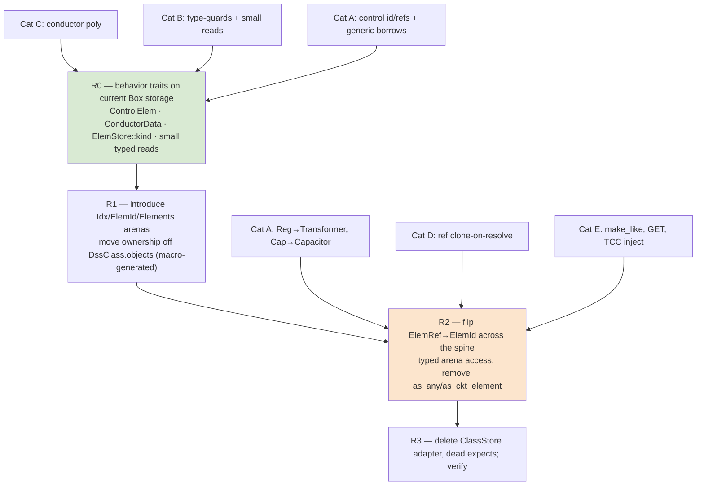

# Plan: De-Pascalize element storage — typed arenas + `enum ElemId`, eliminate downcasting

## Context

The port is idiomatic Rust almost everywhere; the one pervasive Pascal-ism is **dynamic
downcasting** — verified at **306 `downcast_ref`/`downcast_mut`/`as_any` sites across 55
production files** (the draft's "239/52" is a stale undercount). Root cause: every class
stores its objects as a heterogeneous `Vec<Box<dyn DssObject>>` (`exec/registry.rs:16`), so
any code needing a concrete `&Load`/`&mut Transformer` recovers it at runtime via
`as_any().downcast_ref::<T>()`. This **diverges from `PORTING_PLAN.md §2.1`**, which specified
typed `Vec<T>` arenas + `Idx<T>` newtype indices + an `enum ElemId` with match dispatch —
explicitly "no downcast." The implementation took the boxed-trait shortcut; this work package
restores the specified design.

**Decision (user, fixed):** full typed-arena rewrite (remove downcasting *and* `Box`
indirection), scheduled **after the 1:1 port reaches final acceptance** (`PORTING_PLAN §6`),
alongside the `TODO(compat)` sweep — **not during Phase 7**. Behavior is unchanged: the full
suite incl. the unconditional live-oracle `corpus_live` gate stays green at every stage and
**no goldens are regenerated**.

## What exploration confirmed (and corrected vs. the draft)

- **`ElemRef { cls: usize, idx: usize }`** (`elements/traits.rs:15`) is already a tagged
  index; every cross-ref is `Vec<ElemRef>`/`Option<ElemRef>`. The plumbing exists — R2 retypes
  the `cls` tag into an enum variant.
- **Registry blast radius is small and contained:** only ~56 direct `.objects[` accesses,
  almost entirely in `exec/` (`registry` 17, `view` 16, `command` 11, `helpers` 2). The solver
  reaches elements through `ElemStore`/`ElemRef`, not direct indexing — so R2's flip is mostly
  confined to the executive.
- **34 classes are registered in `exec/construct.rs`, and registration order is semantically
  significant** — bare-name `find_ckt_element` and `ForeignClasses` lookups iterate classes in
  registration order and return the first match. **The `Elements` arena layout and any
  iteration over it MUST preserve this order.** This is the single most important invariant the
  macro must encode.
- **`ElemId`/`Elements` must cover ALL 34 classes, not just circuit elements.** General data
  classes (LoadShape, TCC_Curve, Spectrum, WireData/CnData/TsData, LineGeometry, …) also live
  in `DssClass` arenas and are produced as `ElemRef` by object-ref resolution. The draft's
  `ElemId` sketch (circuit classes only) is incomplete.
- **The draft over-claims that R0 "deletes the 67-downcast block" in `dispatch.rs`.** A
  `ControlElem` trait removes the *identification* chain and the generic-controlled-element
  downcasts, but RegControl needs `&mut Transformer` and CapControl needs `&mut Capacitor` —
  those concrete borrows only vanish with typed-arena pair access in **R2**. So dispatch is
  *reduced* in R0 and *emptied* in R2.

## The downcasts fall into four categories — each needs a distinct fix

| # | Category | Sites (approx) | Where | Fix | Stage |
|---|----------|------|-------|-----|-------|
| **A** | Control dispatch | 67 + 4 | `controls/dispatch.rs` | `ControlElem` trait (id + refs + generic-controlled access) **then** typed-arena pair/triple access for Reg→Transformer, Cap→Capacitor | R0 (most) → R2 (last concrete pair) |
| **B** | Meter type-guards & concrete reads | ~50 | `meters/zones/build.rs`, `sampling/{take_sample,allocate}.rs`, `meter/{energymeter,monitor,sensor}/accessors.rs`, `exec/view.rs` | type-guards → `ElemStore::kind(r) -> ElemKind` + `matches!`; concrete reads (line length, load/gen/EM data) → typed `MeterElem`/`CktElement` accessor methods, then typed arena reads | R0 (guards + small reads) → R2 (rest via arena) |
| **C** | Conductor subtype polymorphism | ~13 | `conductor_data/mod.rs`, `line_geometry/{matrix,edit}.rs`, `Line.line_wire_data` (`line/mod.rs:218`) | New **`ConductorData` trait** (or `enum ConductorKind`) with `geom()`/radius/gmr; store `Vec<Option<…>>` as the trait/enum, not `Box<dyn DssObject>` | R0 |
| **D** | Shape/ref clone-on-resolve | ~10 | `set_object_ref` impls in `{load,line,vsource,generator}/accessors.rs` (LoadShape/GrowthShape/etc.) | Hardest. Carry a **typed handle in the resolved object-ref tuple** (`ElemId` instead of bare `&dyn DssObject`); each `set_object_ref` matches the variant it expects and the executive clones the concrete object from the typed arena. Preserve resolve-time snapshot timing (no behavior change) | R2 |
| **E** | `make_like` + misc executive | ~20 | `exec/helpers.rs:280`, `command.rs` (TCC injection, GET) | `make_like` is always same-class → change signature to `make_like(&mut self, other: &Self)` called from a typed arena match (downcast vanishes entirely — better than the draft's `clone_state_from` which keeps an internal downcast and *fails the grep gate*). `command.rs`/`view.rs` GET paths → `ElemId` match arms over typed arenas | R2 |

`clone_box` (`obj/base/mod.rs:508`) is **not** a downcast and need not be removed — but with
typed arenas the two callers (make_like in `helpers.rs`, self-monitoring `mon_clone` in
`dispatch.rs`) become typed clones, so it can be dropped if convenient.

## Target architecture (`PORTING_PLAN §2.1`)

```rust
// crates/dss-core/src/obj/arena.rs  (new)
pub struct Idx<T>(u32, PhantomData<T>);   // stable: OpenDSS never deletes individual
                                          // elements mid-script (Clear drops the whole ckt)
pub enum ElemId {                         // ONE variant per registered class (all 34),
    Line(Idx<Line>), Load(Idx<Load>), Transformer(Idx<Transformer>), /* …ckt… */
    RegControl(Idx<RegControl>), CapControl(Idx<CapControl>), /* …controls… */
    LoadShape(Idx<LoadShapeObj>), TccCurve(Idx<TccCurveObj>), WireData(Idx<WireDataObj>),
    /* …general/data classes… */
}
pub struct Elements { pub lines: Vec<Line>, pub loads: Vec<Load>, /* …one Vec per class… */ }
impl Elements {                           // all match arms generated by ONE macro over the
    fn ckt_elem(&self, id: ElemId) -> &dyn CktElement;          // class list, in reg order
    fn ckt_elem_mut(&mut self, id: ElemId) -> &mut dyn CktElement;
    fn obj(&self, id: ElemId) -> &dyn DssObject;
    fn kind(&self, id: ElemId) -> ElemKind;                     // Category B guards
    fn pair_mut/triple_mut(…);                                  // disjoint borrows by match
    // typed pair getters for dispatch: (&mut RegControl, &mut Transformer), etc.
}
```

`DssObject` loses `as_any`/`as_any_mut`/`as_ckt_element`/`as_ckt_element_mut`. Virtual
dispatch lives on behavior traits: existing `CktElement`, plus new `ControlElem`, `MeterElem`,
`ConductorData`; the arena getters upcast each typed element to the right `&dyn Trait`.

## Dependency shape



R0 and R1 are independently valuable **stop points**: R0 banks ~half the readability win on the
current storage; R1 lands the arenas without yet retyping references. If R2 stalls, the tree is
still a strict improvement.

## Staged execution (each stage ends gate-green; one commit per stage)

**R0 — behavior traits on the current `Box<dyn>` storage (removes ~120 downcasts, no storage change).**
- Add **`ControlElem`** (`elements/control/control_elem.rs`): `ccd()/ccd_mut()` (every control
  already embeds `ccd: ControlElemData`), `control_kind()`, `reset_control_side()`. Rewrite the
  *identification* block in `dispatch.rs:92-161` to `obj.as_control()?.ccd()` + a `control_kind`
  match, deleting the 8-arm `as_any().downcast_ref::<…>()` chain and shrinking the `ControlKind`
  mirror. Generic-controlled controls (Swt/Fuse/Recloser/Relay act through `&mut dyn
  CktElement`) lose their `cobj.as_any_mut().downcast_mut::<Swt…>()` via a `&mut dyn ControlElem`
  acquired from the store. (Reg→Transformer / Cap→Capacitor concrete borrows stay until R2.)
- Add **`ElemStore::kind(r) -> ElemKind`** (returns `DssClass.kind`). Convert the meter
  type-guards in `meters/zones/build.rs` (`is_line`, `is_zone_pce`, `is_pd_element`) and the
  PD/PCE checks in `sampling/{take_sample,allocate}.rs`, `energymeter/accessors.rs` to
  `matches!(store.kind(r), ElemKind::Line)` etc. **Confirmed `ElemKind`'s 12 variants
  (`circuit.rs:44`) match the needed granularity exactly** (Line / Load|Generator|Capacitor|
  Reactor / Line|Transformer|Capacitor|Reactor).
- Add **`ConductorData`** trait over WireData/CnData/TsData (`geom()` + shared accessors);
  retype `Line.line_wire_data` and the `line_geometry`/`conductor_data` resolution to the trait,
  removing those ~13 downcasts.
- Add small typed reads for the remaining concrete-data guards: line length & load/gen power
  on `CktElement`/new `MeterElem` (Monitor mode-2 `present_tap`, generator power-by-phase,
  zone-build line length at `build.rs:214`/load data at `:279`), returning `Option`.

**R1 — introduce `Idx<T>`, `ElemId`, `Elements` behind the current API.**
- New `obj/arena.rs`: `Idx<T>`, `ElemId` (all 34 classes), `Elements` (per-class `Vec<T>`).
  **Drive the arena fields + every match arm (`ckt_elem`/`obj`/`kind`/`pair_mut`/`triple_mut`/
  `find`) from one macro over the class list, emitted in registration order** so class index ==
  variant order, preserving lookup tie-breaking.
- Move ownership from `DssClass.objects: Vec<Box<dyn DssObject>>` into `Elements`. `DssClass`
  keeps metadata only (`props`, `name_to_idx`, `active`, `kind`, `new_object`). The property
  parser keeps a `&mut dyn DssObject` view via `Elements::obj_mut(id)`. `ElemId` may keep a
  `{cls, idx}` shape internally during transition to minimize churn.

**R2 — flip `ElemRef → ElemId` across the spine (compiler-driven, mechanical) and finish A/B/D/E.**
- Replace `ElemRef` with `ElemId` in `elements/traits.rs` (`ElemStore`), `circuit.rs` (all
  per-kind lists), every cross-reference (`controlled_element`, `monitored_element`, shape
  refs), `RefAction`, and `solution/` Y-build + solve loops. Where the class is statically known,
  prefer a typed `Idx<T>` (e.g. Load `daily: Option<Idx<LoadShapeObj>>`) over `ElemId`.
- Add typed arena pair getters so `dispatch.rs` gets `(&mut RegControl, &mut Transformer)` /
  `(&mut CapControl, &mut Capacitor)` by `ElemId` match — emptying Category A.
- **Remove `as_any`/`as_any_mut`/`as_ckt_element`/`as_ckt_element_mut` from `DssObject`.**
  Finish Categories D (typed handle in resolved object-ref tuple; per-class `set_object_ref`
  match; concrete clone pulled from the typed arena, resolve-time timing preserved) and E
  (`make_like(&mut self, other: &Self)` from arena match; `command.rs` TCC injection + `view.rs`
  GET → `ElemId` match arms).

**R3 — delete dead code + verify.** Remove the `ClassStore` boxing adapter, the downcast
`.expect()` assertions, `ControlKind` remnants, and unused helpers (`clone_box` if now unused).
Run the full gate + live oracle + perf check.

## Files to modify (representative — the pattern repeats per class)

- `exec/registry.rs` — `Vec<Box<dyn DssObject>>` + `ClassStore` → typed `Elements` arenas (core cut).
- `obj/arena.rs` *(new)* — `Idx<T>`, `ElemId`, `Elements`, the dispatch macro.
- `elements/traits.rs` — `ElemRef`→`ElemId`; `ElemStore` over arenas; `kind()`; new `MeterElem`.
- `elements/control/control_elem.rs` + `controls/dispatch.rs` — `ControlElem` trait; collapse `ControlKind`.
- `obj/base/mod.rs` — drop `as_any`/`as_ckt_element` from `DssObject`; `make_like(&Self)`.
- `circuit/circuit.rs` — `Vec<ElemRef>` lists → `Vec<ElemId>`.
- `elements/general/conductor_data/mod.rs`, `line_geometry/{matrix,edit}.rs`, `pd/line/mod.rs` — `ConductorData` trait.
- `meters/zones/build.rs`, `sampling/{take_sample,allocate}.rs`, `meter/**/accessors.rs`, `exec/view.rs` — guards → `kind`/trait.
- `exec/{command,helpers}.rs` — TCC injection, GET, `make_like` → typed arena matches.
- every `elements/**/accessors.rs` `set_object_ref`/`make_like` — final downcast removals.

## Risks & fallback

- **Scale (55 files on the storage/dispatch spine).** R0→R3 keeps the build green throughout;
  R0 and R1 are independent stop points (strict improvements even if R2 stalls).
- **Registration-order invariant.** The macro must emit arenas/variants in `construct.rs` order;
  bare-name lookups depend on it. Add a test that asserts `find_ckt_element` tie-breaking is
  unchanged on a fixture with same-named objects across classes.
- **Borrow-checker friction in `pair_mut`/`triple_mut` across arenas** (control + controlled +
  monitored in three Vecs). Same `get_disjoint_mut` disjoint-borrow pattern as today
  (`registry.rs:114-190`), now selected by `ElemId` match; `mem::take` is the documented escape
  hatch for any stubborn flow.
- **Category D timing.** The resolve-time snapshot-clone (`RefSnapshot`, `control_elem.rs:97`)
  is deliberate; keep *when* the clone happens identical — only change the type channel from
  `&dyn DssObject` to a typed `ElemId`/arena clone. Verify via the existing object-ref dump tests.
- **`Idx<T>` invalidation.** Safe only because OpenDSS never deletes individual elements
  mid-script. Document the invariant on `Idx<T>`; `Clear` resets all arenas together.

## Verification

- **Gate at every stage:** `cargo fmt --all --check` · `cargo clippy --workspace --all-targets
  -- -D warnings` · `cargo test --workspace` (includes the unconditional live-oracle
  `corpus_live` comparison — the strongest behavior contract). **No goldens regenerated.**
- **Success metric (add as a CI grep gate in R3):** `rg "downcast_ref|downcast_mut|as_any"
  crates/dss-core/src` returns **zero** matches.
- **Perf check:** re-run the 8500-node solve (`golden_ieee8500.rs` / criterion bench); expect a
  modest improvement from removing per-object boxing, certainly no regression.
- Spot-check `dispatch.rs` and the meter guards read as plain `match`/trait calls — no `Any`.