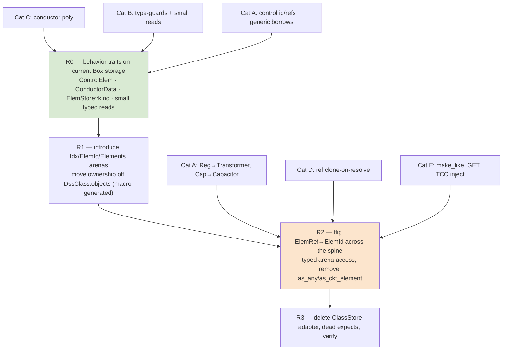

# Plan: De-Pascalize the Rust codebase

Typed arenas + `enum ElemId` (eliminate downcasting) · **index elimination** (flat-offset
arithmetic, 1-based remnants, parallel arrays, sentinels) · integer-constant families →
enums · bitfield → typed flags · borrow hygiene · miette diagnostics · case-fidelity
cleanups · **Stage F: the `oracle-parity` feature split** (idiomatic default build;
bit-compat verification build) **+ F-FMT native report rendering** · a (small) keep list
of genuine product semantics · thread-readiness design constraints. Master ordering across
all plan documents: `PLAN_SEQUENCE.md` (this is stage 5 — it runs after UPGRADE Rungs 1–2,
so Stage F pins **r4133** parity, not r3723).

> **Anchor freshness:** quantitative claims and `file:line` anchors marked
> *(re-verified 2026-07-12)* are current as of that date; everything else is the
> 2026-07-06 audit. The tree keeps moving (UPGRADE Rung 1 added ~16 classes, CIM
> exporters, NCIM). Executors: re-locate by **identifier**, never by line number, and
> re-run the counting greps at WP start — absolute counts only grow until the WP lands,
> which is the point of fixing the architecture.
>
> **Execution status — the plan is COMPLETE (2026-07-31, branch `depas-stagef`).**
> wave 1 (R0 + P1-partial + P2 + P6) merged 2026-07-17 (`e7cfc1e`); the wave-2 v2
> branches (P5a `wt-p5a-v2`, P1b `wt-p1b-v2`, P12+P13 `wt-p1213-v2`, P15 `wt-p15`,
> P9 `wt-p9`) merged 2026-07-19/20 — the old salvage branches `wt-p5a`/`wt-p1b`/
> `wt-p1213` are superseded; R1(+P7) `depas-r1`, P10 `depas-p10`, P11 `depas-p11`,
> P8+P14 `depas-p8p14`, P5b/c `depas-p5bc` merged 2026-07-25; R2 (M3b seam) + R2b
> (a–e) merged 2026-07-25/26; **R3** (store flip + downcast elimination), the P1
> deferred tail, **P3**, and wave 3 (`depas-final`) merged 2026-07-26…29; **Stage F**
> (F.1 seam → F.2 lane test policy → F.3 kernel flips + marker sweep → F.4 F-FMT →
> F.5 lanes/differential gate/docs) executed on `depas-stagef` 2026-07-26…31. Per-WP
> status markers below; full records in `STATUS.md` +
> `docs/phase-records/depascalize-*.md`. The three items the plan hands **forward**
> (they are not open plan work): the `HIDE_015X` retirement bundle → `UPGRADE_PLAN`
> §5, the four `WholeCase` default-lane exclusions → whoever grants that policy, the
> three wasm-guest markers → `WASM_USERMODELS_PLAN`. Each is gated by a test today
> (see §Verification).

Companion: `MULTITHREADING_PLAN.md` (Phase 9 parallelism). This plan's job is to make sure
the de-Pascalized architecture is the one that plan builds on.

## Scheduling & golden policy (user decision, 2026-07-06 — supersedes the earlier
"no goldens regenerated" scoping)

All of this runs **after the 1:1 port reaches final acceptance** (`PORTING_PLAN §6` —
**executed 2026-07-11, referee ACCEPT**; per `PLAN_SEQUENCE` this plan is stage 5, after
UPGRADE Rungs 1–2 — **UPGRADE COMPLETE 2026-07-17**, both rungs exited, so Stage F's
parity target is r4133 as planned). At that
point the porting rules ("Pascal is the spec", "port loop-for-loop where numerics matter")
**no longer bind** — this is refactoring of an accepted engine, and **byte-exact goldens may
be deliberately regenerated**. Two contracts survive acceptance and still constrain every
stage:

1. **The live oracle is not regenerable.** `corpus_live` compares the Rust engine against
   pinned dss-python *live*, under calibrated tolerance floors (`tests/TOLERANCE_NOTES.md`).
   *(Since UPGRADE WP-U0 the oracle is per-case: the manifest `oracle` field selects the
   pinned 0.14.5 backend, `capi015`, or an Oddie target-rev engine — by the time this plan
   runs, post-Rung-2, the parity target is r4133 per `UPGRADE_PLAN §5`/`PLAN_SEQUENCE`.)*
   Any refactor that changes floating-point results must stay inside those floors — or come
   with the empirical decomposition proof the `CLAUDE.md` rules demand. No fudging: a
   tolerance is never loosened to admit a refactor. (The only exceptions are Stage F's
   **documented deliberate divergences** — its dual-kernel table — which are excluded from
   oracle comparison field-by-field and pinned by expected-value tests instead.)
2. **Committed byte-exact goldens are the cheapest equivalence oracle we will ever have.**
   A refactor that preserves arithmetic exactly (same operations, same order) is *proven*
   equivalent by the existing goldens for free. Therefore: **bit-neutral refactors run
   FIRST, against the existing goldens; arithmetic-changing refactors run LAST, inside
   Stage F's feature split (Part IV) — which absorbs and supersedes the `TODO(compat)`
   "wipe-out" sweep of `PORTING_PLAN §6`.**

Available but not a contract: the opt-in **official-EPRI-binary oracle**
(`tools/opendss/`, Oddie bridge, r3723/r4088/r4133, added 2026-07-07) — a third
reference for settling "is this dss_capi-specific or upstream?" questions during
Stage F's dual-kernel table work (`ab_compare.py --a capi --b oddie:r3723`). It
gates nothing here; the pinned dss-python oracle remains the parity-lane spec.

Every work package is tagged with a stratum:

- **[A] bit-neutral** — same arithmetic, same order; existing goldens must stay green
  unchanged. (Iterator/`chunks_exact` rewrites, typed views, `Vec<struct>` re-layouts,
  0-basing, `Option`-ification, enum-ification.)
- **[C] arithmetic-changing** — accumulation order or algorithms change. Lands in
  **Stage F** (Part IV): the idiomatic kernel becomes the **default build**, the
  bit-compat kernel moves behind `#[cfg(feature = "oracle-parity")]`, and only the default
  lane re-baselines. Nothing is deleted, so 1:1 verifiability against the pinned oracle
  never rots.

## Source-integrity gate — ritual step 0 (before the model-tier check)

The Pascal we port FROM — `.inputs/dss_capi` (186 `.pas` files), plus
`.inputs/electricdss-tst` for oracle/live work — is the **specification**. Before doing
anything, and re-checked continuously (not only at kickoff), confirm that folder exists
and is non-empty. If it has vanished — missing or empty — at **any** point in the work,
**STOP immediately**: make no edits, run no gate, and do **not** reconstruct, guess, or
"port" a source you cannot read. Tell the user the vendored source is gone and must be
re-vendored, then wait. Reply exactly:
**«Исходник порта (`.inputs/dss_capi`) отсутствует или пуст — работа остановлена. Восстанови
vendored-исходник (re-vendor) и повтори команду.»**
No spec → nothing to port; fabricating one from memory is a silent, unverifiable
divergence — far worse than stopping. This gate runs **ahead of the tier/refuse check**
(`PLAN_SEQUENCE.md` §Model-tier protocol).

## Per-step ritual (every WP/stage, in order, autonomously — the `PHASE8_PLAN` discipline)

0. **Tier check (before touching anything)** — look up this WP's **exec tier** in the
   difficulty table below and compare against the session (model name is in your system
   prompt; if the effort level is not visible to you, ask the user to confirm it — always
   confirm for `opus-xhigh` stages). Below tier → do NOT execute; reply exactly:
   «Этот шаг требует <exec tier>. Переключи сессию (/model + reasoning effort) и повтори
   команду.» and stop. (Protocol defined in `PLAN_SEQUENCE.md`.)
1. **Gate green** — `cargo fmt --all --check` · `cargo clippy --workspace --all-targets
   -- -D warnings` · `cargo test --workspace` (all goldens + the always-on live corpus
   gate). **After Stage F lands: both lanes** (default and `--features oracle-parity`) +
   the parity↔default differential job. No `#[ignore]`, no name-filter that greens on zero
   matches; a red test blocks the commit.
2. **Update `STATUS.md`** (frontier + phase record), **commit** (code + STATUS together).
3. **`/audit-code` + `/audit-tests` in parallel** — two fresh independent agents (never
   forks), **spawned with an explicit model/effort override matching this WP's audit tier
   from the table below** (never "whatever the session runs"). Each gets a self-contained
   brief: the step's commit range, the diff, the relevant plan Part/WP, and the binding
   rules (stratum [A] = goldens byte-identical / Stage F = lane discipline; the Part IV
   keep list; no tolerance fudging). Settle every finding empirically; a finding
   deliberately not fixed is recorded in STATUS, never dropped; re-run the gate, commit.
4. **`STATUS.md` full review** — sync whatever the step made stale, archive dead weight to
   `docs/phase-records/`; `docs:` commit if anything changed (gate re-run first).
5. **Only now stop** and report in Russian (code/identifiers/commits/STATUS stay English):
   what landed, audit findings and how they were settled, gate status (per lane once
   Stage F exists), next step.

## Executor guidance (difficulty map, forbidden moves, escape protocol)

This plan is written to be executable by a mid-tier model. Difficulty map — where to slow
down and where mechanical execution is enough:

| Stage | Exec tier | Audit tier | Executor notes |
|---|---|---|---|
| R0, R3, Part II (P1/P2/P6/P7), P3 | opus-medium+ | opus-high+ | compiler-guided; each WP names its pattern and pinning tests — follow them literally |
| P5 (miette diagnostics) | opus-medium+ (**P5b spans: opus-high+**) | opus-high+ | P5a is compiler-driven churn over the 163 push sites + one sanctioned text-golden re-baseline; P5b needs care only around token-span recording and the Redirect/Compile `origin` naming — follow the scope rule (one command line = one source) literally |
| **R1** | **opus-xhigh** | **opus-xhigh** | follow the macro sketch below **literally**; land as two commits (arena types first, ownership flip second). If the macro fights: **hand-writing the 34 match arms behind the same API is the sanctioned fallback** — the macro is a convenience, not a requirement |
| R2 | opus-high+ | opus-high+ | flip one class/cross-ref cluster at a time; the build must compile between clusters; `pair_mut`-style disjoint borrows, `mem::take` as escape hatch |
| Part III P8/P9/P11/P12/P13/P14 | opus-medium+ | opus-high+ | bit-neutrality: after each rewritten file, run that WP's named pinning tests; a failing golden means *your* rewrite changed arithmetic |
| P10 (transformer core) | opus-high+ | opus-high+ | densest index math in the tree; same bit-neutrality invariant |
| P15 | opus-high+ (**item 2: opus-xhigh**) | opus-high+ (item 2: xhigh) | the dedup-mapping cache + its invalidation is the subtle part; everything else follows the file:line list; checkpoint Y goldens are the bit-exact proof |
| **Stage F** | **opus-xhigh** | **opus-xhigh** | follow the compat sketch below; Part IV.2's dual-kernel table is the closed list of **shared arithmetic kernels** — do not invent new ones. Per-site upstream quirks are a different class, governed by `PORTING_PLAN.md` §4.1 rule 4, and are counted mechanically by `SPLIT_ALIAS_POPULATION` |

Tier vocabulary and the step-0 refuse protocol: `PLAN_SEQUENCE.md` §Model-tier protocol.

*(Tier status note, 2026-07-26 — not a protocol change: R3 as re-scoped by the R2b
handoff inherits R2's escaped store-flip/category work, so it is executed at
**opus-high+** with opus-high+ audits — above its original opus-medium+ row; see
STATUS §"R3 handoff".)*

**Forbidden moves (hard rules; violating any one = stop, revert the change, record in STATUS):**
1. Never regenerate any golden in an [A] stage. (Single sanctioned exception: P5's
   error-**text** goldens/asserts — user decision 2026-07-12, text only, once; numeric
   goldens still never.)
2. Never loosen any tolerance, anywhere, for any reason.
3. Never reorder floating-point accumulation "because it's cleaner" — order changes are
   Stage F's job, behind the feature.
4. Never write `#[cfg(feature = "oracle-parity")]` outside the `compat` modules.
5. Never delete a compat kernel or a `TODO(compat)` site outside Stage F.
6. Never change class registration order or any Part IV.1 semantic order.
7. Never introduce `Rc`/`RefCell`/`Mutex`/statics (Part V; P7's grep gate enforces it).

**When stuck (escape protocol — do NOT improvise a new design):** if a downcast site
doesn't fit its category (A–E), a rewrite can't be made bit-neutral, or a borrow fight
survives `pair_mut`/`mem::take` — leave the old code in place (gate stays green), record
the site + blocker in `STATUS.md`, finish the WP's remaining sites, and surface the list at
the stop point for the user to decide.

**R1 macro sketch (the one hard artifact — follow literally):**

```rust
// obj/arena.rs — ONE class list, in exec/construct.rs registration order (invariant!).
macro_rules! with_all_classes { ($m:ident) => { $m! {
    //  variant     field          concrete type
    (Line,        lines,         Line),
    (Load,        loads,         Load),
    (Transformer, transformers,  Transformer),
    /* … one row per registered class — ALL of them (50 as of 2026-07-12; recount
       against construct.rs at execution), registration order … */
} } }
// ONE consumer macro expands that list into: `enum ElemId`, `struct Elements`,
// and every impl (ckt_elem/ckt_elem_mut/obj/obj_mut/kind/find/pair_mut) as match arms.
// Mandatory test: ElemId variant order == construct.rs registration order
// (assert via a generated `ElemId::CLASS_NAMES` array compared to the registry).
```

**Stage F compat sketch (the alias pattern — both impls always compiled):**

```rust
// dss-core/src/compat.rs — the ONLY file in the crate allowed to contain the cfg string.
pub fn cdiv_fpc_impl(a: Complex64, b: Complex64) -> Complex64 { /* Smith, moved as-is */ }
pub fn cdiv_std_impl(a: Complex64, b: Complex64) -> Complex64 { a / b }
#[cfg(feature = "oracle-parity")]      pub use cdiv_fpc_impl as cdiv;
#[cfg(not(feature = "oracle-parity"))] pub use cdiv_std_impl as cdiv;
// Same alias pattern for: round_i32, PI, stddev_single_point, SymComp variant,
// the two bug-fix branches, the solver Par/refinement knobs (dss-sparse), and the
// F-FMT rendering seam (compat::g / compat::g_w / … — parity = fmt_g family as-is,
// default = plain format!; see Part IV.2 §F-FMT).
// Unit tests call BOTH `_impl`s directly and assert the documented bound — in any build.
```

---

# Part I — Element storage: typed arenas + `ElemId`, eliminate downcasting [A]

## Context

The port is idiomatic Rust almost everywhere; the one pervasive Pascal-ism is **dynamic
downcasting** — **740 `downcast_ref`/`downcast_mut`/`as_any` sites across 105 production
files** *(re-verified 2026-07-12; the 2026-07-06 audit's 306/55 predates the UPGRADE/CIM
waves — the count grows with every ported class, which is exactly why the architecture,
not the sites, is the fix)*. Root cause: every class stores its objects as a heterogeneous
`Vec<Box<dyn DssObject>>` (`exec/registry.rs:16`), so
any code needing a concrete `&Load`/`&mut Transformer` recovers it at runtime via
`as_any().downcast_ref::<T>()`. *(Progress re-verified 2026-07-26 @ `update` `67d2965`,
after R0–R2b: **369 `downcast_ref|downcast_mut` sites / 73 files** remain (364
production + 5 test-context — the R3 collapse target), **716 `as_any|as_ckt_element`
hits / 134 files**, `fn as_any`/`fn as_any_mut` defs 52+52; ownership already moved to
the typed `Elements` arenas in R1, so the remaining downcasts are access-path, not
storage.)* This **diverges from `PORTING_PLAN.md §2.1`**, which specified
typed `Vec<T>` arenas + `Idx<T>` newtype indices + an `enum ElemId` with match dispatch —
explicitly "no downcast." The implementation took the boxed-trait shortcut; this work package
restores the specified design.

## What exploration confirmed (and corrected vs. the draft)

- **`ElemRef { cls: usize, idx: usize }`** (`elements/traits.rs:18`) is already a tagged
  index; every cross-ref is `Vec<ElemRef>`/`Option<ElemRef>`. The plumbing exists — R2 retypes
  the `cls` tag into an enum variant.
- **Registry blast radius** *(re-verified 2026-07-12)*: **262 direct `.objects[` accesses**,
  concentrated in the executive **and the CIM exporters** — `cim/export.rs` 48,
  `exec/command.rs` 23, `exec/reduce.rs` 22, `exec/report.rs` 17, `cim/ieee1547.rs` 14,
  `exec/registry.rs` 12, `cim/power_xfmr.rs` 12, `exec/view.rs` 11, `exec/save_circuit.rs`
  10 (the 2026-07-06 "~56, almost entirely exec/" is stale — CIM landed since). The solver
  still reaches elements through `ElemStore`/`ElemRef`, not direct indexing — R2's flip is
  confined to the executive + report/CIM layer, never the solve loops. *(Post-R1
  re-measure 2026-07-26: `.objects[` = **1 site** — storage lives in the typed arenas;
  the former direct readers go through the arena API and are counted in the 369 downcasts
  above.)*
- **50 classes are registered in `exec/construct.rs`** (`:17-316`, *re-verified 2026-07-12*;
  the 2026-07-06 "34" predates WindGen/AutoTrans/the upgrade waves — **recount at R1
  execution**), **and registration order is semantically significant** — bare-name
  `find_ckt_element` and `ForeignClasses` lookups iterate classes in registration order and
  return the first match. **The `Elements` arena layout and any iteration over it MUST
  preserve this order.** This is the single most important invariant the macro must encode.
- **`ElemId`/`Elements` must cover ALL registered classes, not just circuit elements.**
  General data classes (LoadShape, TCC_Curve, Spectrum, WireData/CnData/TsData,
  LineGeometry, …) also live in `DssClass` arenas and are produced as `ElemRef` by
  object-ref resolution. The draft's `ElemId` sketch (circuit classes only) is incomplete.
- **The draft over-claims that R0 "deletes the 67-downcast block" in `dispatch.rs`.** A
  `ControlElem` trait removes the *identification* chain and the generic-controlled-element
  downcasts, but RegControl needs `&mut Transformer` and CapControl needs `&mut Capacitor` —
  those concrete borrows only vanish with typed-arena pair access in **R2**. So dispatch is
  *reduced* in R0 and *emptied* in R2.

## The downcasts fall into four categories — each needs a distinct fix

| # | Category | Sites (approx) | Where | Fix | Stage |
|---|----------|------|-------|-----|-------|
| **A** | Control dispatch | 67 + 4 | `controls/dispatch.rs` | `ControlElem` trait (id + refs + generic-controlled access) **then** typed-arena pair/triple access for Reg→Transformer, Cap→Capacitor | R0 (most) → R2 (last concrete pair) |
| **B** | Meter type-guards & concrete reads | ~50 | `meters/zones/build.rs`, `sampling/{take_sample,allocate}.rs`, `meter/{energymeter,monitor,sensor}/accessors.rs`, `exec/view.rs` | type-guards → `ElemStore::kind(r) -> ElemKind` + `matches!`; concrete reads (line length, load/gen/EM data) → typed `MeterElem`/`CktElement` accessor methods, then typed arena reads | R0 (guards + small reads) → R2 (rest via arena) |
| **C** | Conductor subtype polymorphism | ~13 | `conductor_data/mod.rs`, `line_geometry/{matrix,edit}.rs`, `Line.line_wire_data` (`line/mod.rs:218`) | New **`ConductorData` trait** (or `enum ConductorKind`) with `geom()`/radius/gmr; store `Vec<Option<…>>` as the trait/enum, not `Box<dyn DssObject>` | R0 |
| **D** | Shape/ref clone-on-resolve | ~10 | `set_object_ref` impls in `{load,line,vsource,generator}/accessors.rs` (LoadShape/GrowthShape/etc.) | Hardest. Carry a **typed handle in the resolved object-ref tuple** (`ElemId` instead of bare `&dyn DssObject`); each `set_object_ref` matches the variant it expects and the executive clones the concrete object from the typed arena. Preserve resolve-time snapshot timing (no behavior change) | R2 |
| **E** | `make_like` + misc executive | ~20 | `exec/helpers.rs:280`, `command.rs` (TCC injection, GET) | `make_like` is always same-class → change signature to `make_like(&mut self, other: &Self)` called from a typed arena match (downcast vanishes entirely — better than the draft's `clone_state_from` which keeps an internal downcast and *fails the grep gate*). `command.rs`/`view.rs` GET paths → `ElemId` match arms over typed arenas | R2 |

`clone_box` (`obj/base/mod.rs:881`, *re-verified 2026-07-12*) is **not** a downcast and need not be removed — but with
typed arenas the two callers (make_like in `helpers.rs`, self-monitoring `mon_clone` in
`dispatch.rs`) become typed clones, so it can be dropped if convenient.

*(Category-count note, 2026-07-12: the per-category site counts above are the 2026-07-06
audit's relative shares. The absolute population has since grown to 740 — chiefly the CIM
exporters (`cim/{export,ieee1547,power_xfmr}.rs`, WPG.18) and `exec/reduce.rs`, whose
concrete reads are Category B/E patterns (typed reads / `ElemId` match over arenas). The
category taxonomy and fixes are unchanged; only the blast radius is bigger.)*

*(Category status, 2026-07-26: **A** — identification chain + generic-controlled borrows
done in R0; the Reg→Transformer / Cap→Capacitor pair/triple borrows (28 sites) wait on
R3's typed pair getters. **B** — `kind()` guards + small typed reads done in R0; the
disjoint-borrow meter reads wait on R3. **C** — the `ConductorData` trait landed in R0,
but the snapshot **storage** is still `Box<dyn DssObject>`-owned
(`line_geometry/mod.rs` `fwiredata`/`line_spacing_obj`, `line/accessors.rs`
`line_wire_data`) — the retype is R3-handoff item 4; without it the Part I
owned-`Box<dyn DssObject>` grep gate cannot close. **D** — untouched; waits on R3's
typed resolved-object handle. **E** — CLOSED by R2b (c): all 50 `make_like` bodies are
inherent typed fns, the trait method removed, downcasts 416→369; `clone_box` stays live
(conductor snapshots + dispatch `mon_clone`) pending item 4. The 364-production-downcast
file-by-file blocker map lives in STATUS §R2b sub-step (e).)*

## Target architecture (`PORTING_PLAN §2.1`)

```rust
// crates/dss-core/src/obj/arena.rs  (new)
pub struct Idx<T>(u32, PhantomData<T>);   // stable: OpenDSS never deletes individual
                                          // elements mid-script (Clear drops the whole ckt)
pub enum ElemId {                         // ONE variant per registered class (all 50),
    Line(Idx<Line>), Load(Idx<Load>), Transformer(Idx<Transformer>), /* …ckt… */
    RegControl(Idx<RegControl>), CapControl(Idx<CapControl>), /* …controls… */
    LoadShape(Idx<LoadShapeObj>), TccCurve(Idx<TccCurveObj>), WireData(Idx<WireDataObj>),
    /* …general/data classes… */
}
pub struct Elements { pub lines: Vec<Line>, pub loads: Vec<Load>, /* …one Vec per class… */ }
impl Elements {                           // all match arms generated by ONE macro over the
    fn ckt_elem(&self, id: ElemId) -> &dyn CktElement;          // class list, in reg order
    fn ckt_elem_mut(&mut self, id: ElemId) -> &mut dyn CktElement;
    fn obj(&self, id: ElemId) -> &dyn DssObject;
    fn kind(&self, id: ElemId) -> ElemKind;                     // Category B guards
    fn pair_mut/triple_mut(…);                                  // disjoint borrows by match
    // typed pair getters for dispatch: (&mut RegControl, &mut Transformer), etc.
}
```

`DssObject` loses `as_any`/`as_any_mut`/`as_ckt_element`/`as_ckt_element_mut`. Virtual
dispatch lives on behavior traits: existing `CktElement`, plus new `ControlElem`, `MeterElem`,
`ConductorData`; the arena getters upcast each typed element to the right `&dyn Trait`.

## Dependency shape



R0 and R1 are independently valuable **stop points**: R0 banks ~half the readability win on the
current storage; R1 lands the arenas without yet retyping references. If R2 stalls, the tree is
still a strict improvement.

## Staged execution (each stage ends gate-green; one commit per stage)

**R0 — behavior traits on the current `Box<dyn>` storage (removes ~120 downcasts, no storage change).**
**[LANDED — wave 1 (`wt-r0`), merged `e7cfc1e` 2026-07-17; downcasts 766→699; record
`docs/phase-records/depascalize-r0.md`.]**
- Add **`ControlElem`** (`elements/control/control_elem.rs`): `ccd()/ccd_mut()` (every control
  already embeds `ccd: ControlElemData`), `control_kind()`, `reset_control_side()`. Rewrite the
  *identification* block in `dispatch.rs:134-204` *(re-verified 2026-07-12; now a 10-arm
  chain — Reg/Cap/Swt/Fuse/Recloser/Relay/GenDispatcher/StorageController/Inv/ExpControl)*
  to `obj.as_control()?.ccd()` + a `control_kind`
  match, deleting the `as_any().downcast_ref::<…>()` chain and shrinking the `ControlKind`
  mirror. Generic-controlled controls (Swt/Fuse/Recloser/Relay act through `&mut dyn
  CktElement`) lose their `cobj.as_any_mut().downcast_mut::<Swt…>()` via a `&mut dyn ControlElem`
  acquired from the store. (Reg→Transformer / Cap→Capacitor concrete borrows stay until R2.)
- Add **`ElemStore::kind(r) -> ElemKind`** (returns `DssClass.kind`). Convert the meter
  type-guards in `meters/zones/build.rs` (`is_line`, `is_zone_pce`, `is_pd_element`) and the
  PD/PCE checks in `sampling/{take_sample,allocate}.rs`, `energymeter/accessors.rs` to
  `matches!(store.kind(r), ElemKind::Line)` etc. **Confirmed `ElemKind`'s 12 variants
  (`circuit.rs:44`) match the needed granularity exactly** (Line / Load|Generator|Capacitor|
  Reactor / Line|Transformer|Capacitor|Reactor).
- Add **`ConductorData`** trait over WireData/CnData/TsData (`geom()` + shared accessors);
  retype `Line.line_wire_data` and the `line_geometry`/`conductor_data` resolution to the trait,
  removing those ~13 downcasts.
- Add small typed reads for the remaining concrete-data guards: line length & load/gen power
  on `CktElement`/new `MeterElem` (Monitor mode-2 `present_tap`, generator power-by-phase,
  zone-build line length at `build.rs:214`/load data at `:279`), returning `Option`.

**R1 — introduce `Idx<T>`, `ElemId`, `Elements` behind the current API.**
**[LANDED — branch `depas-r1`, merged `6c99b8f` 2026-07-25, incl. the P7 rider
(`assert_send::<Dss>()` + `assert_send::<Elements>()` in `lib.rs`); STATUS
§DE_PASCALIZE R1.]**
- New `obj/arena.rs`: `Idx<T>`, `ElemId` (every registered class — 50 as of 2026-07-12),
  `Elements` (per-class `Vec<T>`).
  **Drive the arena fields + every match arm (`ckt_elem`/`obj`/`kind`/`pair_mut`/`triple_mut`/
  `find`) from one macro over the class list, emitted in registration order** so class index ==
  variant order, preserving lookup tie-breaking.
- Move ownership from `DssClass.objects: Vec<Box<dyn DssObject>>` into `Elements`. `DssClass`
  keeps metadata only (`props`, `name_to_idx`, `active`, `kind`, `new_object`). The property
  parser keeps a `&mut dyn DssObject` view via `Elements::obj_mut(id)`. `ElemId` may keep a
  `{cls, idx}` shape internally during transition to minimize churn.
- **Thread-readiness rider (P7, cheap here):** add `Send` supertraits on
  `DssObject`/`CktElement`/`ElemStore` and a compile-time `assert_send::<Dss>()` — see
  Part V. Every concrete element is plain owned data, so this compiles with no data changes.

**R2 — flip `ElemRef → ElemId` across the spine (compiler-driven, mechanical) and finish A/B/D/E.**
**[PARTIAL → carried by R2b/R3: R2 (`depas-r2`) landed only the M3b seam (item below,
`2ed12d3`, 2026-07-25) — the flip + categories proved one-session-infeasible gate-green
and were escape-recorded. R2b (`depas-r2b`, a–e, merged `a7fb7b3` 2026-07-26) then
landed the `ElemId::from_ref`/`From` bridges, **Category E `make_like` in full** (trait
method removed, downcasts 416→369) and the arena ckt/data tag (`try_ckt_elem*`), and
produced the definitive R3 handoff: the store flip is the single remaining prerequisite
that unblocks A/B/D and both trait-method removals. See STATUS §§R2/R2b.]**
- Replace `ElemRef` with `ElemId` in `elements/traits.rs` (`ElemStore`), `circuit.rs` (all
  per-kind lists), every cross-reference (`controlled_element`, `monitored_element`, shape
  refs), `RefAction`, and `solution/` Y-build + solve loops. Where the class is statically known,
  prefer a typed `Idx<T>` (e.g. Load `daily: Option<Idx<LoadShapeObj>>`) over `ElemId`.
- Add typed arena pair getters so `dispatch.rs` gets `(&mut RegControl, &mut Transformer)` /
  `(&mut CapControl, &mut Capacitor)` by `ElemId` match — emptying Category A.
- **Remove `as_any`/`as_any_mut`/`as_ckt_element`/`as_ckt_element_mut` from `DssObject`.**
  Finish Categories D (typed handle in resolved object-ref tuple; per-class `set_object_ref`
  match; concrete clone pulled from the typed arena, resolve-time timing preserved) and E
  (`make_like(&mut self, other: &Self)` from arena match; `command.rs` TCC injection + `view.rs`
  GET → `ElemId` match arms).
- **Thread-readiness rider (while signatures are open anyway):** split PC-element injection
  into `compute_inj_currents(&mut self, sys, node_v)` (fills the element-owned
  `cd.inj_current`) + a caller-side sequential scatter into `sol.currents`, and replace the
  shared `system_y_changed: &mut bool` in `InjCtx` with a per-element return flag OR-ed by the
  caller. Behavior identical (same order, same sums); this is the exact seam
  `MULTITHREADING_PLAN.md` M3b parallelizes later. Do it in R2 so signatures churn once.
  **(LANDED 2026-07-25, commit `2ed12d3` — the delivered slice of the first R2 session; see
  Part V §"Per-class arena iteration" for the seam-state inventory and the rule for cutting
  further seams.)**

**R3 — the store flip + downcast elimination + closeout (re-scoped 2026-07-26 by the
R2b handoff; IN FLIGHT in worktree `depas-r3`).** R2's escaped items 1–6 moved here, so
R3 now owns the whole Part I endgame, in sequence (STATUS §"R3 handoff"):
1. the `ElemRef → ElemId` **store flip** across the spine (~427 all-or-nothing consumer
   sites / ~55 files, staged via the R2b `from_ref`/`to_ref` bridges: `circuit.rs`
   per-kind lists → `RefAction.target` → cross-refs → statically-known `Idx<T>` shape
   refs → the access layer, which retires the bridges);
2. typed arena accessors (`get::<T>`/`get_mut::<T>`, no `Any`) + Category-A typed
   pair/triple getters + the Category-D typed resolved-object handle (resolve-time
   snapshot timing preserved) + the `generator_mut`-family typed matches + Category-B
   meter reads;
3. the mechanical collapse of the 364 production downcasts + ~174 `as_ckt_element*`
   sites, then removal of `as_any`/`as_any_mut` **and** `as_ckt_element`/
   `as_ckt_element_mut` from `DssObject` (52+52 defs);
4. the Category-C conductor-snapshot storage retype (`fwiredata`/`line_spacing_obj`/
   `line_wire_data` → typed snapshots) + the original R3 dead-code sweep — `ClassStore`
   boxing adapter, downcast `.expect()` assertions, `ControlKind` remnants, unused
   helpers (`clone_box` if now unused) — and the Part I grep-gate closure.
Run the full gate + live oracle + perf check.

## Files to modify (representative — the pattern repeats per class)

- `exec/registry.rs` — `Vec<Box<dyn DssObject>>` + `ClassStore` → typed `Elements` arenas (core cut).
- `obj/arena.rs` *(new)* — `Idx<T>`, `ElemId`, `Elements`, the dispatch macro.
- `elements/traits.rs` — `ElemRef`→`ElemId`; `ElemStore` over arenas; `kind()`; new `MeterElem`.
- `elements/control/control_elem.rs` + `controls/dispatch.rs` — `ControlElem` trait; collapse `ControlKind`.
- `obj/base/mod.rs` — drop `as_any`/`as_ckt_element` from `DssObject`; `make_like(&Self)`.
- `circuit/circuit.rs` — `Vec<ElemRef>` lists → `Vec<ElemId>`.
- `elements/general/conductor_data/mod.rs`, `line_geometry/{matrix,edit}.rs`, `pd/line/mod.rs` — `ConductorData` trait.
- `meters/zones/build.rs`, `sampling/{take_sample,allocate}.rs`, `meter/**/accessors.rs`, `exec/view.rs` — guards → `kind`/trait.
- `exec/{command,helpers}.rs` — TCC injection, GET, `make_like` → typed arena matches.
- `cim/{export,ieee1547,power_xfmr}.rs`, `exec/{reduce,save_circuit}.rs` — concrete
  reads → typed arena matches (post-2026-07-06 additions; largest new `.objects[` users).
- every `elements/**/accessors.rs` `set_object_ref`/`make_like` — final downcast removals.

## Risks & fallback

- **Scale (55 files on the storage/dispatch spine).** R0→R3 keeps the build green throughout;
  R0 and R1 are independent stop points (strict improvements even if R2 stalls).
- **Registration-order invariant.** The macro must emit arenas/variants in `construct.rs` order;
  bare-name lookups depend on it. Add a test that asserts `find_ckt_element` tie-breaking is
  unchanged on a fixture with same-named objects across classes.
- **Borrow-checker friction in `pair_mut`/`triple_mut` across arenas** (control + controlled +
  monitored in three Vecs). Same `get_disjoint_mut` disjoint-borrow pattern as today
  (`registry.rs:114-190`), now selected by `ElemId` match; `mem::take` is the documented escape
  hatch for any stubborn flow.
- **Category D timing.** The resolve-time snapshot-clone (`RefSnapshot`, `control_elem.rs:97`)
  is deliberate; keep *when* the clone happens identical — only change the type channel from
  `&dyn DssObject` to a typed `ElemId`/arena clone. Verify via the existing object-ref dump tests.
- **`Idx<T>` invalidation.** Safe only because OpenDSS never deletes individual elements
  mid-script. Document the invariant on `Idx<T>`; `Clear` resets all arenas together.
- **WASM_USERMODELS overlap.** `WASM_USERMODELS_PLAN` (PLAN_SEQUENCE stage 9, early-start
  allowed) adds thin per-element hooks; if it lands before R2, the arena flip re-touches
  those hooks — cheap and expected (PLAN_SEQUENCE early-start note), not a conflict.

---

# Part II — Constants, flags, borrows, errors (WPs P1–P7) [A]

A full-codebase sweep (2026-07-06; five parallel audits over `crates/*/src`) found the
following non-downcast Pascal patterns. Each WP below is independent of Part I unless noted
and lands gate-green in one commit.

## P1 — Integer-constant families → enums

**[PARTIAL: wave 1 (`wt-p1`) converted 7 families (`DynSolveMode`, `AddType`,
`SolveAlgorithm`, `LoadStatus`, `StorageDispatchMode`, `CoreType`, `LineType`); P1b
(`wt-p1b-v2`) closed the control trio (Relay/CapControl `control_type`, RegControl
action codes); `Winding.connection` was closed by P10 (`Connection` enum + `TermRef`).
The deferred tail — Solution `control_mode`/`load_model`/`random_type`, the InvControl
family, Storage `f_state` + StorageController via the control-queue i32 channel, DER
`var_mode`, the item-7 element families (Generator `dispatch_mode`, PVSystem var-mode,
ExpControl pending, ESPVLControl `f_type`, LoadShape interp), the remaining bare-i32
DssEnum fields, `MonPhase`, Tier-2 — is enumerated in
`docs/phase-records/depascalize-p1.md` §Deferred and remains a P1-continuation WP
(re-measured 2026-07-26: 7 `pub const …: i32` lines left in `elements/`).]**

**Finding.** Beyond the enums already done right (`SolveMode` in
`solution/solution/state.rs:19` (path *re-verified 2026-07-12* — the module was split;
`state.rs` anchors below mean this file) with
explicit discriminants + `ordinal()`/`from_ordinal`; `PropType`; `ElemKind`; `LoadModel`;
`Connection`; …), ~20 mode/state families remain **raw `i32` fields + `pub const` chains**,
compared inline and (for controls) dispatched through long if-else chains. The key boundary:
every such ordinal round-trips string↔i32 through the `DssEnum` registry
(`obj/dss_enum/enum_def.rs:69/111`) for `Set`/`?`/dump — so the numeric values are
**user-visible and frozen**, but the *storage type inside the engine* is free.

**Pattern (one per family):** `#[repr(i32)] enum … { Variant = <pinned ordinal>, … }` with
`ordinal(self) -> i32` / `from_ordinal(i32) -> Option<Self>` exactly like `SolveMode`; the
struct field becomes the enum; `i32` survives only at the DssEnum/property parse+report
boundary. Non-contiguous families (Relay has a gap at 2; StorageController has
`RELEASE_INHIBIT = 999`) get explicit discriminants — never derived ordinals.

**Tier 1 — user/golden-visible ordinals (explicit discriminants + boundary conversion):**

| Family | Today | Notes |
|---|---|---|
| Solution `load_model` (`POWERFLOW=1/ADMITTANCE=2`), `algorithm` (`NORMALSOLVE/NEWTONSOLVE`), `control_mode` (`CONTROLSOFF=-1..MULTIRATE=3`), `random_type` | `state.rs:74-86,114,153`, raw `i32` consts + fields | compared inline at `power_flow.rs:230,241`, `sampling.rs:15`, `set_mode.rs:136-147` |
| InvControl `control_mode` (0..6=AVR), `combi_mode`, RoC codes, pending-change (0..4), reac-power-ref | `inv_control/mod.rs:52-90` | the worst if-else chains: `compute.rs:380,1105-1130,1808,1908-1975,2275,2308` |
| Storage `f_state` (`-1/0/1`), `dispatch_mode` (0..4), var-mode | `storage/mod.rs:59-72,306,330` | |
| StorageController discharge/charge modes (1..9, 999) + `fleet_state` | `storage_controller/mod.rs:66-82,224-372` | non-contiguous |
| Relay `control_type` (0..9, **no 2**), present/normal state | `relay/mod.rs:68-76,222,297` | non-contiguous |
| CapControl `control_type` (0..5) + states | `cap_control/mod.rs:35-47,134,162` | |
| RegControl action codes | `reg_control/mod.rs:35-40` | |
| Generator `dispatch_mode`, PVSystem var-mode, ExpControl pending, ESPVLControl `f_type`, LoadShape interp | `generator/mod.rs:43`, `pvsystem/mod.rs:58`, `exp_control/mod.rs:43`, `espvl_control/mod.rs:150`, `load_shape/mod.rs:75` | |
| AutoAdd `add_type` (`GENADD=1/CAPADD=2`) | `circuit/auto_add.rs:17` | |
| `load.status` (0=Variable/1=Fixed/2=Exempt — compared as bare literals) | `load/mod.rs:189` | today documented only in a comment |
| bare-`i32` DssEnum-backed fields with no local const chain: `transformer.core_type`, **`Winding.connection` (0=wye/1=delta — matched as bare `0/1` literals in `set_term_ref`; P10's rewrite depends on this enum)**, `reactor/capacitor.spec_type`, `line.line_type`, `vsource.{z_spec_type,scan_type,sequence_type}`, `vs_converter.f_mode`, `line_code/line_geometry.fline_type`, `energymeter.ocp_device_type` | various | same pattern, one small enum each |

**Tier 2 — internal-only (pure enums, no numeric baggage):** ControlElem action codes
`CTRL_NONE..CTRL_UNLOCK` (`control_elem.rs:23`), InvControl pending/combi/RoC *internal*
comparisons once Tier 1 lands, `DynamicExp` RPN token sentinels (`CONST_CODE=50001`,
`EQ_MARK=-50` — wrap in a token enum with the pinned payload).

**Monitored-phase sentinels** (`AVGPHASES=-1/MAXPHASE=-2/MINPHASE=-3`, duplicated across
InvControl/CapControl/RegControl/StorageController): one shared
`enum MonPhase { Avg, Max, Min, Phase(i32) }` with pinned `from_ordinal`/`ordinal` — kills
four copies of the sentinel triple.

**Also:** resolve the `SolveMode` name collision (`solution/solution/state.rs:19` vs
`support/dynamics/mod.rs:10`) — rename the dynamics one (`DynSolveMode`).

**Out of scope (see keep list):** the ~1000 per-class property-index `usize` consts
(ordinal == Pascal property order == dump/Save contract) and the `exec/tables.rs`
command/option code tables (~110, non-contiguous CommandList indices). Converting them is
churn with no readability gain — the value *is* the contract.

## P2 — Monitor mode bit-packing → typed decode

**[LANDED — wave 1 (`wt-p2`), merged 2026-07-17; incl. the audit-caught lossless-raw fix
(`Undefined` base variant); record `docs/phase-records/depascalize-p2.md`.]**

The one genuine raw-int bitfield: `Monitor.mode: i32` with `MODEMASK=15`,
`SEQUENCEMASK=16`, `MAGNITUDEMASK=32`, `POSSEQONLYMASK=64`
(`elements/meter/monitor/mod.rs:39-42`, *re-verified 2026-07-12*), decoded ad-hoc with `&`/`+` in `sample.rs:60,158,209`
and `header.rs:30,96,212-216` (including the magic `(mode & MODEMASK) == 1`).

**Fix:** decode **once** at the top of `take_sample`/header generation into

```rust
struct MonitorModeView { base: MonitorBaseMode /* enum, 0..=12 */,
                         sequence: bool, magnitude: bool, posseq_only: bool }
impl MonitorModeView { fn from_raw(mode: i32) -> Self; }  // masks 15/16/32/64 pinned here
```

and match on that — and **store the typed struct on `Monitor` itself**: raw `i32` survives
only at the property parse/report boundary (`mode=` in, ordinal out), with the masks
15/16/32/64 pinned inside `from_raw`/`to_raw` and a round-trip unit test. The `bitflags`
crate is *not* a fit here: the low 4 bits are a multi-bit base-mode subfield, not
independent flags. `PropFlags` (`obj/props/prop_flags.rs`) already shows the in-house idiom
and needs no work.

## P3 — Borrow hygiene: remove the clone-to-release-borrow swarm

**[NOT started — scheduled after R3: the typed `pair_mut` access that obsoletes the
dispatch clone dance arrives with R3 (R2's scope moved there); the `node_v`/monitor-
buffer items are independent but ride the same follow-up WP.]**

All confirmed clones exist only to release `&ckt` before mutating `env.store` — 16-byte
`ElemRef` handle lists, but real per-iteration heap allocations in hot control loops:

- **`solution/controls/dispatch.rs` — 11 handle-list clones** (`:256,305,361,440,1551,1596,…`)
  plus `ckt.buses[bi].ref_no.clone()` (`:373,1587`) → index-range iteration
  (`for n in 0..len` + re-borrow) or a split-borrow helper. Biggest, lowest-risk cleanup.
- **Full `node_v` clones each step**: `solution/harmonics.rs:29,32`, `dynamics.rs:27,44`
  (also `fault_study.rs:104,119` for `zsc`/`vbus`) → scoped `mem::take`/restore or a snapshot
  slice passed through the ctx structs. Real numeric payload copied per frequency/timestep.
- **`monitor/sample.rs:63-64`** — per-sample scratch `Vec<Complex64>` reallocated in the
  time-series hot loop; Pascal keeps them as fields (the comment even says so) → move to
  `Monitor` fields.
- **`dispatch.rs:1014`** `mon_clone = cap.clone()` (whole element cloned to self-monitor) —
  revisit with R2's typed pair access.

Note: several of these clone sites vanish naturally with the typed `pair_mut` access
(originally R2's, now R3's — see Part I); do P3 after R3 to avoid doing the work twice,
except the `node_v` clones and monitor buffers, which are independent.

## P5 — Diagnostics: one `miette`-based error infrastructure (CLI + future GUI)

**[LANDED — P5a (`wt-p5a-v2`, merged 2026-07-19), P5b + P5c (`depas-p5bc`, merged
2026-07-25); records STATUS §§1j/1jb/1jc. P5b's schema-first continuation stays
post-Stage-F (§IV.1b).]**

**Decision (user, 2026-07-12 — supersedes the earlier "adopt-or-drop `thiserror`"
scoping).** The hand-rolled error zoo — `ParserError` (a string wrapper,
`dss-parser/src/parser/error.rs`), `SparseError` (`dss-sparse/src/lib.rs:32`),
`SingularMatrix` (`support/cmatrix/mod.rs:43`), plus the `errors: Vec<String>`
DoSimpleMsg log (`exec/mod.rs:108`) — is unified on **`miette`** as the single
diagnostics infrastructure. Why miette and not ariadne: miette is a *protocol* — the
`Diagnostic` trait exposes `code`/`severity`/`labels`+source spans/`help`/`related` as
structured, queryable fields, with terminal rendering as one pluggable handler; ariadne
is only a terminal pretty-printer with no structured surface. The planned **GUI**
consumes the same `Diagnostic` objects and renders them its own way — one error
infrastructure, two (or more) frontends. Reference implementation vendored in-tree:
**`.inputs/nushell`** (miette 7.6; `ShellError`/`ParseError` derive `Diagnostic` and
carry spans over the script source; the `fancy` handler lives only in the binary) —
copy its *layering*, not its types.

**Golden policy — message-text pinning is LIFTED (user decision, 2026-07-12).** The
Pascal `DoSimpleMsg` wording was a *porting* contract, not a product contract; this
runs post-acceptance, so error **text is free to change** — rewrite messages to be
clear and helpful (miette `help`, labels, modern phrasing), don't preserve Pascal's.
What survives is the *mechanics*, not the words: record-and-continue semantics, the
`solution_abort` flow, drain order (`exec/command.rs:1732`), and **which** situations
raise **which** error (the Pascal error *numbers* live on as `code(dss::eNNN)` — the
stable identity of an error is its code, never its text). Consequences:
- Error-log/`GlobalResult` **text** goldens and exact-message asserts (e.g.
  `golden_reports.rs:3507`) are deliberately re-baselined/rewritten in the P5 commits —
  re-target them to error **codes** + presence, not wording. This is a sanctioned,
  text-only exception to forbidden move 1; numeric goldens stay byte-identical (the
  arithmetic is untouched — the WP stays **[A]** for numerics).
- The oracle lanes don't care: error text is never numerically compared against
  dss-python, so Stage F needs **no** dual kernel for messages.

**Dependency layering (nushell's — copy it):** `miette` (protocol only, **no** `fancy`
feature) in `dss-parser` + `dss-core`; the `fancy-no-backtrace` render handler **only
in `dss-cli`** — the binary owns presentation, the library carries structured data. The
GUI links `dss-core` and reads `Diagnostic` fields directly (never re-parses rendered
text). `dss-sparse` stays on plain `thiserror` (`SparseError` is already a proper
enum); `dss-core` wraps it at the call boundary — keeps the solver crate light.
`thiserror` (declared in `dss-core/Cargo.toml:13`, used nowhere today) finally earns
its keep — it supplies `Error`/`Display`; miette supplies the diagnostic protocol on
top.

**Post-P5 continuation ("P5b"), decided 2026-07-16:** the parser's property core goes
**schema-first** (machine-readable per-class property tables generating dispatch /
validation / spans / docs; one parser with parity-lenient and strict modes; parser
*generators* rejected — the language is stateful and junk-tolerant, not context-free).
Full rationale + sequencing (after Stage F): **§IV.1b design note**.

### Inventory — what exists today (verified against the tree, 2026-07-12)

- **Central log:** `Dss.errors: Vec<String>` (`exec/mod.rs:109`), read via
  `Dss::errors()` (`exec/mod.rs:183`). **163 `errors.push(...)` sites across 41
  files** — the big ones: `exec/command.rs` 35, `exec/report.rs` 16,
  `exec/set_cmd.rs` 14, `exec/helpers.rs` 11, `obj/props/setters.rs` 8,
  `exec/solve.rs`/`reduce.rs` 6 each; long tail in `elements/`/`solution/`.
- **Deferred channel** (property hooks can't reach `Dss`):
  `DssObjectData::{push_error, push_error_abort, take_errors, take_abort}`
  (`obj/base/mod.rs:128-152`); the executive drains it after each edit at
  `exec/command.rs:1732` — `push_error_abort` = Pascal `DoErrorMsg` (also requests
  `SolutionAbort`), plain `push_error` = `DoSimpleMsg`. **14 call sites.**
- **Control-loop trait channels:** local `fn push_error(&mut self, msg: String)` on
  ctx traits — `solution/controls/dispatch.rs:1561,1836`,
  `inv_control/compute.rs:174`, `storage_controller/mod.rs:426`.
- **Typed errors:** `ParserError` (string wrapper, `dss-parser/src/parser/error.rs` —
  also reused by dss-core wherever Pascal raised a caught exception), `SparseError`
  (`dss-sparse/src/lib.rs:32`), `SingularMatrix` (`support/cmatrix/mod.rs:43`).
- **Consumers:** `Export ErrorLog` (`report/export/logs.rs` → the `EXP_ErrorLog.txt`
  golden), `?`/`Get` → `last_result` (GlobalResult), exact-text test asserts
  (`golden_reports.rs:3479-3507`; reliability/autoadd/allocation tests record Pascal
  error *numbers* in doc fields already).
- **Span raw material already exists:** the tokenizer maintains a byte cursor over
  `cmd_string` — `Parser::{position, set_position, remainder}`
  (`dss-parser/src/parser/mod.rs:160-169`). P5b only has to *remember* the cursor at
  token start; no re-architecture.

### The one diagnostic type (sketch — follow literally)

Do **not** build a per-message enum (hundreds of numbered messages → churn with no
payoff, and miette's derive can't express runtime `dss::eNNN` codes anyway). One
struct, one hand-written `Diagnostic` impl (~25 lines, written once):

```rust
// crates/dss-core/src/diag.rs (new)
#[derive(Debug, Clone, thiserror::Error)]
#[error("{message}")]
pub struct DssDiagnostic {
    pub message: String,          // free-form human text — NOT a contract (see policy)
    pub code: Option<u32>,        // Pascal DoSimpleMsg/DoErrorMsg number; rendered as
                                  // `dss::eNNN`. The STABLE identity of an error —
                                  // tests and the GUI key on this, never on text.
    pub abort: bool,              // true = DoErrorMsg semantics (SolutionAbort)
    pub span: Option<miette::SourceSpan>,               // P5b; None until then
    pub src: Option<miette::NamedSource<String>>,       // P5b; the command line/file
    pub help: Option<String>,     // optional "valid range is …"-style hint
}
impl miette::Diagnostic for DssDiagnostic {
    // code()     -> self.code.map(|n| format!("dss::e{n}"))
    // severity() -> Error if self.abort else Warning
    // labels()/source_code()/help() -> delegate to the fields
}
// Constructors used by the mechanical sweep:
//   DssDiagnostic::msg(text, code)          — DoSimpleMsg
//   DssDiagnostic::abort(text, code)        — DoErrorMsg
//   .with_span(span, src) / .with_help(txt) — builder add-ons (P5b/P5c)
```

Unit tests in `diag.rs`: `Display` == `message` verbatim; `code()` renders
`dss::e705`; severity flips on `abort`.

### Staged execution (each stage gate-green, one commit)

**P5a — the type + flip both channels (mechanical, compiler-driven, big diff).**
1. Add `miette` (default features, no `fancy`) to the workspace + `dss-core`; land
   `diag.rs` as sketched, with its unit tests.
2. Flip the central log: `Dss.errors: Vec<DssDiagnostic>`; `Dss::errors() ->
   &[DssDiagnostic]` plus a convenience `Dss::error_texts() -> Vec<String>` for
   existing harness callers. Convert the 163 push sites:
   `errors.push(format!(...))` → `errors.push(DssDiagnostic::msg(format!(...), Some(NNN)))`,
   where `NNN` is the Pascal number the adjacent source comment already cites (the
   `DoSimpleMsg(..., 705)`-style numbers); a site with no number in the Pascal gets
   `None` — never invent one. Message text may be improved *opportunistically* while
   touching a site, but text cleanup is not this stage's goal — codes are.
3. Flip the deferred channel (`obj/base/mod.rs:128-152`) to `Vec<DssDiagnostic>`;
   `push_error_abort` sets `abort: true` on the diagnostic itself **and** keeps the
   separate `deferred_abort` bool so the drain sequence at `exec/command.rs:1732`
   (take_errors → take_abort → lift into `Solution`) is byte-for-byte the same flow.
4. The control-loop `push_error(&mut self, msg: String)` trait methods: either retype
   to `DssDiagnostic` or keep `String` and wrap at the sink — executor's choice, but
   record which in STATUS and be consistent across the four traits.
5. Wrap the typed errors at their catch sites: `From<ParserError> for DssDiagnostic`
   (catch sites keep their current message text), `SparseError`/`SingularMatrix`
   wrapped where caught (the `"Error Encountered in Solve: {e}"` sites in
   `exec/solve.rs`, `exec/auto_add.rs:328,419`, `exec/diakoptics/solve.rs:485-493`).
   `ParserError` itself stays in `dss-parser` (it gains a span field in P5b).
6. Re-baseline the text consumers **once**: `Export ErrorLog` now writes
   `[dss::eNNN] message` (or similar — pick one format and freeze it); regenerate the
   `EXP_ErrorLog.txt`-family goldens; rewrite exact-text asserts
   (`golden_reports.rs:3507` etc.) to assert on `code` + a stable substring, so future
   wording edits don't churn tests.

   **DoD:** gate green; `rg "errors: Vec<String>" crates/dss-core/src` → zero;
   `rg "push_error\(" ` sites all typed; spot-check 10 numbered sites against the
   Pascal source numbers; numeric goldens byte-identical (this stage touches no
   arithmetic — a numeric diff = you broke something).

**P5b — spans (the "beautiful errors" payoff; the only subtle stage).**
1. `dss-parser`: record the cursor at token start; new `Parser::token_span() ->
   Range<usize>` next to `token()`. `ParserError` gains `span: Option<Range<usize>>`
   (populated by the conversion/inline-math raisers, which know the offending token).
2. Attach spans at the highest-value sites first — property edits
   (`obj/props/setters.rs` numbered sites + `class_props/parse.rs`: span of the
   offending *value* token) and command dispatch (`exec/command.rs` unknown
   command/property: span of the *name* token). `src` = `NamedSource::new(origin,
   Parser::cmd_string().to_string())`.
3. **Scope rule for v1: one command line = one source.** The executive processes
   scripts line-by-line; `origin` is `"<command>"` interactively or
   `"<file>:<line-no>"` under `Redirect`/`Compile`. Do **not** build whole-file
   offset maps in v1 — per-line spans already point at the exact token, and the
   file:line origin gives the GUI its jump-to location.
4. Long-tail sites (solve-time errors with no command context) simply stay span-less —
   `span: None` renders as a plain diagnostic; that is fine and final for them.

   **DoD:** a deliberately broken deck (`New Load.x phases=abc`) rendered via
   `miette::Report` underlines `abc`; snapshot-test the fancy render (ANSI stripped)
   for 3 representative errors (bad property value, unknown command, mid-script
   Redirect error with file:line origin).

**P5c — presentation (small).** `dss-cli` adds the `fancy-no-backtrace` feature and
installs the miette hook (binary only); a CLI switch (e.g. `--diag=pretty|plain`,
default `plain`) selects rendering of engine diagnostics; default/scripted output and
`?`/GlobalResult stay plain text so drivers and goldens see no change unless asked.

**Not changed:** record-and-continue semantics and the `solution_abort` flow (drain
order `exec/command.rs:1732`); which situations error (behavior); the ~509
`unreachable!` (generated-style property dispatch arms) and ~348 invariant `.expect(`
in production code (*re-verified 2026-07-12*)
remain a robustness note, not a refactor item — R2/R3 delete the downcast-related
subset; no blanket "replace with Result" pass.

## P6 — Case-fidelity: Unicode `to_lowercase` → ASCII

**[LANDED — wave 1 (`wt-p6`), merged 2026-07-17: 125 identifier-path conversions across
53 files; report-text paths deliberately untouched; record
`docs/phase-records/depascalize-p6.md`.]**

113 occurrences across 49 production files (*re-verified 2026-07-12*; was 173/69 —
shrinking as code churns) use Unicode `to_lowercase()` where Pascal `AnsiLowerCase` is
byte-based. Divergence is latent (all corpus identifiers are ASCII), but the lowercase-keyed
`HashList`/`CommandList`/DssEnum registries could mis-key on non-ASCII names (`ß`, Turkish
`I`). Mechanical fix: `to_ascii_lowercase()` / `eq_ignore_ascii_case` on all *identifier*
paths (not report text). One commit, no behavior change on the corpus.

## P7 — Send-readiness (rides with R1)

**[LANDED — rode with R1 as planned: `Send` supertraits + `assert_send::<Dss>()` /
`assert_send::<Elements>()` live in `lib.rs` (verified 2026-07-26). This is
MULTITHREADING M0.]**

The concurrency audit found **zero** `Rc`/`Arc`/`RefCell`/`Cell`/`Mutex`/statics/
`thread_local`/unsafe in the entire workspace; ownership is a clean tree rooted at
`pub struct Dss` and all cross-refs are index handles. The only thing between the current code
and `Dss: Send` is missing bounds on three trait objects:

- `trait DssObject`, `trait CktElement`, `trait ElemStore` get `: Send` supertraits (every
  concrete impl is plain owned data — compiles unchanged).
- Add a compile-time guard in `lib.rs`: `const fn assert_send<T: Send>() {}` +
  `const _: () = assert_send::<Dss>();` (no new dependency needed).
- Add a CI grep gate: `rg "RefCell|Rc<|static mut|thread_local" crates/*/src` stays empty.

This is days-not-weeks, independently landable, and is stage M0 of
`MULTITHREADING_PLAN.md`. After R2 removes `Box<dyn DssObject>` storage, the bounds become
mostly vacuous but stay as documentation + regression guard.

*(P4 from the earlier draft — sentinel → `Option` — is absorbed into P14 below.)*

---

# Part III — Index elimination (WPs P8–P15)

**[Part III status, 2026-07-26: P8–P15 ALL LANDED — P8+P14 (`depas-p8p14`, merged
2026-07-25), P9 (`wt-p9`), P10 (`depas-p10`, 2026-07-25), P11 (`depas-p11`,
2026-07-25), P12+P13 (`wt-p1213-v2`), P15 (`wt-p15`, incl. creating the
MULTITHREADING M1 criterion benches). Of the two recorded escapes, the
`exec/view.rs` interleaved-re/im snapshot cleanup (P8 escape) is CLOSED by
**W3.4 (a)** and the `ckt_tree::NO_BUS` zone-walk sentinel web (P14 escape) by
**W3.4 (b)** — both `depas-final`, 2026-07-26; STATUS §W3.4. **Part III now has
no open escapes.**]**

**Decision (user, 2026-07-06):** raw index access goes away **everywhere it can be expressed
better** — the loop-for-loop porting rule is retired post-acceptance. Pre-Part-III measure
(*re-verified 2026-07-12; post-landing 2026-07-26: the raw `\* nconds`-family pattern
is down to ~23 matches, accessor-internal or documented STAYS per the P8 settle, and
`term_ref[` outside `TermRef` = 0*): **64 flat-offset arithmetic sites across 32 files**
(`(j-1)*nconds + k`-style),
near-zero `chunks_exact`/slice-view usage in production, ~20 parallel arrays in
`line_constants`, a 1-based `term_ref` with a dead slot 0, and dozens of C-style
`for i in 0..n { v[i] }` loops.

**Method — this is what makes index elimination safe and cheap:**

- Almost all of it is **[A] bit-neutral**: replacing `buf[(t)*nconds + c]` with a
  `chunks_exact(nconds)` view, a `[usize; 2]` pair, or a `zip` does not change one floating
  point operation or its order. The existing byte-exact goldens (`transformer_yprim_bitexact`,
  checkpoint Y/YPrim captures, dump goldens) then *prove* each rewrite equivalent — run
  Part III **before** Stage F re-baselines anything, precisely to keep that
  free proof.
- Where an idiomatic form would genuinely reorder arithmetic (rare — e.g. replacing a manual
  running-sum with `.sum()` changes nothing, but restructuring a Kron elimination might),
  either keep the statement order inside the new structure, or tag the change **[C]** and
  batch it with the compat sweep.
- Every WP: one commit, full gate green, goldens untouched (strata A) — plus a targeted
  before/after `cargo test` on the pinning suite named in the WP.

## P8 — Terminal×conductor views over flat buffers [A] — the highest-leverage cut
**[LANDED — `depas-p8p14`, merged 2026-07-25. Escape CLOSED by W3.4 (a)
(`depas-final`, 2026-07-26): `ElementSnapshot.powers`/`.currents` are
`Vec<Complex64>`; the interleave survives only as the harness boundary adapter
`deinterleave` + `assert_complex_close`. STATUS §W3.4 (a).]**

`vterminal`/`iterminal`/`inj_current`/`complex_buffer`/`node_ref` are flat length-`yorder`
(`nterms*nconds`) vectors indexed `(t-1)*nconds + c` in **every** consumer: exports
(`seq_currents.rs:44` — 6 sites, `currents.rs` — 7, `powers.rs`, `seq_powers.rs`,
`voltages_elements.rs`), `report/show/{powers,bus_powers,currents}.rs`, meter sampling,
`windings.rs::{power_into,get_winding_voltages}`, `exec/view.rs`, `fault.rs`, monitor
sampling.

**Fix:** typed views on `CktElementData`:

```rust
impl CktElementData {
    fn term_v(&self, t: usize) -> &[Complex64];        // 0-based terminal → conductor slice
    fn term_i(&self, t: usize) -> &[Complex64];        //   (chunks_exact(nconds) underneath)
    fn terminals_i(&self) -> impl Iterator<Item = &[Complex64]>;
    fn term_nodes(&self, t: usize) -> &[NodeId];       // node_ref slice per terminal
}
```

plus a `Phases<'_>` helper for the ubiquitous "first 3 conductors of terminal j" walk in the
seq-quantity exports. Rewrite all consumers; offset arithmetic survives **only inside** these
accessors. `exec/view.rs` switches to typed `Vec<Complex64>`/slices — the product is a
Rust-native library (`PORTING_PLAN` binding decision 1), so the COM-style interleaved re/im
`Vec<f64>` (`[2k]`/`[2k+1]`) is a Pascal-ism, not a contract; one boundary adapter
interleaves where a text/CSV writer still needs the flat form.

## P9 — `CMatrix` ergonomics [A]
**[LANDED — `wt-p9`; STATUS §1m.]**

`support/cmatrix/mod.rs` exposes raw column-major math to call sites via repeated local
`idx` closures (`invert`/`mtrx_mult`/`mv_mult`, `:216,238,269-281`). Add
`Index<(usize, usize)>`/`IndexMut`, `col(j) -> &[Complex64]`, and row/col iterators; rewrite
the internals and call sites on them. **Storage stays column-major and every kernel keeps its
statement order** — in particular `cdiv_fpc` (FPC Smith division) and the no-row-exchange
Gauss-Jordan `invert` are *algorithm identity vs the oracle*, owned by the `TODO(compat)`
sweep, not by this WP. Replacing `invert`/`mtrx_mult` with faer dense kernels is a **[C]**
option for the sweep to take or leave (different pivoting/accumulation ⇒ regen + floor
proof).

## P10 — Transformer terminal core [A] — the densest single file
**[LANDED — `depas-p10`, merged 2026-07-25: `TermRef` pair map + `Connection` enum
(closing the P1 item-8 dependency) across transformer AND auto_trans; bit-exact proof
held.]**

`transformer/{yterminal,windings}.rs`: 1-based `term_ref` with an unused slot 0
(`set_term_ref` at `windings.rs:318`, offset math `:327-346`, *re-verified 2026-07-12*),
`2*i-1`/`2*i` conductor-pair math (`yterminal.rs:212-213,255,346`),
`for i in 1..=nw { …[i-1] }` loops throughout. **UPGRADE added a sibling
`auto_trans/yterminal.rs` (AutoTrans, WP-U1.x) with the same idiom family — this WP
covers both files with the same pattern and the same bit-exactness proof.**

**Fix:**
- `term_ref: Vec<usize>` (slot-0 dead) → **`TermRef(Vec<[usize; 2]>)`**, one 0-based
  conductor-index pair per `(phase, winding)`, built by a rewritten `set_term_ref` that
  matches on a `Connection` enum (P1) instead of `0/1` literals. `build_yprim_component`
  becomes a walk over `(pair_i, pair_j)` with the same `add_sym` call order.
- The `2*i-1/2*i` winding-terminal pairs in `calc_y_terminal`/`add_neutral_to_y`/
  `get_all_winding_currents` → a `WdgTerms { plus: usize, minus: usize }` helper (or
  `[usize; 2]`), derived once per winding.
- `for i in 1..=nw` + `windings[i-1]` → `windings.iter().enumerate()`; the XSC
  running-`k` walk (`:135-146`) → an explicit upper-triangle pair iterator that yields the
  same `(i, j, k)` sequence.
- All matrix products (`mv_mult` chains) keep their exact call sequence — this WP re-shapes
  *indexing*, not linear algebra.

**Proof:** `transformer_yprim_bitexact` + checkpoint per-element YPrim captures + the WdgCurrents
dump goldens pin this file bit-for-bit; they must pass unchanged.

## P11 — Kron reduction & stamping loops [A]
**[LANDED — `depas-p11`, merged 2026-07-25; STATUS record.]**

`elements/ckt.rs::do_yprim_calcs` (`:398-451`, `elim = j+k` running offsets),
`capacitor/solve.rs`, `reactor/solve.rs`, `line/solve.rs` (`(i-1)*nphases` stamping),
`generator/solve.rs`, `vs_converter`, `inv_based_pce`, `fault.rs`. Extract the shared
"stamp an `nphases`-block for terminal pair" helper (they all re-derive it) and rewrite the
Kron elimination on named sub-views instead of running flat offsets, preserving elimination
order. The `#[allow(clippy::needless_range_loop)]` escapes go away with the loops.

## P12 — `line_constants` parallel arrays → `Vec<Conductor>` [A]
**[LANDED — `wt-p1213-v2`; STATUS record.]**

`support/line_constants/mod.rs:128-147` (init `:193-198`, *re-verified 2026-07-12*): ~20
parallel `Vec<f64>`/`Vec<i32>` indexed by conductor (`fx, fy, frdc, frac, fgmr, fradius, fcapradius` + 11 cable-only arrays). Textbook
Vec-of-struct:

```rust
struct Conductor { x: f64, y: f64, rdc: f64, rac: f64, gmr: f64, radius: f64,
                   cap_radius: f64, cable: Option<CableData> /* cn/ts extension */ }
```

The Carson/DERI kernels (`:276,287,470`) then read `cond[i].gmr` (or iterate) instead of
seven parallel lookups; the Pascal "subclass arrays empty on overhead lines" trick becomes
the `Option<CableData>`. Same values, same iteration order — proven by the line-constants
unit tests + geometry-line dump goldens + checkpoint YPrims.

## P13 — VCCS delay line → ring buffer type [A]
**[LANDED — `wt-p1213-v2`; STATUS record.]**

`elements/pc/vccs/dynamics.rs:188-274`: 1-based circular `map_idx(iu - k + 1, fl)` filter-tap
indexing. Wrap in a small `RingBuf` (0-based, `iter_from(offset)`) whose accessor reproduces
the exact tap order; the filter arithmetic keeps its statement order. Pinned by the dynamics
monitor-trajectory goldens.

## P14 — 0-basing + sentinel sweep [A] (absorbs old P4)
**[LANDED — `depas-p8p14`, merged 2026-07-25: 4 of 5 sentinels → `Option`, P10-scoped
`1..=` remnants gone; the 5th (`ckt_tree::NO_BUS`, a zone-walk-wide sentinel web incl.
a load-bearing UB guard) escaped there and is CLOSED by W3.4 (b) (`depas-final`,
2026-07-26 — the constant is deleted; STATUS §W3.4 (b)). The broad `for … in 1..=` grep remainder
(106 matches, re-verified 2026-07-26) is STAYS-by-design — report text / 1-based user
API / Pascal state arrays; see the P14 audit settle.]**

1-based indexing and magic sentinels retreat to the **true user boundary** (property parsing
and report text, where `wdg=2`/`terminal=1` are the user's language — per `PORTING_PLAN §2.3`
that boundary conversion is by design):

- **Internal 1-based storage/loops go 0-based:** `term_ref` (done in P10),
  `from_terminal`/`to_terminal` (`ckt.rs:133`, 1-based with `0`=unset →
  `Option<usize>` 0-based), the `for i in 1..=n { …[i-1] }` remnants inside
  `windings.rs`/`yterminal.rs`/`set_node_ref` (`ckt.rs:278-391` converts once at the public
  accessor, internals stay 0-based).
- **Sentinels → `Option`:** `Terminal::bus_ref` (`usize::MAX` = unset, `terminal.rs:11`),
  `iterminal_solution_count: i32 = -1` (`ckt.rs:199` → `Option<u32>`; doubles as
  thread-readiness — the lazy-cache state becomes explicit), `handle: 0` = not-in-circuit
  (`ckt.rs:114` → `Option<u32>`), `ckt_tree::NO_BUS` (→ `Option<usize>` in tree nodes).
- **Stays (documented conventions, not accidents):** `NodeRef == 0` = ground (load-bearing
  across the engine and `dss-sparse`, per `CLAUDE.md`); `rneut < 0` = open neutral (user-facing
  property semantics: negative *input* means open); parser `-1` node sentinel (parse-boundary,
  converted immediately).

## P15 — `dss-sparse` allocation & indexing hygiene [A] — the solver hot path
**[LANDED — `wt-p15` (items 1–6 + the M1 benches, `crates/dss-core/benches/`);
STATUS §1l.]**

The sparse *formats* (COO/CSC) stay index-based by nature, but the audited implementation
(`crates/dss-sparse/src/lib.rs` + its dss-core call sites) re-allocates the world on every
Y rebuild and every solve iteration. *(Post-audit note: dss-sparse has since grown a
real-valued `RealSparseSet` (NCIM Jacobian path, UPGRADE WP-U1.7 Stage 1) — the items
below target the complex `SparseSet`; apply the same reuse/dedup treatment to
`RealSparseSet` where the pattern transfers, under NCIM's own gates. Line anchors below
are 2026-07-06 — re-locate by identifier.)* All fixes below are **bit-neutral** — same values,
same summation order — and are pinned by the strongest gate in the tree (the checkpoint
goldens compare the assembled Y **bit-exactly** as full CSC on micro/feeders):

1. **Reuse the `SparseSet` across Y rebuilds.** `build_y_matrix` constructs a fresh
   `SparseSet::new` every rebuild (`ymatrix.rs:69/73`), throwing away the symbolic
   factorization that `factor()` (`lib.rs:382-387`) is designed to cache — on a tap-change
   rebuild the *pattern* is unchanged and only values move. Keep the `SparseSet` in
   `Solution`, `zero()` + restamp, and **retain `symbolic` when the assembled pattern is
   provably identical** (exact check: same stamp-sequence `(r,c)` pattern, see item 2;
   any mismatch → recompute). Numeric factorization of the same scaled matrix under the
   same symbolic analysis is deterministic → bit-neutral.
2. **Cache the dedup mapping in `assemble` (`lib.rs:297-332`).** Today every rebuild pays
   a `HashMap<(usize,usize), usize>` + 3 full-nnz `Vec`s + a `Triplet` vec + faer's
   builder. The stamp sequence is deterministic (elements in creation order), so cache
   `map: Vec<u32>` (triplet index → cell index) + the CSC skeleton once per pattern;
   subsequent rebuilds just re-accumulate `vals[map[k]] += triplets[k].2` **in the same
   insertion order** — zero hashing, one reused buffer, bit-identical sums by
   construction. Invalidate on any `(r,c)` sequence mismatch (cheap incremental compare
   while stamping) — `Clear`/topology changes rebuild the cache.
3. **Kill the per-element `to_row_major()`** in the stamping loop (`ymatrix.rs:145-164`):
   add a stamping entry that reads the `CMatrix` column-major storage directly but
   **traverses in the exact same row-major `(i,j)` order** as today (`lib.rs:136-148`) —
   traversal order defines triplet insertion order defines dedup summation order, so the
   swap is index arithmetic only, not a reorder.
4. **Stop copying in `build_scaled` (`lib.rs:355-368`):** `vals.to_vec()` + full
   `symbolic.to_owned()` per factorization → scale into a reused `Vec<Complex64>` field
   and build/keep one owned symbolic per pattern (falls out of item 1). Replace the
   manual `pos` running index with per-column slices.
5. **Caller-side per-iteration allocations:** `Solution::solve_system`
   (`state.rs:312-329`) does `self.currents[1..].to_vec()` every fixed-point iteration →
   reusable RHS scratch field. `rcond()` (`lib.rs:218-232`) allocates two n-vectors per
   call → reuse or accept (cold path).
6. **Idiom sweep [A]:** `solve_one`'s `for i in 0..n { x[i] = b[i] * row_scale[i] }` →
   `zip`; `find_islands`' recursive `find` → iterative path-compression (recursion depth
   is unbounded on a degenerate 8500-node chain); `for col in 0..n` walks → iterator over
   column slices.

**DoD:** checkpoint goldens + `corpus_live` byte/floor-identical (items 1–4 are provably
bit-neutral; a diff = implementation bug); `MULTITHREADING_PLAN` M1 benches
(`ybuild_8500`, `lu_factor_solve`, `snapshot_8500`) before/after recorded in STATUS —
this WP is the main reason those benches should exist *before* Part III lands.
**Executor note:** item 2 (dedup cache + invalidation) is the subtle one — high effort
recommended; items 3–6 are mechanical. Forbidden here specifically: changing triplet
traversal/insertion order, or "simplifying" to faer's native dedup — banned in **both**
lanes: after P15 the cached-mapping insertion-order assemble is the shared kernel (faster
than faer's hashing dedup *and* parity-correct), so Stage F has **no** dedup dual kernel.

## Explicitly indexed-by-design (not in scope of Part III)

- `Idx<T>`/`ElemId` arena handles (Part I) — typed indices **are** the target architecture.
- `HashList` index == append order — that *is* the bus/node numbering semantics.
- `dss-sparse` triplet/CSC **formats** and the insertion-order dedup *semantics* — the
  formats stay index arithmetic; P15 removes the avoidable allocations and raw-index
  idioms around them without touching the semantics (see keep list).
- Monitor `mon_buffer: Vec<f32>` stream + header layout — the channel format is the external
  contract (a typed record layer on top is allowed if the emitted bytes/CSV are identical).

---

# Part IV — Permanent semantics, and Stage F: the `oracle-parity` feature split

## IV.1 Permanent semantics (both build modes — product behavior, not porting artifacts)

- Class **registration order** (bare-name lookup tie-breaking), **control-queue order**,
  `HashList` index==append order (bus/node numbering), `NodeRef == 0` ground convention.
- **Y triplet stamp order + `assemble` insertion-order dedup** — shared by both lanes
  (P15's cached-mapping kernel, no Stage F split); stamping remains a sequential ordered
  commit in every future parallel design (`MULTITHREADING_PLAN`).
- Property-index ordinals (~1000 consts — dump/Save order contract), `exec/tables.rs`
  command codes, DssEnum ordinals (user-visible numbers), `CommandList` abbreviation
  matching.
- Output **structure** users consume: CSV/export **column sets, order, and row
  semantics** (machine-parsed downstream), `Save` output **re-compilability** (round-trip
  through our own parser), monitor f64→f32 channel precision (a numeric truncation, not
  cosmetics). These stay in both build modes. **Text *rendering* is NOT on this list
  anymore** (user decision, 2026-07-12): FPC-style `%g`/`Str` emulation (`fmt_g` at
  `util.rs:282`, **89 call sites**; a local twin at `exec/reduce.rs:1255`), `comma_text`
  (`util.rs:243`), and the hand-rolled width/pad helper family (`report/format.rs` —
  `fixed_w_fpc`/`g_w`/`fpc_sci_w`/`pad`/`pad_dots`, …) are porting instruments, not
  product behavior — upstream dss_capi itself does not
  render like official OpenDSS and has no print-comparison gate of its own. Rendering
  moves to the Stage F dual-kernel table (see **F-FMT** in IV.2); the "no `csv` crate"
  rule keeps binding the parity writers only — the default lane may adopt rendering
  crates where they win.
- `dss-sparse` **row equilibration** (KLU `scale=2`) — a numerical-conditioning necessity
  (ill-scaled ideal-switch systems limit-cycle without it), kept in both modes.
- Crate verdicts that stand (2026-07-06 audit): `hashlist` stays custom (IndexMap lacks
  duplicate keys — lateral swap); date/time stays the 25-line Hinnant helper; no
  `byteorder`/`zerocopy` need (no binary serialization exists); `val_f64` already delegates
  to std. **RNG (future Monte Carlo):** keep the `impl FnMut() -> f64` seam; state lives on
  (per-`Dss`) `Solution` (`random_type`, `state.rs:153`), never a global.
- Complex Bessel `bessel_i0/i1` (power series over `Complex64`) — legitimate numerics with
  no crate equivalent (`libm` is real-only); not a compat item, stays in both modes.

## IV.1b TBD — command-input strictness & degenerate-input guards (user request, 2026-07-16)

Origin: the parked `refine_bus_levels_reports_paths_on_radial` hang (resolved
2026-07-16, branch `wt-coverage`). A test fed an 8-line deck to a single
`Dss::command()` call; the Pascal-faithful parser treats line breaks as
whitespace, so every line after `new circuit.covtest` was consumed as extra
parameters of that one command — the resulting degenerate 1-bus circuit is an
input on which `Get_paths_4_Coverage`'s sole exit (Circuit.pas:909) can
genuinely never fire (upstream-faithful nontermination). Post-port, "reject
buggy input" decomposes into three layers with different homes — parser
strictness alone does NOT close the class:

1. **API-boundary guard (cheap, both lanes, may land any time post-port):**
   `Dss::command()` rejects — or explicitly script-splits — input containing
   line breaks. Touches no deck-language semantics (script/redirect paths
   already split lines before `ProcessCommand`), so it is parity-safe; it turns
   this whole misuse class into a loud immediate error.
2. **Strict deck parsing (opt-in, default lane, after Stage F):** a strict mode
   that flags/rejects trailing junk tokens, unknown property names, and
   over-length positional lists instead of silently consuming them. MUST stay
   opt-in or warnings-only: the vendored corpus deliberately relies on upstream
   leniency (bare-quote inline comments; tolerated malformed matrices, e.g.
   Kersting4wire's 3×3 cmatrix under `nphases=4`), and the live-oracle gates
   bind both lanes. Diagnostics surface = P5's miette infrastructure.
3. **Degenerate-input loop guards (default lane, Stage F):** the same
   degenerate circuit is constructible from perfectly *valid* commands, so the
   known-nonterminating state machines need algorithmic guards (iteration cap /
   coverage-plateau detection with a loud abort) — first candidate
   `Get_paths_4_Coverage`; the parity lane keeps reproducing upstream behavior
   unchanged.

**Design note — how layer 2 gets built (user decision, 2026-07-16): schema-first
property core, NOT a parser generator.** Once P5 (miette) lands, the language
authority shifts from "what the Pascal does" to "the DSS language spec" — and the
right formalization of that spec is **data, not grammar**:

- A classical parser generator (LALR/PEG — lalrpop, pest, …) is rejected: the DSS
  command language is not context-free. The RHS "grammar" is parameterized by the
  active class and a stateful positional-property cursor; command/property names
  resolve by prefix-abbreviation against dynamic tables; five quote forms
  (`"…"`, `'…'`, `[…]`, `(…)`, `{…}`) plus `|`-row matrices are local lexical
  polymorphism; and the semantics are deliberately junk-tolerant (the vendored
  corpus depends on it) while generators are built to reject at first error. A
  grammar file would lie about the real language; the tokenizer is tiny and the
  complexity lives in dispatch semantics.
- Instead: extract the de-facto spec already smeared through the code (~1000
  property ordinals, `exec/tables.rs`, the props-roundtrip contract) into a
  **machine-readable schema** — per class: property name, type, ordinal, units,
  flags, accepted value forms. From it, *generate*: the parse dispatch (one core
  instead of per-class ad-hoc code), validation (strict mode = checks enabled
  over the same schema; parity mode = the same schema with upstream leniency —
  **one parser, two strictness modes**, no dual-implementation drift), miette
  diagnostics with spans, docs, `Save` writers, and the props-roundtrip tests.
- Cross-check the extracted schema against DSS-Extensions' existing
  machine-readable property metadata (altdss-schema, the source their generated
  APIs are built from) rather than inventing the spec from scratch.
- Parser *combinators* (winnow/chumsky-style) remain fine **locally** for the
  real micro-grammars — array/matrix literals, bus spec `name.1.2.3`, DynamicExp
  RPN — where spans for miette come cheap. Point applications only, not a parser
  rewrite.
- Sequencing: after Stage F (the parity lane must keep the byte-exact contract —
  property ordinals, `Save` re-compilability, abbreviation semantics); dovetails
  with P5 as its natural continuation ("P5b: schema-driven property core").
  Before Stage F only layer 1 above (the `\n` guard in `command()`) may land.

## IV.2 Stage F — the `oracle-parity` feature split (absorbs the `TODO(compat)` sweep)

**Idea (user, 2026-07-06).** Everything we kept *only for bit-parity with the pinned
oracle* is neither deleted (that loses 1:1 verifiability forever) nor kept as the product
(that freezes Pascal warts). It moves behind `#[cfg(feature = "oracle-parity")]`:

- **default build** (no features) — idiomatic Rust everywhere: `num_complex` division,
  `f64::consts::PI`, `round_ties_even`, upstream bugs *fixed*,
  parallelism and (later) iterative refinement allowed;
- **parity build** (`--features oracle-parity`) — the exact 1:1 engine: every existing
  oracle gate (byte goldens, checkpoint Y, `corpus_live` floors, **iteration counts**)
  stays green, permanently re-runnable against pinned dss-python.

**Dual-kernel inventory** — the **shared arithmetic kernels**, small and closed;
this is the entire list *of that class*:

| Item | parity kernel (`oracle-parity`) | default kernel (idiomatic) |
|---|---|---|
| complex division | `cdiv_fpc` (FPC Smith) | ~~`num_complex` `/`~~ → ***no split*, measured** (F.3e) — note ¹ |
| dense inverse | `CMatrix::invert`/`etk_invert` no-row-exchange GJ | ~~partial-pivot (or faer dense)~~ → ***no split*, measured** (F.3f→F.3i) — note ¹ |
| sym components | ~~`SymComp::official` (via compat invert)~~ → `SymComp::precise` | `SymComp::precise` — ***no split*, measured** — note ¹ |
| RPN pi | `3.14159265359` | `f64::consts::PI` |
| FPC round | `pascal_round_to_i32` (integer-indefinite artifact) | `round_ties_even` + saturation |
| single-point stddev | value itself (upstream bug) | `0.0` |
| Y triplet dedup | *shared kernel — no split*: P15's cached-mapping insertion-order assemble serves **both** lanes (parity-correct and faster than faer-native dedup) | same |
| Export SeqCurrents `Iresidual` | reproduced terminal-1 bug | fixed `(j-1)*Ncond` offset |
| multi-meter `Bus_Int_Duration` | reproduced cross-zone overwrite | foreign section ids skipped |
| solver execution | `Par::Seq`, no refinement (iterate paths pinned) | `Par::rayon` allowed (`MULTITHREADING_PLAN` M3c), WP-R1 iterative refinement on (`RESONANCE_PLAN`) |
| **report text rendering (F-FMT)** | `fmt_g` FPC `%g`/`Str` emulation + `comma_text` + the `report/format.rs` width/pad family, moved as-is | native `format!` precision via one `compat::fmt` seam; `Show` tables through a table crate (pick ONE at Stage F: `tabled` or `comfy-table`, plain no-color output); CSV keeps columns/order, native numbers |

**The second class: per-site upstream quirks.** The table above is the shared
*arithmetic* kernels. Stage F as executed also carries ~23 rows of a different
kind — one upstream slip each, at one site, with no arithmetic shared by anything
else (`ISOURCE_BUS2_NEVER_LATCHES`, `LINECODE_SYM_CLEAR_OMITS_C0`,
`SYM_MATRIX_GETTER_RENDERS_ZEROS`, the CIM writer's three, …). They are **not**
inventions against the rule above: `PORTING_PLAN.md` §4.1 rule 4 (Update
2026-07-06) rules that "compat quirks are **not deleted** — each becomes a dual
kernel behind `#[cfg(feature = "oracle-parity")]`", which is exactly this class,
and `crates/dss-core/src/compat.rs` states the membership test they must each
pass. They are enumerated where they live, not here, because the list is
per-site and moves with the code; what keeps it honest is mechanical rather than
editorial — `oracle_parity_cfg_gate.rs` pins `SPLIT_ALIAS_POPULATION` (38 as of
the wave-4 settlement) and requires every row to carry an expected-value pin
that branches on `compat::ORACLE_PARITY`.

**¹ Three rows resolved to *no split* — the proposal was disproven by
measurement, not quietly dropped (F.3, 2026-07-26/28).** Stage F is the only
stage allowed to change arithmetic, so each proposed default kernel was
implemented, gated, and kept only if it was actually better. Three were not. The
losing impl stays **compiled** in `compat.rs` and its inferiority stays
*asserted* by a unit test, so these verdicts cannot decay into folklore; the full
measurement for each is in that file's module doc.

- **complex division** — FPC `ucomplex`'s `/` **is** Smith's algorithm (C99
  `_Cdivd`, LAPACK `dladiv`), not a Pascal wart kept for parity. Against an
  exact-rational reference over 20 000 operand pairs the naive kernel is the
  worse one (mean rel. error 7.73e-17 / worst 4.50e-16, against Smith's
  5.68e-17 / 3.68e-16) and returns `0`/`NaN` outside
  `|den| ∈ [1e-154, 1e154]` where Smith stays exact. *(Re-measured at the
  wave-4 settlement and now re-runnable: `python tools/lanes/cdiv_sweep.py
  sweep`. The earlier figures — 3.82e-16 vs 4.26e-16 — came from
  decimal-literal references rather than the operands' binary values; same
  ordering, different magnitudes. Note the aggregate is the verdict: Smith is
  strictly worse on ~25% of individual pairs.)* Flipping would make the
  **product** lane less accurate and less robust, buying nothing the parity lane
  does not already provide — the IV.1 "legitimate numerics" rule applies.
- **dense inverse** — a partial-pivot inverse differs from the parity kernel by
  **1 ULP** on an ideal switch (`switch=yes r1=1e-6` → `Z = 1e-9·I`), and an
  ideal switch is exactly the amplifier: 1 ULP of admittance → 1 ULP of node
  voltage → 15 mA → **1.45 kW** on `Test/AutoTrans/Auto1bus-step1.dss`, against a
  floor `TOLERANCE_NOTES.md` calibrated *from a bit-identical Y*. The candidate
  is the **closer** of the two to the exact reciprocal, so being more accurate
  does not rescue it and a faer LU would meet the same wall. Independently, the
  two kernels disagree about what a **singular** matrix leaves behind — the
  parity kernel leaves the input partially transformed, the candidate restores
  it — and the fault-study and line-constants sites consume precisely that
  (`solution::fault_study::compute_ysc`, `report::{show,export}::fault_study`,
  `support::line_constants`' `FYc`), so flipping would silently change those
  reports on a degenerate bus.
- **sym components** — the parity kernel proposed here is **unreachable in the
  pinned oracle**: `mathutil.pas:548` ends the unit's initialization with
  `SelectAs2pVersion(False)` ("select ours by default"), and the truncated
  `official` pair is reachable only through upstream's `DSSCompatFlag.BadPrecision`
  (`CAPI_DSS.pas:315`), which no gating oracle sets. So parity == default ==
  `SymComp::precise` and a cfg alias would select the same impl twice.

The remaining rows split as specified, except `solver execution` — declared, but
both lanes still select the sequential impl, because M3c / WP-R1 own that flip —
and `report text rendering`, which is F.4's.

**Mechanism — no cfg spaghetti, and both kernels always compiled:**
- One `compat` module per affected crate — as executed, three:
  `dss-core/src/compat.rs`, `dss-parser/src/compat.rs`, `dss-sparse/src/compat.rs` —
  holds *all* `#[cfg(feature = "oracle-parity")]`-selected definitions; call sites are
  unconditional (`compat::cdiv(a, b)`, `compat::round_i32(x)`, `compat::PI`). CI grep
  gate: the cfg string appears **only** inside `compat` modules (plus test attributes).
- **Both implementations of every dual kernel are always compiled** (plain sibling
  functions, e.g. `cdiv_fpc_impl` / `cdiv_std_impl`); the cfg selects only which one the
  `compat::` alias points at. This is what makes them unit-testable against each other in
  *any* build, and prevents the unselected path from bit-rotting.
- The feature is additive and propagates workspace-wide (`dss-core/oracle-parity` enables
  `dss-sparse/oracle-parity`); `dss-cli` exposes it as a build option.

**What actually drifts in the default build (the drift model — testing follows from it):**

| Quantity class | Expected default-vs-oracle behavior | Default-lane policy |
|---|---|---|
| Continuous results (voltages, currents, powers, losses, registers) | ulp-level kernel differences amplify to ~1e-12..1e-9 rel through the solve — **orders below** the calibrated 1e-6-class floors | **still oracle-compared, same floors, unchanged** |
| **Iteration counts** | can genuinely shift (±1 near the convergence boundary; more under M3c parallel LU / WP-R1 refinement) | **unpinned vs oracle**; tracked vs the parity build with a small documented slack — growth beyond it is a regression signal |
| Discrete states (taps, switch/control states, action counts, event log) | a ulp drift flips one **only** at an exact deadband knife-edge — rare, and `PORTING_PLAN §5` already classifies an unexplained flip as a bug signal | **still exact vs oracle.** A knife-edge flip on a corpus case is investigated per the `CLAUDE.md` prove-it rule and documented individually (`TOLERANCE_NOTES` style) — never blanket-relaxed |
| Text reports (Dump/Save/Show/Export) | rendering differs wholesale after F-FMT (native formatter; table-crate layout) | parity lane keeps the **byte** comparison vs the committed goldens; default lane compares **parsed-numeric** with the *already-existing* tokenizer (`tests/harness/mod.rs::compare_export` + `ExportPolicy`, PHASE8_PLAN §2.3: numeric fields under per-column floors, text fields case-insensitive, padding collapsed) against the same goldens while row/column structure is unchanged; re-layouted reports get default-lane self-goldens + the differential gate |
| Deliberate divergences (Iresidual fix, `Bus_Int_Duration` fix, WP-R1 refinement) | intentionally different from the oracle | excluded from oracle comparison at those fields; pinned by their own **expected-value tests** |

So the user-visible answer to "what moves?": iteration counts, the handful of deliberate
fixes, and — after F-FMT — how report text *looks* (never which numbers it contains) —
everything else either stays inside existing floors or stays
exact, and the lane machinery *verifies* that claim instead of assuming it.

### F-FMT — native report rendering + parsed-numeric goldens (user decision, 2026-07-12)

**Rationale.** Byte-fidelity of printed reports was a porting *instrument* (the cheapest
possible equivalence oracle), never a product contract: upstream dss_capi renders
differently from official OpenDSS and carries no print-comparison gate of its own, so
nothing in the ecosystem depends on the exact glyphs. What IS contractual is in IV.1:
CSV/export column structure, `Save` round-trip re-compilability, monitor channel
precision. Everything else about rendering is ours to modernize — and the same rendering
seam is what the future **GUI** consumes (it reads structured values and diagnostics, not
`Pad`-ded strings).

**Execution (inside Stage F, same commit discipline):**
1. **Seam first.** Route every number-to-text call through `compat::fmt` aliases
   (`compat::g(x)`, `compat::g_w(x, w)`, …): parity kernel = today's `fmt_g`
   (`util.rs:282`; fold the `exec/reduce.rs:1255` local twin into it) + `comma_text` +
   the `report/format.rs` width family, moved as-is; default kernel = plain `format!`
   with explicit precision. Same alias pattern as the numeric kernels — both compiled
   always, cfg only selects.
2. **Table layout.** `Show`-style reports assemble rows as data (`Vec<Row>`), rendered by
   the lane: parity = the existing `pad`/`pad_dots` writer; default = ONE table crate
   (`tabled` or `comfy-table` — evaluate at Stage F start, criteria: plain ASCII output,
   no mandatory color, `forbid(unsafe_code)`-clean dependency tree). CSV/`Export` writers
   keep column sets and order in **both** lanes (IV.1) — only number rendering differs.
3. **Golden comparison flip (default lane).** The mechanism already exists and is proven:
   `compare_export`/`ExportPolicy` (`tests/harness/mod.rs:1650`, PHASE8_PLAN §2.3)
   tokenizes reports, compares numeric fields under per-column floors, text fields
   case-insensitively, and already collapses `PadDots` padding. Default lane: the
   byte-golden families (Dump/Save/Show/Export) run through this comparator against the
   **same committed goldens** — valid as long as F-FMT v1 keeps row/column structure
   (it does; only rendering changes). Parity lane keeps byte comparison untouched.
4. **v2 (optional, GUI era, separate decision):** free re-layout of human-facing `Show`
   reports (table crate styling, column reordering). At that point the oracle-derived
   goldens can't align → those reports switch to default-lane self-goldens; numeric
   content is still guarded by the parity lane + the parity↔default differential gate.

**Sequencing guard (binding):** F-FMT lands **only inside Stage F** — Parts I–III depend
on byte-stable goldens as their free [A] equivalence proof; touching rendering earlier is
forbidden move 1/3 territory. `Save` output in the default lane must stay re-compilable
by our own parser (add a round-trip test: Save → Compile → same checkpoint Y).

**Payoff:** `fmt_g`/`comma_text`/pad emulation shrink to parity-lane-only code; the
default lane and the GUI print through one native seam; report-writing code stops
hand-measuring column widths (~16k lines in `report/` today, much of it layout
arithmetic).

**Two validation lanes (both in CI, permanently) + the differential gate:**
- **Parity lane:** `cargo test --workspace --features oracle-parity` — the entire existing
  gate as-is: byte-exact goldens, checkpoint captures, `corpus_live` calibrated floors,
  iteration-count/discrete-state exactness. This lane never re-baselines.
- **Default lane:** `cargo test --workspace` — per the drift-model table: oracle floors on
  continuous quantities, exact discrete states, parsed-numeric goldens, iteration counts
  unpinned, expected-value tests for deliberate divergences; default-build self-goldens
  for regression detection only, regenerated once at Stage F landing.
- **Parity↔default differential gate** (CI job, not a unit test — the two kernels live in
  different builds): build both, run the corpus checkpoint dump on each, diff within the
  per-kernel documented bounds + the iteration-count slack. Since parity == oracle
  (bitwise), `default ≈ parity` measured here **is** the transitive proof `default ≈
  oracle` — this is the single strongest default-lane test and the drift-model table's
  enforcement point. Per-kernel unit tests (both impls compiled, see Mechanism) cover the
  same bounds at function granularity in every build.
- `CLAUDE.md`'s gate definition is updated at Stage F landing to name both lanes + the
  differential job.

**Risks:** dual-path drift — mitigated by the closed kernel inventory (a new *kernel* row
requires editing this table), the centralized `compat` modules, both lanes in CI, the
parity-vs-default kernel unit tests, and — for the per-site quirk rows — the pinned
`SPLIT_ALIAS_POPULATION`, which fails the gate whenever a row is added or removed. **Sequencing:** Stage F runs after Parts I–III (the
[A] rewrites need the goldens *stable* as their equivalence proof; Stage F is the single
re-baseline event for the default lane).

### Stage F as executed (✅ 2026-07-31) — outcome, exit metric, and the three hand-offs

**Outcome.** F.1 (seam, bit-neutral) → F.2 (default-lane drift-model test policy, all of it
in `crates/dss-core/tests/harness/lane.rs`) → F.3 (the kernel flips + the marker sweep, 33
commits) → F.4 (F-FMT: the number seam, `Show` rows as data through one table crate, the
`Save`→checkpoint-Y round-trip guard) → F.5 (the differential job, the two-lane gate
definition, the success-metric gates). **The sanctioned default-lane re-baseline was never
spent**: no golden, tolerance, ledger entry or deck moved in the whole stage — measured, not
asserted (`git diff` over `tests/golden`/`tests/corpus` at the F.3 close; F.4's per-report
probes; F.5's differential job, which found the two lanes' full corpus checkpoint stream
**bit-identical** outside the one deliberate Newton row). Three of the eleven proposed dual
kernels were disproven by measurement and resolved to *no split* (note ¹ above) — the losing
implementations stay compiled and their inferiority stays asserted.

**Exit metric (ruled at the F.3 close; supersedes the literal "0 markers"):** *zero
**unclassified** markers; zero carriers beyond the pinned escape; every escape gated by a
test.* See §Verification for the full wording and the tests that enforce it.

**The three hand-offs — none of them open Stage F work:**

1. **`HIDE_015X` → `UPGRADE_PLAN` §5.** Its §5 exit criterion ("`rg HIDE_015X` must be
   empty") is **not** a Stage F item and was deliberately re-homed there (F.3aa measured it,
   F.3ag disproved F.4 as its host, the F.3 close ruled §5). The reason is that the flag
   cannot be retired alone: un-hiding the five props, dropping the `Line.Wires →
   "Conductors"` `json_name` masquerade, and regenerating the **13** gated artifacts (8
   `Dump` texts + 5 JSON documents — no `Show` report, no corpus case) is **one atomic
   change in both lanes**, and it moves *parity-lane* byte goldens, which only an
   oracle-surface switch may do (`gen_json.py` is hard-pinned to 0.14.5; §5 re-pins it).
   Doing it inside Stage F would instead buy a zero count by forking a numeric-content-free
   surface into 13 default-lane-only artifacts. Tripwires, so the bundle cannot be half-done
   or quietly lost: `the_hide_flag_escape_population_is_pinned_by_surface` (the 13 artifacts
   and their surface classification) and
   `exec::tests::compat_quirks::hide_015x_carrier_set_is_the_measured_escape` (the 5
   carriers, plus the sibling flag's carrier set — carrier-free until R4133_PROPS RP1.1,
   which re-armed it with the three Generator/Sensor upstream stubs, so the isolation the
   measurement needs is now asserted as **class-disjointness** of the two carrier sets:
   no r4133 carrier touches Line or LineGeometry). Disposition text: `docs/upgrade/DIVERGENCES.md` §"Line/LineGeometry Conductors";
   tracked in `ORPHANED_GAPS.md` §2 and `PLAN_SEQUENCE.md` (UPGRADE's open tail).
2. **The 4 `WholeCase` markers** — each one's clean fix moves node voltages, so the default
   lane would have to drop a *whole gated case* from oracle comparison rather than a field.
   The drift model sanctions field-scoped exclusions only; a whole-case skip is a coverage
   trade no Stage F step may grant. Measured per row (the bill is at each site).
3. **The 3 `WasmGuest` markers** (`WASM_USERMODELS_PLAN`) — they live in a
   workspace-excluded reference model where `dss-core/oracle-parity` does not reach; a lane
   split there is a second `.wasm` fixture, not a cfg alias. Each flip was run against the
   crate's native-FPC-twin pins and fails a bit-exact generated pin.

---

# Part V — Thread-readiness design constraints (binding on Parts I–III)

`MULTITHREADING_PLAN.md` builds directly on the de-Pascalized architecture. These constraints
are **requirements on how Parts I–III are executed**, so nothing has to be reopened for
Phase-9 parallelism:

1. **Typed arenas are the parallelism substrate.** `Elements`' per-class `Vec<T>` is exactly
   what `rayon::par_iter_mut` needs (disjoint `&mut` per element, no trait-object store in the
   way). The R1 macro must therefore expose the per-class `Vec`s (or a generated
   `for_each_ckt_elem_mut` / future `par_for_each`) — do not funnel everything through a
   single `&mut dyn ElemStore` entry point in the *new* API the way `ClassStore` does today.
2. **Element-owned scratch stays element-owned.** `vterminal`/`iterminal`/`complex_buffer`/
   `inj_current` live in `CktElementData` and alias nothing across elements (P8 wraps them in
   views but does not move them). Do not "optimize" them into shared `Solution`-level
   scratch — that would create cross-element aliasing and kill `par_iter_mut`.
3. **Context structs stay snapshot-shaped.** `SysCtx` (immutable scalars) + explicit mutable
   outputs is already the right shape for fork-join. R2's rider (split
   `compute_inj_currents` from the scatter; per-element `system_y_changed` return instead of
   the shared `&mut bool` in `InjCtx`) creates the two seams M3 parallelizes
   *(landed 2026-07-25, commit `2ed12d3` — see the design note below)*.
4. **No new ambient state.** Zero `Rc`/`RefCell`/statics today; P7's CI grep keeps it that
   way. Randomness, when it arrives, goes on `Solution`, not a global.
5. **Order is sacred where semantic** (Part IV list). Any future parallel pattern must be
   "parallel compute into element-owned storage → **sequential ordered commit**" (float
   addition is non-associative; a parallel reduction over shared sums diverges from the live
   oracle by construction).

## Per-class arena iteration — the dispatch endgame (design note + scoping rule, 2026-07-26)

Settles the recurring question "can the solve loops drop `dyn` without an enum match?" and
scopes which part of the answer belongs to Part I. Execution (rayon conversion, benchmarks,
thread-count gates) is `MULTITHREADING_PLAN.md` M3a/M3b/M3d/M4 — nothing below duplicates it.

**The constraint (fundamental, not a style choice).** Any walk over an *interleaved
runtime-ordered* element list (`ckt_elements`, `pc_elements`, `sources` — creation order
across classes) needs a runtime tag at every step: vtable (`&dyn`), `ElemId` match (enum
dispatch), and fn-pointer tables are isomorphic forms of the same data-driven branch, and no
type-system construct removes it. Per-element dispatch is eliminable **only** by
restructuring the walk into per-class homogeneous loops (macro-generated over the class
list, or the generic-method visitor `Elements::for_each…`/`par_for_each` of item 1 — the
`dyn`-free formulation), which changes visit order from interleaved to class-grouped —
legal **only where order is unobservable**. Where order is observable it is pinned forever
(Part IV.1: scatter/stamp FP accumulation, report/export row order, bare-name lookup,
control queue, error-log drain order); those walks keep the runtime tag and don't care —
they are gathers/commits/IO whose dispatch cost is noise against the work they trigger.

**The seam pattern — the piece Part I owns.** Split each heavy phase into (i) **order-free
compute**: per-element into element-owned state (`cd.*` buffers), reading shared state only
through `&`-snapshots (`SysCtx`, `&node_v`) — later convertible to per-class monomorphic
loops / `par_iter_mut` without touching results; and (ii) a minimal **order-pinned
sequential commit** (scatter / stamp / drain) that preserves today's interleaved order
bit-exactly (forbidden move 3). **Scoping rule (binding):** cutting such a seam is
[A]-legal and *encouraged* whenever a phase's signatures are already churning in a Part I–III
WP (that is how R2 landed the injection seam); converting loop shape to per-class is **never**
Part I–III work — it is M3/M4, gated on M1 baselines.

**Seam-state inventory (verified against the tree, 2026-07-26):**

| Phase | Where | State |
|---|---|---|
| Injection (fixed-point, direct, dynamics & harmonics injections all flow through it) | `power_flow.rs::{get_source_inj_currents, get_pc_inj_curr_filtered}` | **seam DONE** (R2, `2ed12d3`): `compute_inj_currents` → `cd.inj_current`, caller scatter + OR in list order |
| Newton residual | `power_flow.rs::sum_all_currents` | **already seam-shaped**: `compute_iterminal` → `cd.iterminal` (lazy per-solution cache), caller scatter in `ckt_elements` order — no Part-I work left |
| Y rebuild | `ymatrix.rs::build_y_matrix` | **already two-phase**: phase A `calc_yprim(&sys)` → `cd.yprim` per element (recomputes ALL elements every build — the whole set is the parallel work item, M3a); the per-element `take_errors` drain is order-observable and stays sequential; phase B ordered stamping = sequential forever (IV.1; de-tag recipe: materialized stamp list, below) |
| Dynamics init/integrate, harmonics init | `dynamics.rs::{calc_initial_machine_states, integrate_pc_states}`, `harmonics.rs::initialize_for_harmonics` | **pure per-element compute** into element-owned state from `&node_v` snapshots; shared writes are OR-flags + the ordered error/abort drain — no seam needed |
| Meter/monitor sampling | `meters/sampling/*` | NOT seam-shaped (samples call `&mut` getters on shared zone elements) — M3d's two-phase problem, assessed there, not here |

Any further phase discovered mid-WP that fuses heavy per-element compute with an ordered
shared write: cut the seam under the rule above, record it in STATUS and in this table.

**The commit side can drop its per-element tag too — materialized stamp/gather lists
(ready recipe, gated on M1).** The ordered commits never call element *behavior* — they
read a few plain `cd` fields (phase-B stamping: `enabled` + `node_ref[..yorder]` + the
`yprim` values, `ymatrix.rs::build_y_matrix`; injection/Newton scatters: `node_ref` +
`cd.inj_current`/`cd.iterminal`). So the runtime tag is removable **without touching visit
order**: during the (per-class, monomorphic) compute phase each element writes a plain
descriptor — node-ref slice + value-buffer handle — into a dense `Vec<StampEntry>` at its
**precomputed slot** (slot = its position in `ckt_elements`/`pc_elements`/`sources`); the
commit then walks the flat vector with zero dispatch and sequential prefetch. Triplet
insertion / FP accumulation order is byte-identical by construction (slots are ordered as
the lists), hence [A]-legal — the same compute/commit pattern with the commit's *inputs*
materialized. Do NOT land it before M1 shows the commit loops matter: per element the
commit already does `yorder²` triplet inserts (stamp) or `yorder` complex adds (scatter)
against ONE indirect deref — single-digit percent of a phase that is itself dwarfed by
factorization. The far end of this axis — splitting `CktElementData` out of the elements
into hot/cold columnar arenas (full SoA/ECS decomposition: dispatch-free commits,
structural borrow-split, native M4 `par_iter`) — is explicitly NOT a Part I–III or M-plan
item; if M4 scaling ever demands it, it is its own plan.

**Costs (reasoned now, measured at M1 — do not pre-optimize).** Class-grouped iteration
visits all 50 arenas; an empty arena costs one `len == 0` check — ~50 well-predicted checks
per pass, cheaper than a single cache miss, amortized to nothing on real circuits. Never add
"non-empty class" side-lists preemptively. The real cost is **code size**: each converted
phase monomorphizes its loop body ×50 (icache pressure) — which is exactly why loop-shape
conversion waits for M1 benchmarks instead of landing on faith.

**What this does NOT change.** `&dyn CktElement`/`&dyn DssObject` *views* remain the correct
form for the genuinely heterogeneous ordered walks (parser property editing, reports,
Save/Dump). Part I eliminates boxed *ownership* and downcasts; view-typed virtual dispatch
on behavior traits is the target architecture, not a leftover.

---

# Ordering & staging summary

```
1. Part I  R0 ✅ → R1(+P7) ✅ → R2 ✅(M3b seam; rest → R2b ✅ a–e) → R3 ✅
                                                — arenas, downcast removal      [A]
2. Part II P1 ✅ (incl. the deferred tail) · P2 ✅ · P6 ✅ · P5 ✅ (a/b/c) · P3 ✅ [A]
3. Part III P8✅ → P10✅ → P11✅ → P12✅ → P13✅ → P14✅ · P9✅ · P15✅ (M1 benches
   created there) — de-indexing + solver hot-path hygiene                       [A]
   ── all [A] stages BEFORE Stage F: the still-stable byte-exact goldens are the free
      equivalence proof for every [A] rewrite ──
4. Stage F (Part IV.2) ✅ 2026-07-31 — the `oracle-parity` feature split, last. F.1
   seam (bit-neutral) → F.2 default-lane drift-model test policy → F.3 kernel flips +
   the TODO(compat) sweep (117 sites in `crates/dss-core/src` at the 2026-07-26
   measurement → 15, all registered escapes) → F.4 F-FMT (number seam, `Show` tables
   as data, `Save` round-trip) → F.5 (the differential gate, the two-lane gate
   definition, the success-metric gates). The default-lane re-baseline it was granted
   turned out **empty by measurement**; the parity lane never re-baselined. The
   `HIDE_015X` waiver is NOT part of this: measured in F.3aa, re-homed in F.3ag/F.3
   close to `UPGRADE_PLAN` §5 (see IV.2).
```

P1 before P10/P14 (the `Connection`/mode enums feed the rewritten match arms). Each WP = one
gate-green commit. Stage F is the prerequisite for `RESONANCE_PLAN` WP-R1 (refinement on by
default, off under parity) and `MULTITHREADING_PLAN` M3c (faer parallelism in the default
lane) — see `PLAN_SEQUENCE.md` for the cross-plan order.

# Verification

- **Gate at every stage:** `cargo fmt --all --check` · `cargo clippy --workspace --all-targets
  -- -D warnings` · `cargo test --workspace` (includes the unconditional live-oracle corpus
  comparison — the permanent behavior contract). **From Stage F on, each of the two latter
  commands runs twice** — once per lane (`--features dss-core/oracle-parity`); `CLAUDE.md`
  carries the canonical five-command form.
- **Strata discipline:** [A] stages — goldens byte-identical, zero test churn (that *is* the
  equivalence proof; a failing golden in an [A] stage means the rewrite changed arithmetic —
  fix the rewrite, never regenerate). [C] changes exist only inside Stage F's `compat`
  split: parity lane unchanged forever, default lane re-baselined once with documented
  parity-vs-default kernel bounds. *(Executed: the one sanctioned re-baseline came back
  **empty** — F.3ab measured it, F.3's close re-verified it, and F.4 landed F-FMT without
  regenerating a single golden.)*
- **Stage F gates (all live):** both lanes green; `#[cfg(feature = "oracle-parity")]` appears
  only inside `compat` modules and test code
  (`oracle_parity_cfg_gate.rs::oracle_parity_cfg_appears_only_in_compat_modules_and_tests`);
  every lane-split alias is pinned by an expected-value test at an observable
  (`every_lane_split_alias_is_pinned_by_an_expected_value_test`, 37 split + 2
  declared-not-wired); the surviving compat markers are exactly the recorded escape register
  (`surviving_compat_markers_are_exactly_the_recorded_escape_register`, fail-on-stale both
  ways); the compat tag is a marker and never prose
  (`compat_tag_is_only_ever_a_marker_never_prose`); the operational docs' references into the
  machinery are accurate (`operational_docs_cite_the_compat_machinery_accurately`); the
  hide-flag escape's population is pinned by surface and by carrier set
  (`the_hide_flag_escape_population_is_pinned_by_surface` +
  `exec::tests::compat_quirks::hide_015x_carrier_set_is_the_measured_escape`). Plus the
  on-demand **parity↔default differential job** (`tools/lanes/lane_diff.ps1`), the transitive
  `default ≈ oracle` proof — see `TESTING.md`.
- **Stage F exit metric (as ruled at the F.3 close, and the wording that supersedes the
  earlier literal "0 markers"):** *zero **unclassified** markers; zero carriers beyond the
  pinned escape; every escape gated by a test.* The literal zero was unreachable inside the
  stage's sanctioned scope — two whole classes of clean fix (a whole-case default-lane oracle
  exclusion; an UPGRADE-rung oracle re-baseline) are not a Stage F step's to authorize, which
  F.3 established by measuring each one rather than by argument. What replaces it is stronger
  than a count, because it cannot rot: an unregistered marker fails the gate, a registered
  marker that disappeared fails the gate, and each surviving row names the successor that
  owns it. Current population: **18** markers = 11 `UpgradeRung` + 4 `WholeCase` + 3
  `WasmGuest`, plus the single non-marker escape (the `HIDE_015X` bundle, → `UPGRADE_PLAN`
  §5).
- **Success metrics — now executable** (`crates/dss-core/tests/depascalize_metrics_gate.rs`,
  added in F.5; each metric below is one test, counting **code** only, i.e. ignoring the
  documentation that names the banned shapes). Values re-measured 2026-07-31 on
  `depas-stagef`:
  - `rg "downcast_ref|downcast_mut|as_any" crates/dss-core/src` → **zero** ✅ (R3)
    *(was 369 downcasts / 716 `as_any|as_ckt_element` on 2026-07-26)*.
  - `rg "RefCell|Rc<|static mut|thread_local" crates/*/src` → **zero** ✅ (P7) — the 3
    remaining textual hits are prose in comments that *document* the ban.
  - flat-offset arithmetic (`\* nconds`, `\* ncond\b`): from **64 sites / 32 files**
    (2026-07-12) to **15** — the count the gate measures, since it strips comment-only
    lines (a raw `rg` reports 17, two of them prose in `elements/ckt.rs`) — gated as a
    ceiling that may only shrink; `rg "term_ref\["` → **zero** ✅. Most are
    accessor-internal (P8/P10/P11) but not all: `relay/logic.rs` ×2, `meter_element.rs`
    and `report/export/seq_currents.rs` are not view accessors, the last being F.3c's
    `Iresidual` fix. The base wording also named a third form, `(… - 1) \*`; it is **not**
    gated (24 sites in `dss-core/src`) — retired as too noisy, recorded rather than
    dropped silently. *(Re-measured and re-scoped at the wave-4 settlement: the ceiling
    stood at 17 against a measured 15, i.e. two free slots.)*
  - `rg "for .* in 1\.\.=" crates/dss-core/src/elements` → **106**, every one verified
    STAYS-by-design at the P14 audit settle (report text / 1-based user API / Pascal state
    arrays) — gated as a ceiling.
  - `rg "pub const .*: i32 = " crates/dss-core/src/elements` → **zero** ✅ — the P1 deferred
    tail closed the last 7 keep-list families, so this metric is now an absolute zero rather
    than "shrinks to the keep list" (property indices are `usize` and were always exempt).
- **Perf check:** criterion baseline from `MULTITHREADING_PLAN.md` M1 before/after Part III —
  expect neutral-to-positive (views are zero-cost; `Vec<Conductor>` improves locality; P3
  removes hot-loop allocations); any regression >2% on `snapshot_8500` is investigated before
  merge.
- Spot-checks: `dispatch.rs` and meter guards read as `match`/trait calls — no `Any`;
  InvControl `compute.rs` mode chains read as `match` over enums; `seq_currents.rs` reads as
  a terminal walk — the flat `(j-1)*ncond` form survives there only as the *default* lane's
  `Iresidual` base behind `compat::IRESIDUAL_FROM_TERMINAL_1` (F.3c's fix for the upstream
  bug), pinned by that row's expected-value test. **Corrected at the wave-4 settlement:**
  this bullet used to claim the form was gone, which Stage F's own Iresidual fix falsified.
