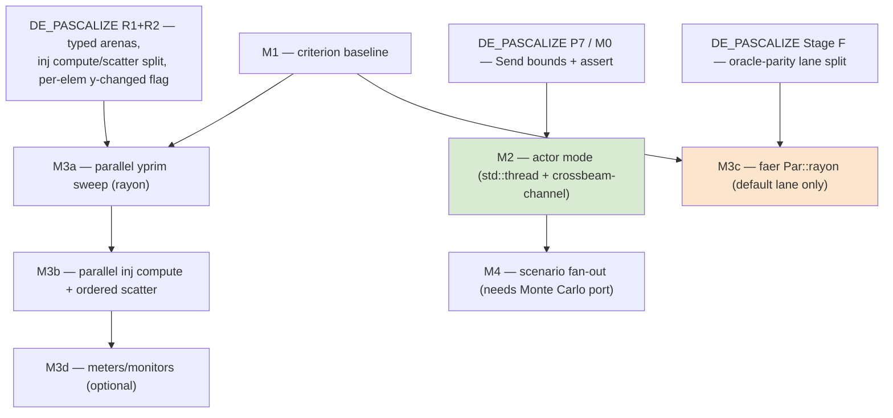

# Plan: Multithreading (Phase 9 — parallel-machine actor mode + intra-solve parallelism)

Fulfils `PORTING_PLAN.md` Phase 9: "A-Diakoptics + parallel-machine actor mode →
re-architect on `std::thread` + channels; gate: numerically identical to single-actor
results." Builds on the architecture delivered by `DE_PASCALIZE_PLAN.md` (typed arenas,
Send bounds, the injection compute/scatter split — see its Part IV constraints).

## Governing rule: determinism beats speedup — enforced per lane

`DE_PASCALIZE_PLAN.md` Stage F splits the build into two lanes, and every parallel stage is
judged against both:

- **Parity lane** (`--features oracle-parity`): the full historical gate — byte-exact
  goldens, checkpoint captures, `corpus_live` calibrated floors, **iteration counts** —
  stays green bitwise. Stages that are bit-identical by construction (M3a/M3b: parallel
  compute + sequential ordered commit) may be enabled here too; anything that can shift
  iterate paths (M3c faer parallel kernels, RESONANCE refinement) is **forced off** in this
  lane. This is what makes "iteration counts won't match under parallelism" a non-problem:
  the counts are pinned only where parallel kernels are off.
- **Default lane** (idiomatic build): iteration counts and byte-exactness vs the oracle are
  *not* pinned; validation is the tolerance-based oracle comparison plus **run-to-run
  determinism** — the same binary, deck, and thread count must produce bitwise-identical
  results across runs. That still bans unordered parallel float reduction:

> **parallel compute into element-owned storage → sequential ordered commit** — in BOTH
> lanes. Racing `+=` into shared accumulators is nondeterministic run-to-run, not merely
> oracle-divergent.

Anything whose *order* is semantic (control-queue order, registration order, time-step
sequence; Y stamp/dedup order in the parity lane) stays sequential — see the inventory at
the end. Never loosen a tolerance to admit a parallel version — in either lane. The full
default-lane drift model (what may move — iteration counts — and what must not — discrete
states, floor-level continuous accuracy) and the parity↔default differential gate are
defined once in `DE_PASCALIZE_PLAN.md` Part IV.2 and apply here verbatim.

## Per-step ritual (every M-stage, in order, autonomously — the `PHASE8_PLAN` discipline)

0. **Tier check** — compare the session against this stage's **exec tier** (table below);
   below tier → do NOT execute, reply exactly: «Этот шаг требует <exec tier>. Переключи
   сессию (/model + reasoning effort) и повтори команду.» and stop
   (`PLAN_SEQUENCE.md` §Model-tier protocol).
1. **Gate green** — fmt · clippy `-D warnings` · `cargo test --workspace` in **both lanes**
   (default and `--features oracle-parity`) + the parity↔default differential job + this
   plan's determinism tests (`RAYON_NUM_THREADS=1` vs `=8` bitwise for bit-neutral stages;
   fixed-thread run-to-run bitwise for M3c). A red test blocks the commit.
2. **Update `STATUS.md`**, **commit** (code + STATUS together).
3. **`/audit-code` + `/audit-tests` in parallel** — fresh independent agents (never forks),
   **spawned with an explicit model/effort override matching the stage's audit tier**,
   briefed with the commit range, diff, the M-stage's section here, and the binding rules
   (ordered-commit pattern, sequential-forever inventory, lane discipline, no tolerance
   fudging). Settle findings empirically; record deliberate no-fixes in STATUS; re-run the
   gate, commit.
4. **`STATUS.md` full review** — sync stale sections, archive to `docs/phase-records/`.
5. **Only now stop** and report in Russian: what landed, audit findings + resolution,
   before/after criterion numbers, gate status per lane, next step.

## Executor guidance (difficulty map, forbidden moves, escape protocol)

| Stage | Exec tier | Audit tier | Executor notes |
|---|---|---|---|
| M0 | opus-medium+ | opus-high+ | three supertrait bounds + one const assert + one cross-thread test |
| M1 | opus-medium+ | opus-high+ | criterion boilerplate; take deck paths from `tests/corpus/manifests/`; record numbers in STATUS |
| **M2** | **opus-xhigh** | **opus-xhigh** | **the design step of this plan** — follow the `DssPool` sketch; the rules below are binding |
| M3a/M3b | opus-high+ | opus-high+ | mechanical after R2 — the seams already exist (R2 riders); pinning = the bitwise determinism tests, run them after every file |
| M3c | opus-medium+ | opus-high+ | one `compat` knob; requires Stage F; do NOT attempt before it |
| M3d/M4 | opus-high+ | opus-high+ | deferred — do not start unless M1 benchmarks (M3d) / a ported Monte Carlo (M4) justify it |

Tier vocabulary and the step-0 refuse protocol: `PLAN_SEQUENCE.md` §Model-tier protocol.

**M2 binding rules (each is also a test):**
- Actors **own** their `Dss` — `Arc<Mutex<Dss>>` (or any shared engine state) is forbidden.
- Lifecycle: `Shutdown` message + `join` on pool drop; a panicked actor surfaces as an
  error status, never a hang (`recv` on a dead channel must time out or error, not block
  forever).
- **Single-actor zero-overhead test:** a pool of 1 must produce bitwise-identical output
  to plain `Dss` — the default path bypasses channels entirely.
- Replies flow over per-request channels; the pool never blocks on a busy actor except in
  `Wait`.

**Forbidden moves:** no `Arc<Mutex>` around engine state; no atomics/racing `+=` on floats
(ordered commit only, both lanes); no tolerance loosening; no parallel stage lands without
its determinism test; never parallelize the sequential-forever inventory; no `tokio`.

**When stuck:** same escape protocol as `DE_PASCALIZE_PLAN.md` — leave code sequential
(green), record the blocker in `STATUS.md`, surface at the stop point. A parallel stage
that can't pass its determinism test **stays sequential**; that is a valid outcome, not a
failure to hide.

## Where the codebase stands (audited 2026-07-06)

- **Zero** `Rc`/`Arc`/`RefCell`/`Cell`/`Mutex`/`OnceCell`/`thread_local`/`static mut`/unsafe
  in the workspace. Ownership is a clean acyclic tree rooted at `pub struct Dss`
  (`exec/mod.rs:67`); all cross-references are index handles (`ElemRef`), no back-pointers.
- Per-instance CWD/output paths (`Dss.current_dir`/`output_directory` — the engine never
  calls `set_current_dir`); no RNG; no stored file handles or closures. Two `Dss` in one
  process already don't interfere (cargo test runs hundreds concurrently).
- The only gap to `Dss: Send`: missing `Send` bounds on `dyn DssObject`/`CktElement`/
  `ElemStore` trait objects (every concrete impl is plain owned data). Closed by
  DE_PASCALIZE P7.
- Intra-solve blockers: the single `&mut dyn ElemStore` funnel in `SolveEnv`
  (`solution/state.rs:97`) — removed by typed arenas (R1/R2) — and `&mut self` element hot
  paths (`calc_yprim`, `inj_currents`, `compute_iterminal`) whose caches are strictly
  **element-local** (`cd.vterminal`/`iterminal`/`inj_current`), i.e. safe under
  `par_iter_mut`, just not under today's store API.

## Crate choices

| Crate | Role | Why |
|---|---|---|
| **rayon** | intra-solve fork-join (`par_iter_mut`, `join`, scoped pools) | the standard, heavily-tested work-stealing pool; fits per-element sweeps exactly |
| **std::thread::scope + crossbeam-channel** | actor mode (one engine per thread, message passing) | matches `PORTING_PLAN` "std::thread + channels"; crossbeam-channel is the proven MPMC channel with `select!`; actors are long-lived, so an OS thread each is correct (no pool needed) |
| **criterion** (dev) | benchmarks | none exist today; parallelism without a baseline is guesswork |
| **core_affinity** (optional) | `Set ActorCPU=` parity | upstream pins actor threads to cores; optional feature, off by default |
| — `std::sync::mpsc` | fallback if we prefer zero new deps for M2 | adequate (SPSC per actor mailbox); crossbeam chosen for `select!` + MPMC replies |

**Explicitly rejected: `tokio`** (and async in general). The engine is pure CPU-bound
compute with no async I/O, no network, no timers-under-load; an async runtime adds an
executor, `Send + 'static` future plumbing and latency for zero benefit. Actor mailboxes are
trivially served by blocking channels on dedicated threads. If a future server embeds dss-rs
under tokio, `spawn_blocking` around a `Dss` is the integration point — nothing inside the
engine needs to be async.

Also rejected: `loom` (no lock-based shared state to model — message passing + fork-join
only), `zerocopy`/atomics-based shared accumulators (banned by the determinism rule).

## Stages

Each stage lands gate-green, one commit (or PR) per stage. M0/M1 can land any time
(M0 rides with DE_PASCALIZE R1); M2 needs only M0; M3 needs DE_PASCALIZE R2.

### M0 — Send foundation (== DE_PASCALIZE P7; days, land first)

- `: Send` supertraits on `DssObject`/`CktElement`/`ElemStore`;
  `const _: () = assert_send::<Dss>();` in `lib.rs`.
- CI grep gate: `rg "RefCell|Rc<|static mut|thread_local" crates/*/src` → empty.
- Proof test: move a compiled+solved `Dss` across a thread boundary and re-solve
  (`std::thread::spawn(move || …)`), assert identical voltages — this is what cargo-test
  concurrency does *not* currently prove.

### M1 — Benchmark baseline (criterion; before any parallel code)

No `benches/` exist. Add `crates/dss-core/benches/`:
- `snapshot_8500` — compile+solve the vendored IEEE-8500 case (end-to-end, and split
  compile / Y-build / solve phases via criterion groups);
- `daily_ieee8500` (or the largest time-series corpus deck) — the meters/monitors hot loop;
- `ybuild_8500` — `build_y_matrix` alone (Phase A yprim sweep vs Phase B stamping);
- `lu_factor_solve` — `dss-sparse` factor + triangular solve at 8500-node scale.

Record numbers in `STATUS.md`. Every later stage quotes before/after from these benches.
Expected profile (from architecture, to be confirmed): LU factor dominates Y-rebuild-heavy
runs; the fixed-point loop = triangular solve + injection sweep; time-series adds the meter
zone walk. These benches also serve `DE_PASCALIZE_PLAN` **P15** (dss-sparse allocation
hygiene: SparseSet/symbolic reuse across rebuilds, dedup-mapping cache, per-element
`to_row_major` and per-iteration RHS `to_vec` removal) — land M1 before Part III so P15's
wins are measured, not asserted.

### M2 — Actor mode: parallel-machine parity (coarse-grained, the upstream model)

Upstream (`.inputs/dss_capi`, `{$IFDEF DSS_CAPI_PM}`: `CAPI_Parallel.pas`,
`Solution.pas` `TSolver = class(TThread)`) parallelizes at **whole-engine granularity**: one
`TDSSContext` per actor, its own Y/NodeV/solution, a message queue per actor, no shared
electrical state. That maps to Rust with no intra-solve surgery at all — it needs only M0:

```rust
// crates/dss-core/src/actors/mod.rs (new)
pub struct DssPool {
    actors: Vec<ActorHandle>,          // actor 1 = "prime" semantics like DSSPrime
    active: usize,                     // Set ActiveActor=n target
}
struct ActorHandle {
    tx: crossbeam_channel::Sender<ActorMsg>,
    status: Receiver<ActorStatus>,     // Busy/Ready + progress %, polled non-blocking
    join: std::thread::JoinHandle<()>, // owns its Dss for its lifetime
}
enum ActorMsg { Command(String), Solve, Query(String, Sender<String>), Shutdown }
```

- Each actor thread owns a full `Dss` and blocks on its mailbox; replies flow back over
  per-request channels. No `Arc<Mutex<Dss>>` anywhere — ownership, not sharing.
- **Command surface** (upstream parity, wired through the existing executive):
  `NewActor` (spawn slot) · `Set ActiveActor=n` / `Get ActiveActor` · `Set Parallel=on/off`
  (when off, commands to the active actor run synchronously — degenerates to today's
  behavior) · `SolveAll` (fan a Solve to every actor) · `Wait` (barrier: drain all statuses)
  · `ActorProgress`/`ActorStatus` · optional `Set ActorCPU=` via `core_affinity`.
- The CLI/`Dss::command` layer routes to `DssPool` when >1 actor exists; a single-actor pool
  must be **zero-overhead identical** to plain `Dss` (the default path stays untouched —
  actors are opt-in, exactly like upstream's `DSS_CAPI_PM` compile gate).
- **ConcatenateReports** parity: child report/export files go to per-actor output dirs
  (already per-instance via `output_directory`), merged on request.
- **Gate:** (a) the same script run through N actors == N sequential single-actor runs,
  **numerically identical** (bitwise on exports, not tolerance); (b) full existing suite
  green with the pool code merely present; (c) a stress test: 8 actors × different corpus
  decks concurrently, results equal to sequential runs.
- **Out of initial scope:** A-Diakoptics (circuit tearing across actors). It is a separate
  numerical method (Y-partitioning + boundary exchange), not a threading feature; revisit
  only if a real use case demands it. Actor mode does not depend on it.

This stage is where the practical wins live for the actual upstream use cases: parameter
sweeps, 8760-hour studies split across actors, contingency fan-outs, Monte Carlo (when
ported — its per-scenario independence rides on this machinery, M4).

### M3 — Intra-solve parallelism (rayon; requires DE_PASCALIZE R2 arenas)

Fine-grained fork-join inside one solve. Ranked by (benefit × safety):

**M3a — parallel YPrim sweep (`ymatrix.rs:110`), the clean win.**
Phase A of `build_y_matrix` recomputes every element's `cd.yprim` from an immutable `SysCtx`
snapshot — embarrassingly parallel, zero shared writes (the port deliberately recomputes all
elements every build, so the whole set is the work item). With typed arenas:
`rayon::join`/`par_iter_mut` across the per-class `Vec<T>`s (or a generated
`Elements::par_for_each_ckt_elem_mut`). Per-element errors collect into each element
(`take_errors` already per-element) and are **drained sequentially in element order** after
the join. Phase B (triplet stamping) is untouched and sequential → the assembled Y is
bit-identical by construction (same per-element yprims, same stamp order).

**M3b — parallel injection compute (`power_flow.rs:36-58`), the per-iteration win.**
Today each PC element computes `cd.inj_current` **and** scatter-adds into the shared
`sol.currents[node_ref]` inside one `&mut self` call — a write-write hazard on shared nodes
(and ground slot 0) under parallelism. DE_PASCALIZE R2's rider splits this into
`compute_inj_currents` (parallel: reads `&node_v` snapshot, writes element-owned
`cd.inj_current`) + a **sequential scatter loop in element order** (`+=` into
`sol.currents`) — bit-identical sums because the commit order is unchanged. The shared
`system_y_changed: &mut bool` becomes a per-element return flag OR-ed during the sequential
scatter. Same treatment for `get_source_inj_currents`.

**M3c — faer's built-in parallelism in `dss-sparse` (the biggest single-solve lever;
requires Stage F's lane split).**
faer's sparse LU accepts a parallelism setting (`Par::rayon(n)` vs `Par::Seq`). Parallel
factorization kernels may change accumulation order → last-ulp differences in the factors →
different fixed-point iterate paths and **different iteration counts**. Stage F makes this
safe instead of accept-or-revert: the parallelism knob lives in `compat` — **parity lane
hard-forces `Par::Seq`** (iterate paths and iteration counts stay pinned to the oracle),
the **default lane runs `Par::rayon(n)`**, validated by the tolerance-based oracle
comparison (ulp-level factor drift is far below the 1e-6-class floors) plus run-to-run
determinism at a fixed thread count. Benchmark before/after (M1); document the knob at the
flip site.

**M3d — meters/monitors sampling (optional; only if M1 shows it matters).**
Per-meter zones are disjoint, but sampling calls `get_currents`/`losses` (`&mut self`
iterminal cache) on **shared** zone branch elements, and monitors need `&mut` metered
elements. Two-phase pattern: (1) parallel per-element refresh of `cd.iterminal` over the
union of needed elements (each element refreshed once — the `iterminal_solution_count`
lazy-cache makes refresh idempotent per solution), then (2) sequential (or per-meter
parallel with `&self` reads) register accumulation in meter order. `DI_RegisterTotals`
accumulation stays sequential in meter order. Defer until benchmarks justify it — the
time-series driver already spends most of its step inside `solve_snap`.

**Gate for every M3 sub-stage:** both lanes green, zero tolerance changes. M3a/M3b
additionally assert `RAYON_NUM_THREADS=1` vs `=8` **bitwise-identical** exports/monitor
channels (they are bit-neutral by construction, in both lanes). M3c asserts bitwise
run-to-run determinism at each fixed thread count in the default lane, and asserts the
parity lane still runs `Par::Seq` (a test that the compat knob is wired).

### M4 — Scenario fan-out (future, when Monte Carlo / AutoAdd modes are ported)

Monte1/2/3, MonteFault and load-duration modes are currently unported stubs. When they
arrive, per-scenario independence maps onto either actor fan-out (M2 machinery) or
`rayon`-over-cloned-`Dss` — decided then. Constraint carried from DE_PASCALIZE Part III:
RNG state lives on (per-`Dss`) `Solution`; per-scenario seeding must be explicit and
deterministic so a parallel run equals the sequential run scenario-for-scenario.

## Sequential-forever inventory (do not parallelize)

- **Y triplet stamping + `assemble` dedup** — insertion order is byte-pinned to
  KLU/CSparse (`dss-sparse/lib.rs:297-332`).
- **Control queue** sample → queued action → apply (`controls/sampling.rs`) — semantically
  ordered; event-driven correctness depends on it.
- **Time-series step loop** (`time_series.rs`) — state carries across steps (node_v seed,
  storage SOC, meter integration, control queue).
- **Fixed-point iteration loop** itself — inherently sequential; parallelism lives *inside*
  an iteration (M3a/b/c).
- **Report/export writers** — byte-pinned output order.

## Dependency graph



Recommended order: **M0 → M1 → M2** (ships user-visible parallelism with zero numerical
risk, upstream-parity command surface) → **M3a → M3b** (single-solve scaling, bit-neutral
by construction) → **M3c** (default lane, after Stage F) → M3d/M4 as demand appears.
Cross-plan position: this plan runs **last** — see `PLAN_SEQUENCE.md`.

## Verification summary

- Mandatory gate at every stage: **both lanes** (`--features oracle-parity` = the full
  historical gate incl. `corpus_live` and iteration-count pins; default = tolerance lane +
  run-to-run determinism); **no tolerance changes in either lane** — a parallel version
  that needs a looser tolerance is wrong by definition.
- New permanent tests: `Dss` cross-thread move+solve (M0); N-actor == N-sequential bitwise
  (M2); `RAYON_NUM_THREADS=1` vs `=8` bitwise for M3a/M3b; fixed-thread-count run-to-run
  bitwise + parity-forces-`Par::Seq` for M3c.
- Perf: criterion before/after per stage, recorded in `STATUS.md`; target for M3a+M3b is
  measurable wall-clock reduction on `snapshot_8500`/`daily_ieee8500` with 0 test churn.
